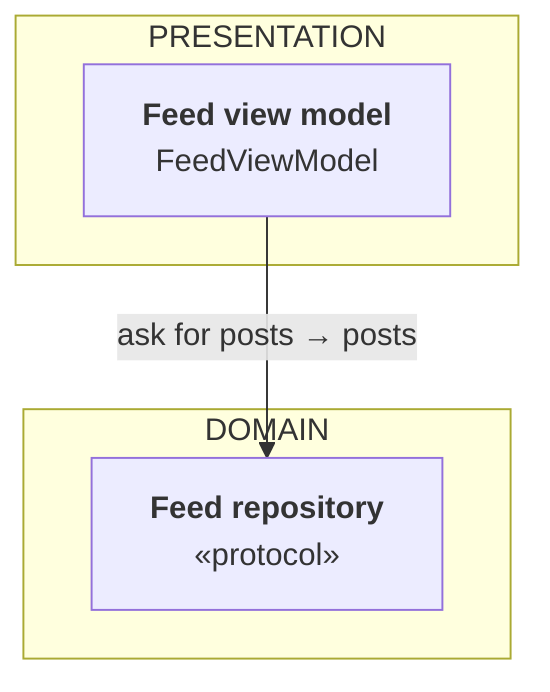

# knowledge

A personal technical knowledge base. Markdown in, one self-contained web page out.

## Layout

```
topics/<topic-slug>/topic.json     title, tagline, summary
topics/<topic-slug>/NN-slug.md     one chapter per file, ordered by filename
build.py                           stdlib only — no pip install, no network
index.html                         generated; open it in a browser
```

A topic can also pull its chapters from a folder **outside** this repo, which is how the day
sessions appear here without being copied:

```json
{ "title": "Day Sessions", "slug": "daily",
  "source": "../Interview/02-Study-Plan/daily", "prefix": "day-" }
```

Those files carry no front matter, so the build takes the `# …` line as the title and the italic
line under it as the summary (and the `~NN min` in it as the reading time), strips both, and
renders the rest. Setup sessions sort before numbered days. The markdown on disk stays the source
of truth — edit the session file, rebuild, and the page follows.

Add `"schedule"` and the build gets the short nav labels, the build groupings and the days not
written yet from that track's table; `"setupLabels"` names the setup sessions, which aren't in it:

```json
{ "schedule": "../Interview/02-Study-Plan/tracks/labs.md",
  "setupGroup": "Week 0 · setup",
  "setupLabels": { "S1": "Short label for a session the table doesn't list" } }
```

A session topic renders as a timeline in the rail (done / current / not yet), gets a card index of
its own at `#/<slug>`, and each session page gets a progress bar and an outline of its steps down
the right-hand side. Every other topic collapses to one row in the rail until you open it.

## Build

```bash
python3 build.py
```

Writes `index.html`. Open it directly (`open index.html`) — it needs no server.
The same file is what gets published to the private web URL, so it renders
identically on the Mac, the iPad and the phone.

## Adding a chapter

Drop a new `NN-slug.md` in a topic folder and rebuild. Frontmatter:

```
---
title: Actors
summary: One sentence for the chapter list.
minutes: 8
sources:
- WWDC21 · Swift concurrency: Behind the scenes | https://developer.apple.com/videos/play/wwdc2021/10254/
- SE-0306 · Actors | https://github.com/swiftlang/swift-evolution/blob/main/proposals/0306-actors.md
---
```

Every claim about mechanism should carry a source. Sources render as linked
chips at the foot of the chapter, and inline links stay inline.

## Adding a topic

```bash
mkdir -p topics/my-topic && $EDITOR topics/my-topic/topic.json
```

Then chapters. Rebuild. The home page picks it up automatically.

## Two aside styles

Blockquotes are styled by their opening bold label:

- `> **In the office.** …` / `> **In the library.** …` — the running analogy. One per
  topic, used in every chapter of it. A new topic with a new analogy adds its label to
  `QUOTE_KINDS` in `build.py`.
- `> **Under the hood.** …` — the precise mechanism, proposal numbers, Apple's wording.

Anything else stays a plain quote.

## Hidden answers

A block opened with `::: Label` and closed with a line containing only `:::` renders
collapsed, labelled, and stays closed until tapped. Used for DSA solutions and model
system-design answers, so you can try first.

```
::: Solution
…anything, including code blocks and tables…
:::
```

## Diagrams

A fenced block tagged `diagram` (or `html`) is emitted as raw HTML instead of a code block, and
`template.html` carries a small CSS kit so every diagram in the site looks the same and works in
dark mode:

```
```diagram
<figure class="dg">
  <figcaption>What the diagram shows</figcaption>
  <div class="dg-row"><span class="dg-lane">UI</span>
    <div class="dg-nodes"><div class="dg-node"><b>FeedView</b><span>renders rows</span></div></div>
  </div>
  <div class="dg-flow">asks for a page</div>
  <div class="dg-row"><span class="dg-lane">Domain</span>
    <div class="dg-nodes"><div class="dg-node accent"><b>FeedRepositoryType</b><span>the seam</span></div></div>
  </div>
</figure>
```
```

Classes: `dg` wrapper · `dg-row` + `dg-lane` + `dg-nodes` · `dg-node` with `accent`, `warm`,
`ghost` variants · `dg-flow` (`up`, `both`) for a labelled arrow · `dg-group` + `dg-group-label`
for a module boundary · `dg-split` for parallel paths · `dg-note` · `dg-legend`.

## Mermaid boards

A fenced block tagged `mermaid` renders as a Mermaid diagram on a dotted "board" (system-design
sketches and sequence diagrams). The page loads Mermaid from jsdelivr the first time a chapter has
one; offline, the block's source text shows instead. Colours follow light and dark mode.

Flowcharts get six class names, so a sketch never hardcodes a colour:

| Class | Use for | Colour |
|---|---|---|
| `pres` | presentation layer / a library's API | blue |
| `dom` | domain layer / a library's core | purple |
| `data` | data layer / a library's I/O | green |
| `net` | anything that crosses the network | orange |
| `reuse` | a component reused from another question | grey, dashed |
| `focus` | the one card a deep dive is about | thick blue border |

```

```

Card labels are **Markdown strings** (backtick-quoted): `**bold**` for the role, a new line for each
further line. The page renders labels as plain SVG text (`htmlLabels: false`), which the browser
measures and draws the same way, so a label can't spill out of its box. Don't use `<b>`/`<br/>`
HTML labels; they're measured as HTML and clipped or overflow in some browsers.

Keep arrows pointing down the page, with one exception: the dependency-inversion arrow, which must
point **up** from the implementation to the protocol. An upward edge on its own scrambles Mermaid's
layer order, so pair it with an invisible link that keeps the protocol above:

```
  Repo ~~~ Impl
  Impl -. "implements" .-> Repo
```

Label each solid arrow **request → reply** (it points from the part that asks to the part that
answers), so the sketch shows data coming back as well as requests going down, and keep labels short
(≈4 words) so the sketch isn't widened. Keep rows to three cards so the sketch isn't scaled down. Never put a `;` in diagram text: Mermaid reads it as a line break and
the diagram falls back to its raw source.
## Publishing

Two builds from the same sources:

```bash
python3 build.py            # index.html — everything, including Day Sessions. Local only.
python3 build.py --public   # docs/index.html — the reference topics. This is what GitHub Pages serves.
```

A topic marked `"private": true` in its `topic.json` is dropped from the public build. Day Sessions
is marked private: those files quote an employment contract, a CV and a notice period, and the repo
is public. `.gitignore` keeps the private build and that topic's config out of git as well, so the
only way they reach GitHub is by deliberately removing both guards.

Sentences that only make sense inside the daily programme are wrapped so the public build swaps
them for a reader-facing line:

```
<!--private-->…comes back as a recall prompt.<!--/private--><!--public-->…worth reading up on.<!--/public-->
```

Publishing goes to reza-bina.com/notes, which is an Astro site whose `public/` folder is copied
verbatim at build. One command does the whole thing:

```bash
./publish.sh             # build both, check for leaks, commit and push both repos
./publish.sh --dry-run   # build and report what would be committed, change nothing
```

It runs the two builds plus `python3 build.py --public --out ../reza-bina.com/public/notes/index.html`,
greps the public build for anything private and aborts if it finds any, writes a commit message naming
the topics that changed, and pushes. It refuses to touch the site repo unless it is on `main`, since the
only file it writes there is generated. `SITE_REPO=/path ./publish.sh` overrides the site location.

`claude/publish-notes.md` is the same job as a Claude Code command: copy it to
`~/.claude/commands/publish-notes.md` and run `/publish-notes` after a session. Claude Code has the SSH
key, so that is where the push happens.

`docs/` stays in this repo as a standalone copy if its own Pages site is ever wanted.
