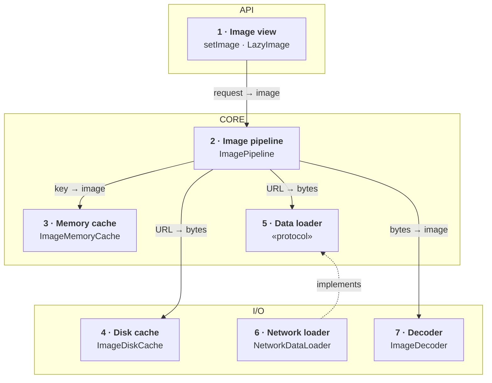
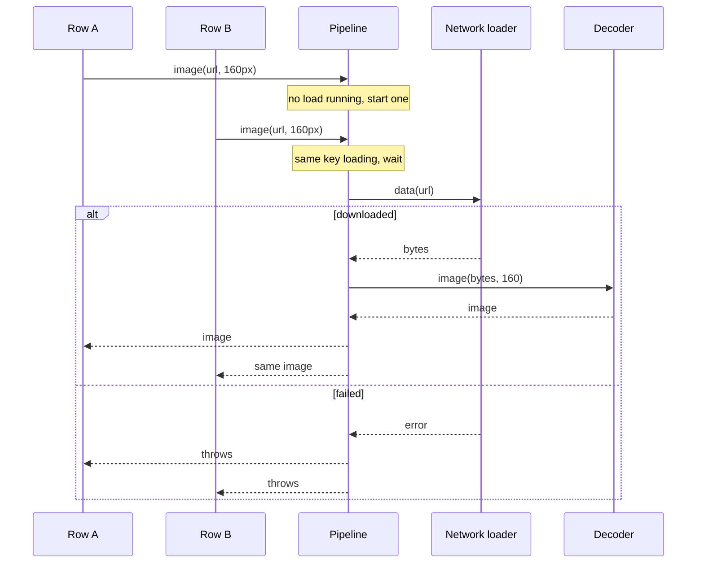
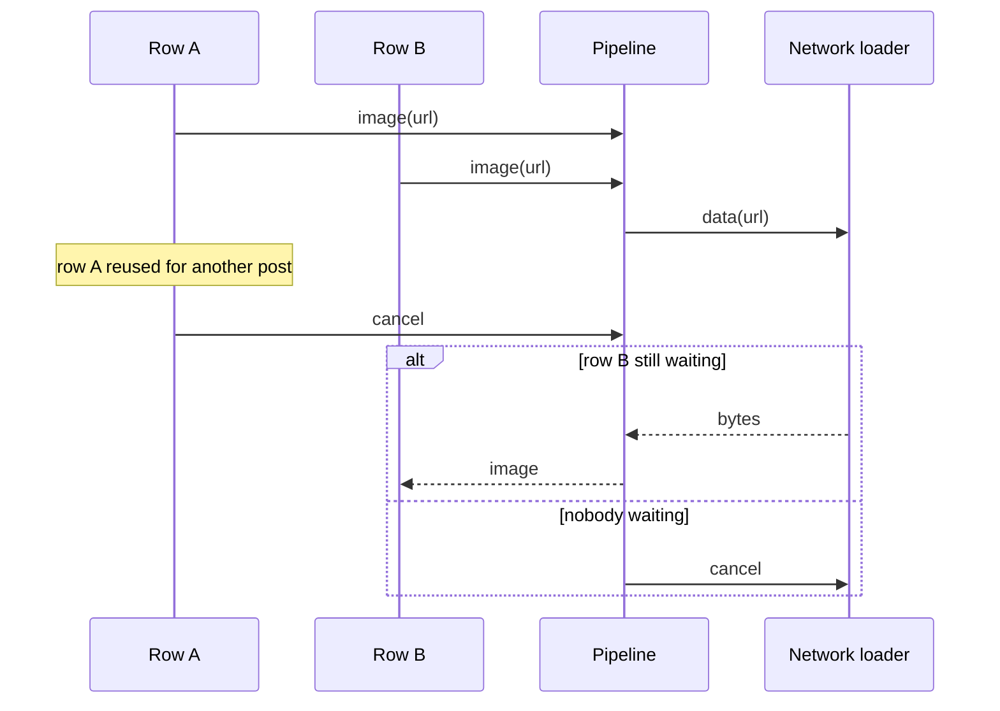

*A recurring senior mobile prompt. The answer below stays small on purpose: seven parts, one shared download per picture, one idea per part.*

> **Interviewer:** "We show a lot of images — feeds, avatars, a photo grid. Design the image loading library we'd build for that. Something like Kingfisher or Nuke."

## Run it as a round, not as reading

Set a timer. Sketch. Talk the whole time. Open a section only when its slot is over.

| Clock | Phase | What you do |
|---|---|---|
| 0:00–0:02 | The prompt | Repeat it back in one sentence |
| 0:02–0:07 | Clarify | Ask yours, then read section 1 |
| 0:07–0:12 | Scope | Out of scope first, then features, then what must feel good |
| 0:12–0:24 | High level | The idea · the parts · the sketch · each part · two flows |
| 0:24–0:40 | Deep dives | The interviewer picks one of sections 9–11 |
| 0:40–0:45 | Recap | Follow-ups, then the 60-second summary |

## What this question is really testing

- **The cost of a decoded image:** width × height × 4 bytes, whatever the file size.
- **One download for two rows** that want the same picture.
- **Cancelling on cell reuse**, without killing a download another row still needs.
- **Shrinking off the main thread**, so scrolling never stutters.
- **Knowing when to stop.** `AsyncImage` and `NSCache` are fine for a small app. Say when.

**Traps:** designing the CDN; a cache with no limit; forgetting cancellation; decoding on the main thread; listing Kingfisher's features instead of designing.

::: Words used in this chapter
- **Library** — reusable code the whole app calls. Here, the code that loads every picture.
- **Pixel** — one dot on the screen. A picture's pixel size is how many dots wide and tall it is.
- **Decode** — unpack a compressed file (JPEG, HEIC) into pixels the screen can draw. Unpacked, it's much bigger.
- **Downsample** — decode straight to a smaller size, so the big version never exists.
- **Memory vs disk** — memory is fast, small and emptied when the app quits. Disk is slower, bigger and survives.
- **Cache** — a kept copy, so the next time is instant. *Eviction* throws old entries out when it's full.
- **CDN** — servers that keep copies of files close to users. Ours can also resize a picture before sending it.
- **Main thread** — the one lane that draws the screen. Slow work there freezes scrolling.
- **Actor** — a Swift object that runs one piece of its code at a time, so its data is never changed twice at once.
- **Protocol** — a promise of what a part can do, without saying how. A fake can keep the same promise in tests.
- **Prefetch** — fetch pictures just before they come into view.
- **Deduplicate** — when two callers want the same thing, do the work once and give both the result.
:::

::: 1 · The interviewer answers your clarifying questions
**"One app, or an SDK other teams adopt?"** → *One app, but shaped so it could become a package.*

**"Where do images come from?"** → *The network. A few bundled assets, but skip those.*

**"Who uses it?"** → *UIKit image views and SwiftUI. Sometimes code that wants an image to share.*

**"Heaviest screen?"** → *A thumbnail grid you can fling through, plus a full-screen detail view.*

**"Can the server resize?"** → *Yes. The CDN takes `?w=` and sends `ETag` and `Cache-Control`.*

**"Offline?"** → *Pictures the user has seen should still show.*

**"What hurts today?"** → *Stutter on older phones, and the app gets killed for using too much memory.*
:::

::: 2 · Requirements and scope — what you should have said
**Out of scope, said first:** GIFs and video, filters and editing, placeholder animations (the caller owns those), bundled and file sources, and the server beyond "a CDN with a width parameter".

**Features**

1. Load an image by URL, at the size it will be shown, into a view or back to a caller.
2. Cache in memory and on disk, so seen pictures show offline.
3. Cancel when a row no longer needs the picture.
4. Prefetch rows about to appear.

**What must feel good**

- **Smooth** — no decoding or disk work on the main thread.
- **Bounded memory** — the picture cache has a byte limit.
- **No wasted data** — the same picture is never downloaded twice.
- **Correct** — a reused row never shows another row's picture.
:::

::: 3 · The idea, in 30 seconds — before you draw anything
> *"A view asks for a picture by URL and by the size it will show it at. One pipeline checks a memory cache, and if the same picture is already loading for another row, it waits for that load instead of starting a second. On a miss, it reads the bytes from a disk cache or downloads them, shrinks them to the display size off the main thread, and keeps the result in memory. It's a library, so three frames of its own: the API callers touch, the core that coordinates, and the I/O that does the work."*
:::

::: 4 · What we need — the components, before the sketch
| # | Part | Type | Layer | Its one job |
|---|---|---|---|---|
| 1 | **Image view** | `setImage` · `LazyImage` | API | Shows one request in one view. |
| 2 | **Image pipeline** | `ImagePipeline` | Core | Coordinates loads, one per picture. |
| 3 | **Memory cache** | `ImageMemoryCache` | Core | Keeps pictures ready to draw. |
| 4 | **Disk cache** | `ImageDiskCache` | I/O | Keeps downloaded files on the phone. |
| 5 | **Data loader** | `DataLoader` «protocol» | Core | Promises bytes for a URL. |
| 6 | **Network loader** | `NetworkDataLoader` | I/O | Downloads the bytes. |
| 7 | **Decoder** | `ImageDecoder` | I/O | Turns bytes into a small picture. |

Not on the list yet: a file loader, revalidation with `ETag`, Low Data Mode, a disk index, metrics. *"I'll add those if we go there."*

No use case and no composite here: it's a library with no app rules and no model built from several sources.
:::

::: 5 · The sketch


**How to read it.** A solid arrow points from the part that asks to the part that answers: *request → reply*. The dashed arrow means *implements*. On a miss the pipeline tries memory, then disk, then the network, then decodes.

**Dependency inversion, in one line.** The core writes the promise (card 5); the network loader in I/O keeps it (card 6). The arrow points **up**, so the core never imports networking.

**One owner per source.** Memory, disk and network each have their own card. The pipeline owns none of them: it only decides which to ask, in order, like a composite.

**On Miro:** three frames (blue, purple, green), seven cards, six arrows. Point at card 2 and say: *"this is where two rows share one download."*
:::

::: 6 · Each component: its job, its interface, the choice inside it
Every part passes around one value:

```swift
struct ImageRequest: Hashable, Sendable {
    let url: URL
    /// Display size in pixels (points × screen scale), nil = full size
    let pixelSize: CGSize?
    /// Visible rows high, prefetch low
    let priority: Priority
}
```

### 1 · Image view (`setImage`, `LazyImage`)

**Job:** the one line a screen calls to show a picture. It cancels the old request when the row is reused.

**Interface:**

```swift
extension UIImageView {
    /// nil cancels and clears
    @MainActor func setImage(_ request: ImageRequest?)
}

struct LazyImage: View {
    init(request: ImageRequest)
}
```

**Choices:**

- **It checks the memory cache first, synchronously**, so a cached picture shows in the same frame with no flicker.
- **It keeps its current request** and only shows a result that matches it. Cancelling is cooperative, so a late result can still arrive.
- `LazyImage` uses `.task(id: request)`, which cancels the old load and starts the new one for free.

### 2 · Image pipeline (`ImagePipeline`)

**Job:** every request goes through it. It checks memory, joins a load already running for the same picture, or starts one.

**Interface:**

```swift
protocol ImagePipelineType: Sendable {
    /// Synchronous memory lookup, safe on the main thread
    func cachedImage(for request: ImageRequest) -> UIImage?
    func image(for request: ImageRequest) async throws -> UIImage
    /// Low priority, cancelled when the user flings past
    func prefetch(_ requests: [ImageRequest])
    func cancelPrefetch(_ requests: [ImageRequest])
}
```

**Choices:**

- **An actor that only keeps the books.** It holds a table of running loads. It never decodes, or every decode in the app would queue behind it.
- **A running load is shared.** It stops only when nobody is waiting for it (deep dive 9).
- **`async throws`**, so the share sheet and tests use the same path as the views. *Rejected:* `AsyncImage` alone. It has no shared cache and no downsampling. Fine for one screen.

### 3 · Memory cache (`ImageMemoryCache`)

**Job:** keeps decoded pictures ready to draw. When it's full, the one unused the longest goes.

```swift
protocol ImageMemoryCacheType: Sendable {
    func image(for key: ImageKey) -> UIImage?
    /// Cost = the picture's bytes
    func store(_ image: UIImage, for key: ImageKey)
    /// Called on memory warning
    func removeAll()
}

/// URL + pixel size: a picture is only reusable at the size it was decoded for
struct ImageKey: Hashable { let url: URL; let pixelSize: CGSize? }
```

**Choices:**

- **A byte budget, not an item count.** One full-screen picture costs as much as a hundred thumbnails.
- **Emptied on memory warning**, trimmed when the app goes to the background.
- *Rejected:* `NSCache`. Its eviction order is unknown and you can't remove one URL at every size. *Switch to it* for a small app.

### 4 · Disk cache (`ImageDiskCache`)

**Job:** keeps the downloaded files, still compressed, so seen pictures show offline.

```swift
protocol ImageDiskCacheType: Sendable {
    func data(for url: URL) async -> Data?
    func store(_ data: Data, for url: URL) async
    /// Removes the oldest files, off the launch path
    func trim(toBytes limit: Int) async
}
```

**Choices:**

- **Compressed bytes, keyed by URL alone.** Bytes don't depend on display size, so every size shares one file.
- **In `Library/Caches`**, with a size cap. The system may clear it, and that's fine for a cache.
- *Rejected:* `URLCache`. It obeys the server's headers, so `max-age=300` would mean "gone offline after five minutes" (deep dive 11).

### 5 · Data loader (`DataLoader`)

**Job:** the promise "give me the bytes at this URL". The pipeline depends on it, not on the network.

```swift
protocol DataLoader: Sendable {
    /// Stops when cancelled. Never returns half a file.
    func data(for url: URL) async throws -> Data
}
```

**Choice:** the one protocol drawn on the board, because it's where the library grows. A file loader or a test fake is a new conformance, never a `switch` in the pipeline.

### 6 · Network loader (`NetworkDataLoader`)

**Job:** downloads the bytes from the CDN.

**Interface:** conforms to `DataLoader`. Built with `init(session: URLSession)`.

**Choices:**

- **It asks the CDN for the right width**, rounded up to a few buckets (160, 320, 640, 1280), so nearby sizes share one cached copy.
- **Visible requests go first.** Prefetches get low priority and don't run on Low Data Mode.

### 7 · Decoder (`ImageDecoder`)

**Job:** turns compressed bytes into a picture, shrunk to the display size, off the main thread.

```swift
protocol ImageDecoderType: Sendable {
    func image(from data: Data, maxPixelSize: CGFloat?) async throws -> UIImage
}
```

**Choices:**

- **Downsample while decoding** with ImageIO (`CGImageSourceCreateThumbnailAtIndex`), so the full-size picture never exists in memory.
- **Decode now, not at first draw**, or the first draw decodes on the main thread mid-scroll.
- *Simpler:* `UIImage.byPreparingThumbnail(ofSize:)` does the same in one line. Use it unless you need ImageIO's options.
:::

::: 7 · Key flows through the sketch
**Flow 1 — two rows want the same avatar.** Memory and disk both miss.



One download and one decode serve both rows. The pipeline also saves the bytes to disk and the picture to memory.

**Flow 2 — a row is reused before its picture arrives.**



Cancelling takes the row off the waiting list. The download stops only when nobody is left.
:::

::: 8 · The server contract
```
GET https://img.example.com/{id}?w={160|320|640|1280}
    → 200  image/jpeg
           Cache-Control: max-age=86400
           ETag: "a1b2"

GET same URL, If-None-Match: "a1b2"
    → 304  (keep the copy on disk)
```

- **Width buckets**, so the phone downloads a 640-pixel picture, not a 4000-pixel original, and nearby sizes share one CDN copy.
- **`ETag`** lets the app check a stale copy cheaply. A 304 sends no bytes.
- **The client chooses how long to keep files.** Offline display can't depend on `max-age`.
:::

::: 9 · Deep dive — "Two cells show the same avatar. Walk me through it."
**Decision:** the pipeline actor keeps a table: key → the running load and how many callers wait on it.

1. **Check memory.** A hit returns at once.
2. **If a load for this key is running, join it.** Add one to its count and wait on the same task.
3. **Otherwise, put a new load in the table straight away**, before any `await`.
4. **When a caller cancels, take one off the count.** Cancel the load only at zero. Remove the entry when it finishes, success or failure.

**Why step 3 says "straight away".** An actor lets other callers in every time it waits. If it waited before recording the load, two callers could both find nothing and both download.

*Rejected:* cancel the shared load when any caller cancels. Row A scrolls away and kills the download row B still needs.
:::

::: 10 · Deep dive — "This grid gets the app killed on an iPhone 12. Why?"
**The fact:** a decoded picture costs width × height × 4 bytes. A 4032 × 3024 photo is a 2 MB JPEG but about 49 MB decoded. Twenty of those is the kill.

**Decision:** decode straight to the display size, off the main thread.

1. The view computes the size in **pixels**: points × screen scale.
2. The decoder makes a thumbnail at that size from the compressed bytes. The full-size picture never exists.
3. The memory cache counts each picture's bytes against a budget (a slice of what the app may use).
4. A memory warning empties the cache. Visible rows simply ask again.

*Rejected:* decode full size, then redraw smaller. Peak memory is still the full picture.
:::

::: 11 · Deep dive — "Why not just use URLCache?"
**Decision:** own a disk cache of compressed bytes, with a size cap.

1. **Compressed, not decoded.** Bytes are 10–50 times smaller, and decoding is cheap next to downloading.
2. **Safe writes.** Write to a temporary file, then rename, so a crash never leaves half a picture.
3. **Oldest out first**, using a small index of size and last use, trimmed off the launch path.
4. **Stale copies show at once**, then check in the background with `If-None-Match`.

*Rejected:* `URLCache`. It obeys the server, so `max-age=300` means "offline after five minutes", and you can't remove one URL. *Switch to it* if you control the headers and offline doesn't matter.
:::

::: 12 · Failure modes and 10×
- **Offline** → disk hits work; misses fail fast and the view shows a placeholder.
- **Download fails** → one retry for timeouts and 5xx, none for 4xx. Remember a 404 briefly.
- **Corrupt file** → delete it from disk, download once more, then give up.
- **Memory warning** → empty the memory cache.
- **Late result into a reused row** → dropped by the current-request check.
- **App killed mid-write** → the temporary file is never renamed, so the old copy stays.

**At 10×:**

- **Ten times more pictures** → the memory budget is fixed, so use smaller buckets for thumbnails.
- **A much bigger disk cache** → move the index to SQLite.
- **Older phones** → decoding becomes the bottleneck. Prefetch decodes one screen ahead, bytes further.
:::

::: 13 · Question bank — everything they can push on
Answer out loud first, then open.

### Scope and architecture

<details>
<summary>"Walk me through the layers."</summary>

API: the view helpers callers touch. Core: the pipeline, the memory cache and the data loader promise. I/O: disk cache, network loader, decoder.
</details>

<details>
<summary>"Where's the use case? The composite repository?"</summary>

There are none. A library has no app rules and no model combined from several sources, so neither earns its place.
</details>

<details>
<summary>"Show me dependency inversion."</summary>

The pipeline holds a `DataLoader` protocol. The network loader implements it. The arrow points up, so the core never imports networking.
</details>

<details>
<summary>"Where do bytes become a picture?"</summary>

Only in the decoder. The disk cache and loader deal in bytes; the memory cache and views deal in pictures.
</details>

<details>
<summary>"Why seven parts and not one ImageManager?"</summary>

Each changes for a different reason: the loader with the network, the decoder with formats, the caches with eviction, the pipeline with coordination. One class would change for all of them.
</details>

<details>
<summary>"When is AsyncImage enough?"</summary>

One screen, few pictures, no offline need. It has no shared cache and no downsampling.
</details>

### Caching

<details>
<summary>"Why two caches?"</summary>

Memory gives a same-frame hit when scrolling back. Disk gives offline and saves data. They hold different things: pictures and bytes.
</details>

<details>
<summary>"Why does the memory cache key on URL plus size?"</summary>

A picture decoded for 80 points can't be reused at 300. Bytes are the same at every size, so disk keys on URL alone.
</details>

<details>
<summary>"Why a byte budget?"</summary>

One full-screen picture can cost as much as a hundred thumbnails. Counting items doesn't bound memory.
</details>

<details>
<summary>"Why not store decoded pictures on disk?"</summary>

They're 10–50 times bigger. Decoding is cheap next to the disk space.
</details>

<details>
<summary>"Why not NSCache?"</summary>

Eviction order is unknown and you can't remove one URL at every size. It's a fine answer for a small app.
</details>

<details>
<summary>Follow-up chain: "Revalidation."</summary>

1. *"The picture on the server changed."* → The disk copy has an `ETag`.
2. *"When do you check?"* → After a freshness window, in the background.
3. *"What does the user see meanwhile?"* → The old copy, at once.
4. *"And if it's unchanged?"* → A 304, no bytes. Just mark it fresh.
</details>

### Concurrency and cancellation

<details>
<summary>"Two rows want the same picture."</summary>

The pipeline finds the running load for that key and the second row waits on it. One download, one decode.
</details>

<details>
<summary>"Why is the pipeline an actor?"</summary>

Its table of running loads is changed by many callers. An actor makes sure only one changes it at a time.
</details>

<details>
<summary>"Why not decode inside the actor?"</summary>

Every decode in the app would queue behind one actor. The actor keeps the books, the decoder runs elsewhere.
</details>

<details>
<summary>"An async function runs off the main thread, right?"</summary>

Not since SE-0461: a plain `nonisolated async` function runs on the caller's actor. Mark the decoder `@concurrent` to move it off.
</details>

<details>
<summary>"A cell is reused. What happens?"</summary>

The view cancels its request and starts the new one. The pipeline cancels the download only if nobody else waits.
</details>

<details>
<summary>Follow-up chain: "The wrong picture flashes."</summary>

1. *"A reused row shows the old picture for a moment."* → The old result arrived after cancel.
2. *"Why, if you cancelled?"* → Cancelling only sets a flag. Work stops at its next check.
3. *"Fix?"* → The view shows a result only if it matches its current request.
</details>

### Performance and memory

<details>
<summary>"How much memory does a picture take?"</summary>

Width × height × 4 bytes, decoded. A 12-megapixel photo is about 49 MB.
</details>

<details>
<summary>"It stutters. Where do you start?"</summary>

Instruments first. Usual causes: decoding on the main thread, decoding at full size, decoding at first draw.
</details>

<details>
<summary>"How does prefetch work?"</summary>

The collection view's prefetch callback calls `prefetch` with low priority. It's cancelled when the user flings past.
</details>

<details>
<summary>"Visible rows and prefetches compete. Who wins?"</summary>

Visible rows. They get high priority, and the loader caps connections per host.
</details>

<details>
<summary>"Low Data Mode?"</summary>

Prefetches don't run on a constrained network. Visible rows still load, at a smaller bucket.
</details>

### Testing, security and change

<details>
<summary>"How do you test deduplication?"</summary>

A fake loader that holds its reply. Ask twice for the same URL, then check it was called once.
</details>

<details>
<summary>"How do you test cancellation?"</summary>

Two callers, cancel one, check the fake loader wasn't cancelled. Cancel both, check it was.
</details>

<details>
<summary>"Some images are private now."</summary>

Add the auth header in the network loader. Use a separate disk folder with file protection, and clear it on sign-out.
</details>

<details>
<summary>"Add a file or bundle source."</summary>

A new `FileDataLoader` conforming to `DataLoader`. The pipeline doesn't change.
</details>

<details>
<summary>Follow-up chain: "A second screen."</summary>

1. *"Tap a thumbnail to open it full screen."* → A new request, same URL, bigger size.
2. *"Does it download again?"* → Bytes are on disk under the URL. Only the decode is new.
3. *"Show something at once?"* → Show the cached thumbnail, then swap in the sharp one.
4. *"Memory?"* → The full-screen picture is one entry in the same budget.
</details>
:::

::: 14 · Scorecard — mark yourself, 0 / 1 / 2
| | Did you… | 0–2 |
|---|---|---|
| 1 | Talk the whole time, and listen when interrupted | |
| 2 | Clarify before designing | |
| 3 | Give a rejected alternative for each choice | |
| 4 | Say out of scope first | |
| 5 | Say the idea, list the parts, then sketch | |
| 6 | Keep the sketch to about seven cards | |
| 7 | Name the server contract: width buckets and `ETag` | |
| 8 | Give the decoded cost: width × height × 4 | |
| 9 | Key memory on URL + size, disk on URL | |
| 10 | Share one download between two rows | |
| 11 | Cancel only when nobody is waiting | |
| 12 | Decode to display size, off the main thread | |
| 13 | Name when `AsyncImage` or `NSCache` is enough | |
| 14 | Land the recap inside 60 seconds | |

14+ is a pass.<!--private--> Anything scored 0 goes in the progress log and comes back as a recall prompt.<!--/private--><!--public--> A zero names the thing to read about next.<!--/public-->
:::

::: 15 · The 60-second recap
A view asks for a picture by URL and by the pixel size it will show it at. One pipeline actor checks a memory cache keyed by URL plus size, and if the same picture is already loading, it joins that load, so two rows share one download. On a miss, bytes come from a disk cache keyed by URL alone, or from the CDN at a rounded width. The decoder shrinks them to display size off the main thread, because a decoded picture costs width × height × 4 bytes whatever the file size. The memory cache has a byte budget and empties on memory warnings. The disk cache keeps compressed bytes on our terms, not the server's headers, so seen pictures show offline. A reused row cancels its request, the download stops only when nobody waits, and a late result is dropped. The pipeline depends on a loader protocol, so a new source or a test fake plugs in without changing it.
:::
