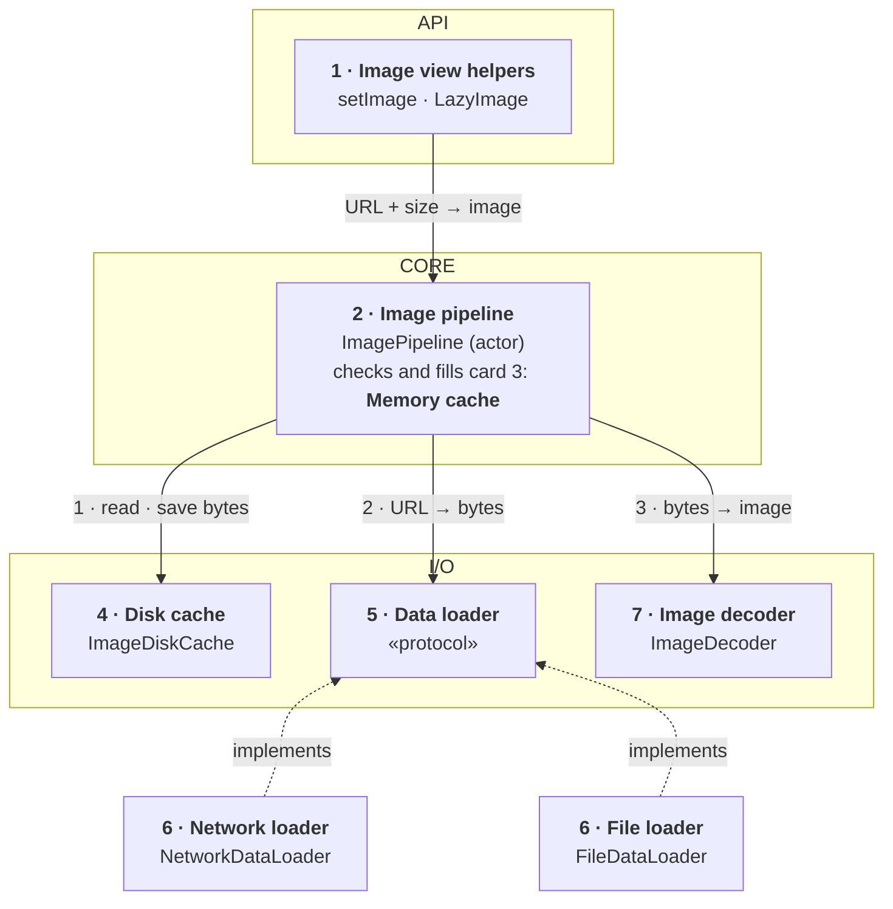
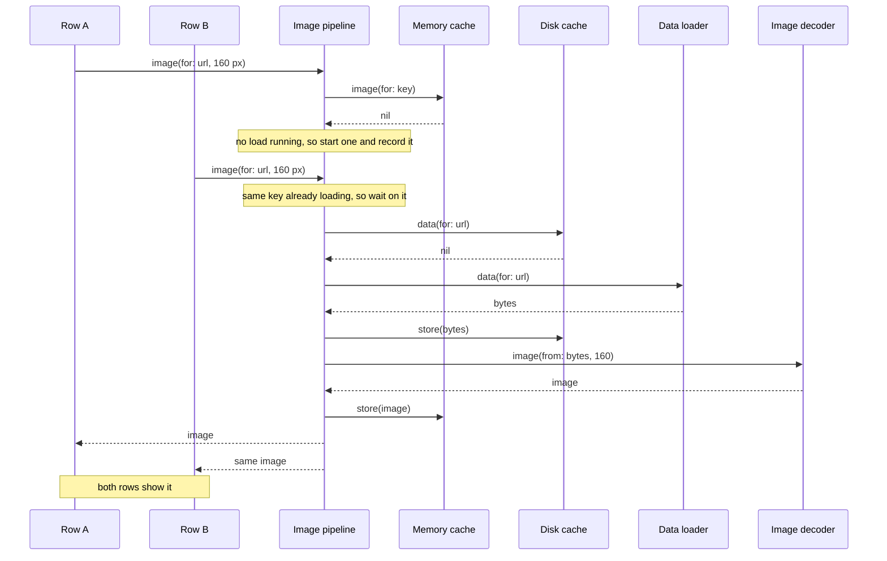

*A recurring senior mobile prompt in first-hand interview reports. The public exercise interviewers draw their wording from is weeeBox's image-library brief, which also publishes the grading criteria used below.*

> **Interviewer:** "We show a lot of images — feeds, avatars, a photo grid. I'd like you to design the image loading library we'd build for that. Something in the spirit of Kingfisher or Nuke. Where would you start?"

## Run it as a round, not as reading

Set a timer. Stand up. Sketch on paper or an iPad. Talk the whole time — silence is the thing that fails these rounds. **Do not open a section until its slot is over.**

| Clock | Phase | What you do |
|---|---|---|
| 0:00–0:02 | The prompt | Repeat it back in one sentence and say what you're going to do with the time |
| 0:02–0:07 | Clarify | Ask; then open section 1 only after you've asked yours, and take its answers as the interviewer's |
| 0:07–0:12 | Scope | Out of scope first, then 3–5 functional, then the non-functional ones that matter |
| 0:12–0:24 | High level | Say the idea (1 min) · list the components (2) · sketch them (4) · explain each (4) · trace one request (1) |
| 0:24–0:40 | Deep dives | The interviewer picks; sections 9–11 are the three they pick from |
| 0:40–0:45 | Follow-ups and recap | Whatever they still probe, then the 60-second summary; the question bank afterwards |

## What this question is really testing

It looks like a question about caching. It isn't, quite.

- **Can you find the axis?** Every decision here trades **memory ↔ disk ↔ CPU ↔ bandwidth**. A candidate who names that axis in the first five minutes has already passed the framing part.
- **Do you know what a decoded image costs?** Width × height × 4 bytes, regardless of file size. Everything about memory follows from that one fact, and it's the most common gap.
- **Can you design components with reasons?** They will ask why these types and not fewer. This is where SOLID earns its keep — not as vocabulary, but as four or five sentences about what would change and what wouldn't.
- **Do you think about the same image twice?** Two cells, one URL. Dedupe of in-flight work is the concurrency content of this question and the thing most answers miss.
- **Do you know when to stop?** `AsyncImage` and `NSCache` are legitimate answers for a small app. Saying so, with the condition attached, reads as senior. Building a pipeline for a settings screen does not.

**Traps:** drifting into CDN and backend design; describing a cache with no eviction; forgetting cancellation entirely; naming Kingfisher's features instead of designing; decoding on the main actor without noticing.

::: Words used in this chapter
Plain definitions for the technical words this chapter uses. Read once; come back when a word stops you.

- **URL** — the web address of a picture.
- **Library** — reusable code other parts of the app call; here, the code that loads every picture in the app.
- **Pixel** — one coloured dot on the screen. A picture's size in pixels is how many dots wide and tall it is.
- **Decode** — a picture arrives compressed (a JPEG or HEIC file); decoding unpacks it into pixels the screen can draw. Unpacked, it's many times bigger: width × height × 4 bytes.
- **Memory vs disk** — *memory* is the phone's fast, small working space, emptied when the app closes; *disk* is its slower, larger storage that survives.
- **Cache** — a kept copy of something fetched before, so it's instant next time. *Eviction* is throwing old entries out when it's full.
- **CDN** — a network of servers that keep copies of files close to users; this one can also resize a picture before sending it.
- **Main thread** — the single lane that draws the screen. Slow work there (like decoding) freezes scrolling, so it's done elsewhere.
- **Actor** — a part that handles one request at a time, so two requests can never trample the same data.
- **Protocol** — a written promise of what a part can do, without how. Anything that keeps the promise can be plugged in.
- **Cancel** — stopping work nobody needs any more, such as a download for a row that scrolled away.
- **Prefetch** — fetching pictures just before they come into view, so they're already there.
- **Offline** — no internet connection.
:::

::: 1 · The interviewer answers your clarifying questions
Ask yours first. These are the answers you'd get, and the assumptions the rest of this chapter runs on.

**"Is this a library for one app, or an SDK other teams adopt?"**
→ *One app to start, but shaped so it could be extracted as a package later.*

**"Where do images come from — network only?"**
→ *Network mostly, but also files on disk and a few bundled assets. The public version of this exercise wants all three.*

**"Who consumes them? Views only, or code too?"**
→ *`UIImageView` and SwiftUI, and occasionally non-UI code that wants the image to share or export.*

**"What's the heaviest screen?"**
→ *A grid of thumbnails you can fling through, plus full-screen detail views.*

**"Can the server resize? Is there a CDN with a width parameter?"**
→ *Yes, assume `?w=` works and the CDN sends `ETag` and `Cache-Control`.*

**"Do images need to show offline?"**
→ *Yes. Anything the user has seen should still appear with no network.*

**"Anything sensitive in these images?"**
→ *Not today. Ask me again at the end.* (They will.)

**"What are we optimising — smoothness, data, battery?"**
→ *Scrolling must stay smooth on a three-year-old phone, and we've had memory-pressure kills in the field.*
:::

::: 2 · Requirements and scope — what you should have said
**Out of scope, stated first, before any design:** animated GIF/APNG playback, video thumbnails, editing and filters beyond resize, placeholder and transition animations (the caller owns those), plug-in loaders for arbitrary formats, and everything server-side beyond "there is a CDN with a width parameter". Progressive JPEG is a stretch goal if time allows.

**Functional — five, no more**

1. Load an image by URL from network, file or bundle, into a view or back to a caller.
2. Downsample to the size it will actually be displayed at.
3. Cache in memory and on disk; previously seen images appear offline.
4. Cancel automatically when a view stops needing the image — cell reuse, disappearance.
5. Prefetch ahead of the scroll position.

**Non-functional that matter here**

- **Memory** — decoded bitmaps are what gets the app killed. Budget them explicitly.
- **Main-thread time** — no decode and no disk I/O on the main actor; the scroll holds its frame rate.
- **Bandwidth and battery** — never fetch the same bytes twice; honour Low Data Mode.
- **Correctness** — a reused cell never shows another row's image.
- **Testability** — every I/O boundary behind a protocol.

Then say the axis out loud: *"Everything from here is memory against disk against CPU against bandwidth. I'll keep naming which one each choice spends."*
:::

::: 3 · The idea, in 30 seconds — before you draw anything
Say the whole design in plain words first:

> *"A view asks for an image by URL and by the size it will show it at. One coordinator checks a memory cache first; if the image is already being loaded for someone else, it waits for that load instead of starting another. Otherwise it gets the bytes from a disk cache or the network, shrinks them to the display size off the main thread, and keeps the result in memory. It's a library, not an app, so three layers of its own: the API callers touch, the core that coordinates, and the I/O that does the work."*

Then the axis, in one sentence: *"Every choice here trades memory against disk against CPU against bandwidth."*
:::

::: 4 · What we need — the components, before the sketch
List them out loud, in the order you'll draw them. Name each by **what it does**, not by its class name; the type name is a detail you mention while explaining it.

| # | Component | Type name | Layer | Its one job |
|---|---|---|---|---|
| 1 | **Image view helpers** | `setImage` · `LazyImage` | API | The one line a screen calls to say "show this picture here". Calls it off if the row scrolls away. |
| 2 | **Image pipeline** | `ImagePipeline` | Core | The dispatcher: is the picture ready, is someone already fetching it, or send someone. |
| 3 | **Memory cache** | `ImageMemoryCache` | Core | A small, fast shelf of ready-to-show pictures in the phone's memory. Lives inside the dispatcher. |
| 4 | **Disk cache** | `ImageDiskCache` | I/O | A bigger, slower drawer of downloaded files on the phone, so seen pictures show offline. |
| 5 | **Data loader** (protocol) | `DataLoader` | I/O | The job description "get the file at this address", written once for every source. |
| 6 | **Network and file loaders** | `NetworkDataLoader` · `FileDataLoader` | Sources | The two workers who do that job: one downloads from the internet, one reads from the phone. |
| 7 | **Image decoder** | `ImageDecoder` | I/O | Unpacks the downloaded file into a picture the screen can draw, at the size it's shown. |

And what's deliberately **not** on the list yet: prefetching, revalidation, Low Data Mode, the disk index. *"I'll add those if we go there."*
:::

::: 5 · The sketch


Each card is **what it does** in bold, with the type name underneath.

**How to read the arrows.** A solid arrow means *asks*: it points from the part that asks to the part that answers, which is also the direction of dependency. Its label reads **request → reply**, so the data coming back travels the other way along the same arrow. The dashed arrow means *implements*. Section 7 replays the same flow step by step. The numbers are the order on a memory miss: look on disk (and save there after a download), download, decode.

**Drawing it on Miro, step by step** (about four minutes, talking the whole time):

1. Three wide frames stacked top to bottom: **API**, **Core**, **I/O**. Label them first.
2. Fill them in the order of your list, one card per component: blue for what callers touch, purple for the core, green for I/O, orange for the network.
3. Write the memory cache *inside* the pipeline card (the pipeline owns it and checks it first), then number the pipeline's three arrows as you draw them, labelled **request → reply**. That numbering *is* the algorithm on a memory miss: bytes from disk if they're there, otherwise download them and save them to disk, then decode them into an image, which goes into the memory cache and back up to the view.
4. Write «protocol» on the data loader card, put the two loaders under it, and draw a dashed "implements" arrow from each **up** to it. The pipeline depends on the protocol, and so do the loaders; the pipeline never points at a concrete loader. That's dependency inversion on the board. That's the one seam worth drawing: a new image source is a new card under it, never a change to the pipeline. *"The caches and the decoder are behind protocols too, for tests."*

Seven cards, three frames, six arrows. Methods stay off the board; they come up when the interviewer asks about a component, which is the next section.
:::

::: 6 · Each component: its job, its interface, the choice inside it
Point at each card and cover three things: **what it owns**, **its interface** (what others can call), and **the choice you made inside it**. The *Under the hood* notes are for learning; they're what lets you answer the follow-up.

First, the one value every component passes around:

```swift
struct ImageRequest: Hashable, Sendable {
    let url: URL
    /// The size it will be shown at, in pixels; nil = full size
    let targetPixelSize: CGSize?
    /// Visible rows high, prefetch low
    let priority: Priority
    /// False for prefetch, so Low Data Mode skips it
    let allowsConstrainedNetwork: Bool
}
```

### 1 · Image view helpers (`setImage`, `LazyImage`)

**In plain words:** the single line a screen calls to say "show the picture at this address, at this size, here". If the row it was for scrolls away before the picture arrives, it calls the job off so no time is wasted.

**Owns:** the link between one view and its current request.

**Interface:**

```swift
extension UIImageView {
    /// Nil cancels and clears
    @MainActor func setImage(_ request: ImageRequest?)
}

struct LazyImage: View {
    /// SwiftUI; reloads when request changes
    init(request: ImageRequest)
}
```

**The choice inside it:** both are thin. `setImage` reads the memory cache straight away, so a cached image appears in the same frame with no flicker, and remembers its request so a reused row can cancel it. When a load finishes, it checks the result is for the row's *current* request before showing it. That check stops the classic wrong-image-in-a-reused-row bug.

> **Under the hood.** *In plain words:* calling off a job only leaves the worker a note saying "stop"; the worker may finish before reading it. So the screen also checks that the picture it receives is still the one it wants.
>
> *The detail:* Cancelling in Swift concurrency is *cooperative*: cancelling a task only sets a flag, and the work stops at its next check. So a result can still arrive after you cancelled, which is why the "is this still my request?" check is needed on top of cancelling. SwiftUI's `.task(id:)` gives you both for free: it cancels the old task and starts a new one whenever the id changes.

### 2 · Image pipeline (`ImagePipeline`)

**In plain words:** the dispatcher every request goes through. It checks whether the picture is already on the ready shelf, whether someone is already fetching that same picture (then it simply waits for them), and otherwise sends someone to get it.

**Owns:** the coordination: which images are cached, which are loading, who is waiting for each.

**Interface:**

```swift
protocol ImagePipelineType: Sendable {
    func image(for request: ImageRequest) async throws -> UIImage
}

protocol ImagePrefetchingType: Sendable {
    /// Rows about to appear, low priority
    func prefetch(_ requests: [ImageRequest])
    /// Rows the user flung past
    func cancelPrefetch(_ requests: [ImageRequest])
}
```

**The choices inside it:** it's an **actor** that does bookkeeping only, never decoding, or every decode in the app would queue behind it. Prefetching is a **separate protocol**, so a detail screen showing one image doesn't depend on it. The core call is `async throws`, so cancelling comes free with the calling task, and non-UI code (share, export) and tests use the same path.

> **Under the hood.** *In plain words:* an actor is like a desk clerk who serves one person at a time, so two people never scribble on the same form at once. But while the clerk is on hold on a phone call, the next person in line may step up, so the clerk writes "already being handled" on the board *before* picking up the phone.
>
> *The detail:* An *actor* is an object that runs one piece of its code at a time, so its data can't be changed by two threads at once. The catch is *re-entrancy*: whenever the actor waits (an `await`), other callers may run. So "check the table, wait for a download, then write the table" is not safe: two callers can both check before either writes. The fix, recording the running load *before* waiting, is deep dive 9.

### 3 · Memory cache (`ImageMemoryCache`, inside the pipeline)

**In plain words:** a small, fast shelf of pictures ready to show, kept in the phone's working memory. It has a fixed size; when it's full, the picture unused the longest is thrown out to make room.

**Owns:** decoded, ready-to-draw images.

**Interface:**

```swift
protocol ImageMemoryCacheType: Sendable {
    /// Fast, safe to call from the main thread
    func image(for key: ImageKey) -> UIImage?
    /// Cost = the image's bytes
    func store(_ image: UIImage, for key: ImageKey)
    /// On memory warning
    func removeAll()
}
```

**The choice inside it:** a least-recently-used cache with a **byte budget**, keyed by URL **plus pixel size**. *Rejected:* `NSCache`, a fine answer for one image screen, but its eviction order is undocumented and you can't remove one URL at every size. *Switch condition:* one screen, no purging by URL.

> **Under the hood.** *In plain words:* a shelf with a fixed size: when it's full, the item nobody has touched for the longest goes first.
>
> *The detail:* *LRU* (least recently used): when the cache is full, throw out what was used longest ago. It's built from a dictionary (find by key) plus a linked list ordered by use (find the oldest), so both are instant. The budget is in **bytes**, not item count, because one full-screen image can cost as much as a hundred thumbnails.

### 4 · Disk cache (`ImageDiskCache`)

**In plain words:** a bigger but slower drawer on the phone's storage that keeps the downloaded files themselves. Pictures you've seen before come from here instead of the internet, which is also how they still appear offline.

**Owns:** downloaded, still-compressed bytes on disk.

**Interface:**

```swift
protocol ImageDiskCacheType: Sendable {
    func data(for url: URL) async -> Data?
    func store(_ data: Data, for url: URL) async
    /// Evict oldest, off the launch path
    func trim(toBytes limit: Int) async
}
```

**The choice inside it:** compressed bytes, keyed by **URL alone**, in `Library/Caches`. *Rejected:* `URLCache`, which obeys the server's cache headers, so `max-age=300` would mean "offline after five minutes".

> **Under the hood.** *In plain words:* pictures are kept on the phone in their small, packed form and unpacked only when shown, like clothes kept vacuum-packed in a drawer and shaken out when you wear them.
>
> *The detail:* Compressed bytes (JPEG, HEIC) are 10–50 times smaller than the decoded image, and decoding is fast next to downloading, so disk stores bytes and memory stores images. Files are named by a hash of the URL (so any URL makes a safe file name) and written *atomically*: to a temporary file, then renamed, so a crash never leaves half an image.

### 5 · Data loader, the protocol (`DataLoader`)

**In plain words:** a job description: "given an address, bring back the file". It's written once, so anything that can do that job (the internet, the phone's own storage, a test) can be plugged in.

**Owns:** nothing. It's the promise every source makes.

**Interface:**

```swift
protocol DataLoader: Sendable {
    func data(for url: URL) async throws -> Data
}
```

**The choice inside it:** it's the one protocol drawn on the board, because it's where the library grows. A new source (the Photos library, test fixtures) is a new conformance, never a `switch` inside the pipeline.

> **Under the hood.** *In plain words:* this card is **dependency inversion**. Think of a dispatcher hiring delivery drivers. The dispatcher (the pipeline) writes one **job description**, "given an address, bring back the file", and hires only against that. The drivers (the network and file loaders) each promise to fit the description; that's the dashed arrow pointing **up** at it. The dispatcher never needs to know which driver turned up, so you can add a new driver (the Photos library, a test driver with fake files) without changing the dispatcher at all. In one line: *the dispatcher depends on a job description, not on any particular driver, and every driver depends on the same description.*
>
> *The detail:* the pipeline (core) holds a `DataLoader`, never a `NetworkDataLoader`; the concrete loaders are created once when the library is set up and handed in. The dependency arrows all point at the protocol, so the core never imports networking or file code, and a test can pass a loader whose response it controls.

> **Under the hood.** *In plain words:* every worker hired for the same job must behave the same way (stop when told, never hand over half a file) or the people relying on them get surprises.
>
> *The detail:* A protocol's contract is more than its signature. Every loader must also **stop when cancelled**, **never return half the bytes**, and be **safe to call from several tasks at once**. A loader that ignores cancellation still compiles, but breaks every caller that relies on it: that's the *Liskov substitution principle* in practice. Write the promises in the protocol's comment, and run the same tests against every loader.

### 6 · Network and file loaders (`NetworkDataLoader`, `FileDataLoader`)

**In plain words:** the two workers who do that job: one downloads files from the internet, the other reads files already on the phone or packed inside the app.

**Owns:** one source each.

**Interface:** both conform to `DataLoader`; nothing else is public. They differ only in what they're built from: `NetworkDataLoader(session: URLSession)`, `FileDataLoader(fileManager: FileManager)`.

**The choice inside it:** the network loader asks the CDN for a resized image (`?w=`), rounding the width up to a few buckets (160, 320, 640, 1280) so neighbouring sizes share one cached copy.

> **Under the hood.** *In plain words:* a chain of nearby warehouses that keep copies of each picture and can cut it down to size before sending it, so the phone downloads less.
>
> *The detail:* A *CDN* is a network of servers that keep copies of files close to users. One that can resize on request means the phone downloads a 640-pixel image instead of a 4000-pixel original: less data, less memory, less decoding. Rounding widths into buckets keeps the number of distinct copies small, so they're more likely to be cached.

### 7 · Image decoder (`ImageDecoder`)

**In plain words:** a downloaded picture is a compressed file, like a zipped folder. The decoder unpacks it into the grid of coloured dots the screen draws, and shrinks it to the size it will be shown while doing so.

**Owns:** turning compressed bytes into a drawable image.

**Interface:**

```swift
protocol ImageDecoderType: Sendable {
    func image(from data: Data, maxPixelSize: CGFloat?) async throws -> UIImage
}
```

**The choice inside it:** decode **directly at the display size** with ImageIO, off the main thread, and decode immediately rather than at first draw. Details in deep dive 10.

> **Under the hood.** *In plain words:* a packed photo might be 2 MB, but unpacked into dots for the screen it's about 49 MB. Shrinking it while unpacking means the big version never exists on the phone.
>
> *The detail:* A decoded image costs **width × height × 4 bytes** (one byte each for red, green, blue, transparency), whatever the file size. A 4032 × 3024 photo is a 2 MB JPEG but 49 MB decoded; at 300 × 300 pixels it's 0.36 MB. Shrinking during decoding means the large version never exists in memory.

### Why these seven, and not one ImageManager

Each changes for a different reason: the loader with the transport, the decoder with the format, the caches with the eviction policy, the pipeline with the coordination rules. One `ImageManager` would be touched by all of them. *"I split where the reasons to change differ, not per noun."*
:::

::: 7 · One request through the sketch
Trace one request across the cards, the case where two rows want the same avatar at once:



In words: one download and one decode serve both rows. Solid arrows are requests, each a method from the interfaces in section 6; dashed arrows are the replies, the data flowing back: bytes up from disk or network, an image up from the decoder, and finally the image to both rows.
:::

::: 8 · The server contract and the two keys
**The server contract.** Nothing of our own: `GET https://img.example.com/{id}?w={pixels}`, returning `ETag` and `Cache-Control` headers. The client rounds width up into buckets so neighbouring sizes share a CDN entry and a disk entry.

**The two keys, the detail most answers miss.**

```swift
/// Memory cache + running loads
struct ImageKey: Hashable { let url: URL; let pixelSize: CGSize? }
// the disk cache and the loaders key on the URL alone
```

Bytes don't depend on the display size, so downloads and disk entries are shared by URL. A decoded image is only reusable at the size it was decoded for, so the memory cache keys on URL + size. Two rows showing one avatar at 80 and 300 points share a download and get two decodes.

**What's stored.** Memory: key → image and its byte cost. Disk: one file per URL, named by its SHA-256 hash, in `Library/Caches/Images/`, plus a small index of size, last use and `ETag` for eviction and revalidation.
:::

::: 9 · Deep dive — "Two cells show the same avatar. Walk me through it."
**Decision: an actor holds a dictionary of in-flight `Task`s keyed by `ImageKey`; callers join; the work is cancelled only when the last subscriber leaves.**

Say it as four steps, pointing at the pipeline card (section 7 draws exactly this):

1. **Check memory.** A hit returns at once.
2. **Look for a load already running for this key.** The pipeline keeps a small table: key → the running load and how many callers are waiting on it. If there's an entry, add one to the count and wait on that same load.
3. **Otherwise start a load and put it in the table straight away**, before waiting on anything.
4. **When a caller goes away** (its cell scrolled off), take one off the count. Only when nobody is left waiting is the load cancelled. When the load finishes, success or failure, its entry is removed.

**Why step 3 says "straight away" — the whole trick.** The pipeline is an actor, and an actor lets other callers in every time it waits. The naive version (check the cache, wait for the download, then store the result) leaves a gap: two callers both find nothing, both wait, both download. Recording the *running load* before waiting closes the gap, because the second caller finds it in the table. And the entry must be removed on failure too, or one failed load blocks that image forever.

*Alternative rejected: cancel the shared work when any caller cancels.* Simpler and wrong — cell A scrolls away and kills the download cell B is still waiting for. *Alternative rejected: never cancel shared work.* Wastes bandwidth exactly during a fast fling, when requests pile up.

*Switch condition:* if profiling showed duplicate URLs are rare on screen, the subscriber count is complexity for nothing; plain per-caller cancellation is fine. A nice middle: on last unsubscribe let the **download** finish into the disk cache and cancel only the **decode**.

**Where each piece runs.** `setImage` is `@MainActor` and reads the memory cache synchronously, so a hit paints in the same frame with no flicker. The pipeline actor does bookkeeping only — it must never decode, or every decode in the app serialises behind one executor. Decoding is `@concurrent`, because since SE-0461 a plain `nonisolated async` function runs on the caller's actor: "it's async" no longer means "it's off the main thread", so the hop has to be asked for.

**Cell reuse is a cancellation problem, not a caching one.** `setImage` keeps the current `Task` on the view; a new call or `prepareForReuse` cancels it. On completion the view checks the request it finished for is still its current one, because cancellation is cooperative and a late result can still arrive. That check is what stops the wrong-image-in-a-reused-cell bug. SwiftUI's `.task(id: request)` gives you both behaviours for free.
:::

::: 10 · Deep dive — "This grid gets the app killed on an iPhone 12. Why?"
**The fact the rest rests on:** memory cost comes from pixel dimensions, not file size. A decoded 8-bit RGBA bitmap costs width × height × 4 bytes. A 4032 × 3024 photo that's 2 MB as a JPEG is about 49 MB decoded. Twenty of those at full size is the kill.

**Decision: decode straight to display size with ImageIO; never decode full-size and then scale.**

ImageIO can produce a thumbnail directly from the compressed bytes, at a maximum pixel size you give it, so the full-size bitmap is never created. Three settings matter, and they're worth naming:

- **Don't keep a full-size copy** in ImageIO's own cache.
- **Decode now**, here, off the main thread, not lazily the first time the image is drawn (which would happen on the main thread, mid-scroll).
- **Apply the photo's orientation** while shrinking, so portrait photos don't come out sideways.

The first two are the difference between a smooth scroll and a hitch. (The API is `CGImageSourceCreateThumbnailAtIndex`; naming it is enough, nobody will ask for the option keys.)

*Alternative rejected:* redrawing through `UIGraphicsImageRenderer` — it decodes the full image first, so peak memory is the full bitmap. *Also available:* `UIImage.byPreparingThumbnail(ofSize:)` and `byPreparingForDisplay()` (iOS 15) do this with far less code. *Switch condition:* if you don't need EXIF-transform control or exotic formats, use them and own less code. Sizes must be in **pixels** — points × `displayScale` — which is why the request carries a pixel size the view computes.

**Decision: a custom LRU memory cache with a byte budget**, costed by `bytesPerRow × height` of the decoded image. Budget a fraction of what the process may use (sample `os_proc_available_memory()` at launch, take 15–20%, cap it). Purge on `didReceiveMemoryWarningNotification`; trim on background.

*Alternative rejected: `NSCache`.* Thread-safe, reacts to memory pressure by itself, and an entirely respectable answer. Its costs: eviction order is undocumented, you can't enumerate it to purge one URL at every size, and it's widely observed to empty itself on backgrounding — behaviour that isn't documented, so you can't design around it. *Switch condition:* one image screen, no need to purge by URL → `NSCache` with a `totalCostLimit`, and say so out loud.

**"Why cache decoded images at all, when the disk has the bytes?"** Because a disk read plus a decode is milliseconds of CPU per image, and scrolling back up the feed must paint in the same frame. Memory buys CPU and smoothness — the axis again.
:::

::: 11 · Deep dive — "Why not just use URLCache?"
**Decision: own a disk cache of encoded bytes, keyed by SHA-256 of the URL, in `Library/Caches`, with a size cap and LRU eviction driven by a small index.**

- **Encoded, not decoded.** Bytes are 10–50× smaller than the bitmap, and decoding is cheap next to the network. Storing bitmaps trades a lot of disk for a little CPU — the wrong direction on a phone.
- **Atomic writes.** Write to a temp file and rename (`Data.write(to:options: .atomic)`), so a kill mid-write leaves the old file or nothing, never a truncated JPEG that fails forever.
- **LRU needs its own index.** File access dates aren't a dependable "recently used" signal, so keep `hash → (bytes, lastAccess, etag)` in a small file or SQLite, updated in memory and flushed in batches.
- **Sweep off the launch path.** Enforce the cap (150–300 MB) on background entry or a low-priority task, never during start-up.
- **`Library/Caches` is not backed up and the system may purge it** — correct for a cache, and the code must treat any file as possibly gone.

*Alternative rejected: `URLCache`.* Free, handles HTTP semantics, and Nuke's default loader leans on it. It loses here because it obeys the server: a CDN sending `max-age=300` means "offline after five minutes", which breaks functional requirement 3. It also gives no control over eviction, can't purge one URL, and covers network sources only. *Switch condition:* if you control the cache headers and offline display isn't required, `URLCache` with a large `diskCapacity` is the better answer — less code, correct revalidation for free. Say that it's a judgement call, not a rule.

**Revalidation.** Store the `ETag`; past a freshness window, show the disk copy immediately and revalidate in the background with `If-None-Match`. A 304 just touches the index. Stale-while-revalidate, client-side.
:::

::: 12 · Failure modes and 10×
- **Offline.** Disk hits work; misses fail fast with a typed error the view maps to a placeholder. Don't retry into a dead network — watch `NWPathMonitor` and let the view re-request when the path returns.
- **Errors and retries.** One retry with jittered backoff for transient failures (timeout, connection lost, 5xx); none for 4xx. Remember 404s briefly in memory so a broken URL isn't refetched on every scroll.
- **Races.** Duplicate work: the in-flight dictionary. Late result into a reused cell: the current-request check.
- **Corrupt bytes.** Decode returns nil → delete the disk entry, refetch once, then give up. Never loop on a file that will never decode.
- **Memory pressure.** Memory warning purges the cache; in-flight decodes for visible cells finish. MetricKit's exit reasons tell you if you're being killed in the field; the first knob is the budget, the second the width buckets.
- **Killed mid-operation.** Atomic writes keep the disk consistent; the index may lag, so the next sweep reconciles — orphan files deleted, entries without files dropped.
- **Low Data Mode.** Prefetches set `allowsConstrainedNetworkAccess = false` and simply don't run on a constrained path; visible requests still load at a smaller bucket. A failure with `networkUnavailableReason == .constrained` becomes tap-to-load.
- **Too many requests at once.** A fling issues dozens. Cap per-host connections and give visible requests priority over prefetches; decodes run on the cooperative pool, already sized to the cores.

**At 10×** — ten times denser grid, or ten times more images per session:
- Memory: the budget is fixed by the device, so hit rate falls. Smaller buckets for thumbnails; cache fewer sizes per URL.
- Disk: the index moves to SQLite so eviction is a query rather than a full load.
- CPU: decode becomes the bottleneck on older devices. Prefetch decodes one screenful ahead, bytes further ahead.
- Bandwidth: the CDN width parameter carries almost all of it. The client's job is to ask for the smallest bucket that still looks sharp.
:::

::: 13 · Question bank — everything they can push on
Grouped by the checklist from the first chapter. Read the question, answer it out loud, *then* open it. Each area ends with a follow-up chain, because a real interviewer doesn't change topic after your first answer; they go one level deeper.

### Clarify and scope

<details>
<summary>"Where would you start?"</summary>

Questions first: one app or an SDK, which sources (network, file, bundle), who consumes images (views and code), the heaviest screen, whether the CDN can resize, offline needs. Then out of scope first (GIFs, video, editing, transitions), then five features.
</details>

<details>
<summary>"Why not just use Kingfisher or Nuke?"</summary>

In a real team I'd start there: they're mature and cover this design. The exercise is to show I understand what they do. Reasons to own it: a size or dependency budget, an SDK that can't impose a dependency, or needs they don't meet.
</details>

<details>
<summary>"Why not AsyncImage?"</summary>

No memory cache you control, no downsampling, no prefetch, no dedupe across views. Fine for a settings screen, not for a grid you fling through.
</details>

<details>
<summary>"What are you optimising?"</summary>

Memory, disk, CPU and bandwidth trade against each other, and every choice spends one of them. The two hard requirements given: smooth scrolling on an old phone and no memory-pressure kills.
</details>

<details>
<summary>Follow-up chain: "Smallest version."</summary>

1. *"You have two days. What do you build?"* → A memory cache, downsampling, and cancel on reuse.
2. *"Why those three?"* → They carry smoothness and the memory kills. Everything else is efficiency.
3. *"What comes next, in order?"* → Disk cache (offline), then prefetch, then in-flight dedupe.
</details>

### Architecture and components

<details>
<summary>"Walk me through the components."</summary>

The API layer (view helpers and an async call), one pipeline actor that coordinates, and I/O underneath: a disk cache, a data loader per source, and a decoder. Four types plus the thin API.
</details>

<details>
<summary>"Why not one ImageManager?"</summary>

Each type changes for a different reason: the loader with the transport, the decoder with the format, the cache with the eviction policy, the pipeline with the coordination rules. One class would be touched by all four changes.
</details>

<details>
<summary>"Where is dependency inversion?"</summary>

The pipeline depends on loader, cache and decoder protocols; the concrete types are created once at the composition root and injected. That's what lets a test hold a download open to test dedupe.
</details>

<details>
<summary>"How do you add a new image source, say the Photos library?"</summary>

A new conformance to the loader protocol and one line in the composition root. The pipeline doesn't change; there's no `switch` over sources to grow.
</details>

<details>
<summary>"Why is the pipeline an actor and not a class with a lock?"</summary>

Its coordination is async (it awaits loads), and a lock can't be held across an `await`. The actor serialises the bookkeeping without blocking a thread.
</details>

<details>
<summary>"Is prefetching part of the main protocol?"</summary>

No, its own small protocol. A detail screen showing one image shouldn't depend on prefetching, or have to fake it in tests.
</details>

<details>
<summary>Follow-up chain: "Make it an SDK."</summary>

1. *"Other teams want to adopt this. What changes?"* → A Swift package with a small public surface: the request type, the async call, the view helpers.
2. *"How do they customise it?"* → They inject their own loader, cache or decoder through the same protocols, so the seams become the extension points.
3. *"What do you guarantee?"* → The protocol contracts in writing: loaders honour cancellation, never return partial data, are safe to call concurrently. And a shared test suite every conformance must pass.
</details>

### API and keys

<details>
<summary>"Design the public API."</summary>

An `ImageRequest` (URL, target pixel size, priority, whether constrained networks are allowed), an `async throws` call that returns an image, a separate prefetch protocol, and thin `UIImageView` and SwiftUI helpers on top.
</details>

<details>
<summary>"Why async/await at the core and not callbacks?"</summary>

Cancellation comes free with task cancellation, non-UI callers use the same path, and tests call it directly with no view.
</details>

<details>
<summary>"What's the cache key?"</summary>

Two keys. Bytes (disk and network) key on the URL, because they're the same at any display size. Decoded images (memory and in-flight decodes) key on URL plus pixel size.
</details>

<details>
<summary>"Why does the request carry a pixel size?"</summary>

The decoder needs it to downsample, and it must be pixels (points × screen scale), which only the view knows.
</details>

<details>
<summary>"What does the server need to provide?"</summary>

A width parameter on the CDN, and `ETag` / `Cache-Control` headers. The client rounds widths up into a few buckets so neighbouring sizes share one cache entry.
</details>

<details>
<summary>Follow-up chain: "Same URL, two sizes."</summary>

1. *"Same URL on screen at 80 and 300 points. What happens?"* → One download, two decodes, two memory entries, one file on disk.
2. *"Could you decode once?"* → Decode the larger and scale down for the smaller, but that holds a bigger bitmap and costs a redraw. Usually not worth it.
3. *"When is it?"* → When the two sizes are close: then round both to the same width bucket and they share everything.
</details>

### Caching

<details>
<summary>"Memory cache: NSCache or your own?"</summary>

My own LRU with a byte budget, so I control eviction order, can purge one URL at every size, and can cost entries in bytes. NSCache is a respectable answer for a single image screen: thread-safe and pressure-aware.
</details>

<details>
<summary>"How big is the memory cache?"</summary>

A fraction of what the process may use, about 15–20% of `os_proc_available_memory()` at launch, capped. Costed by the decoded bitmap's bytes, purged on memory warning.
</details>

<details>
<summary>"Why cache decoded images at all if the disk has the bytes?"</summary>

A disk read plus a decode is milliseconds of CPU per image. Scrolling back up must paint in the same frame, so memory buys smoothness.
</details>

<details>
<summary>"Why not URLCache for the disk?"</summary>

It obeys the server's headers, so `max-age=300` means offline after five minutes, and it gives no control over eviction or purging one URL. If I controlled the headers and didn't need offline, URLCache would be the better, smaller answer.
</details>

<details>
<summary>"What do you store on disk?"</summary>

Encoded bytes, not bitmaps: 10–50× smaller. Files named by the SHA-256 of the URL in `Library/Caches`, written atomically, with a small index of size, last access and ETag for LRU eviction.
</details>

<details>
<summary>"How do you keep images fresh?"</summary>

Show the disk copy at once, and past a freshness window revalidate in the background with `If-None-Match`. A 304 only touches the index.
</details>

<details>
<summary>Follow-up chain: "The disk cache is full."</summary>

1. *"The disk cache hits its cap. What happens?"* → Evict least recently used files using the index.
2. *"When does eviction run?"* → On background entry or a low-priority task, never on the launch path.
3. *"The app is killed mid-eviction."* → Writes are atomic, so files are whole or gone; the next sweep reconciles the index with what's actually on disk.
</details>

### Concurrency

<details>
<summary>"Two cells request the same image at once."</summary>

The pipeline keeps a dictionary of in-flight tasks by key. The second caller joins the existing task. Lookup and insert happen with no `await` between them, so it's atomic on the actor.
</details>

<details>
<summary>"A cell scrolls away. What gets cancelled?"</summary>

Its subscription. The shared task is cancelled only when the last subscriber leaves. Optionally let the download finish into the disk cache and cancel only the decode.
</details>

<details>
<summary>"Where does decoding run?"</summary>

On the cooperative pool via a `@concurrent` function, never on the pipeline actor (it would serialise every decode) and never on the main actor. Under SE-0461 (Swift 6.2, when its upcoming feature is on), a plain `nonisolated async` function runs on the caller's actor, so the hop must be asked for.
</details>

<details>
<summary>"How do you stop a reused cell showing the wrong image?"</summary>

The view keeps its current request; a new request or reuse cancels the old task, and on completion the view checks the result is for its current request before assigning it. Cancellation is cooperative, so a late result can still arrive.
</details>

<details>
<summary>"A load fails. What happens to the in-flight entry?"</summary>

The task removes its entry on success and failure alike. Otherwise one failed load poisons that key forever.
</details>

<details>
<summary>Follow-up chain: "The naive version."</summary>

1. *"Why not check the cache, await the download, then insert?"* → Two callers both miss and both download, because an actor is re-entrant at every `await`.
2. *"So how does storing the task fix it?"* → The task is in the dictionary before the first `await`, so the second caller finds it.
3. *"Where else does this bug appear?"* → Anywhere a check and a set have an `await` between them, like a feed's load-more guard.
</details>

### Performance and memory

<details>
<summary>"What does a decoded image cost?"</summary>

Width × height × 4 bytes, regardless of file size. A 4032 × 3024 photo is about 49 MB decoded, though the JPEG is 2 MB.
</details>

<details>
<summary>"How do you downsample?"</summary>

ImageIO's `CGImageSourceCreateThumbnailAtIndex` with a max pixel size, decoding immediately and honouring EXIF orientation, so the full-size bitmap never exists. `UIImage.byPreparingThumbnail(ofSize:)` does it with less code if I don't need the control.
</details>

<details>
<summary>"Why is the decode forced eagerly?"</summary>

Otherwise the image decodes lazily at first render, on the main thread, and that's the hitch.
</details>

<details>
<summary>"The grid gets killed on an iPhone 12. Why?"</summary>

Full-size decodes: twenty 49 MB bitmaps. Downsample to display size, cap the memory cache by bytes, purge on memory warning.
</details>

<details>
<summary>"How do you prefetch?"</summary>

From the collection view's prefetch callbacks, at low priority, cancelled when the user flings past, and off in Low Data Mode. Decode one screen ahead; fetch bytes further ahead.
</details>

<details>
<summary>Follow-up chain: "Still hitching."</summary>

1. *"Decoding is off main and it still hitches. Where do you look?"* → Instruments: Animation Hitches and a signpost around assignment. Maybe the image is still being decoded at render.
2. *"How would that happen?"* → An image that wasn't force-decoded, or one at the wrong pixel size being scaled on render.
3. *"Fix it."* → Decode eagerly to exactly the displayed pixel size, and check sizes are pixels, not points.
</details>

### Networking and failures

<details>
<summary>"How many downloads run at once?"</summary>

Cap concurrent connections per host and give visible requests priority over prefetches, so a fling doesn't queue fifty requests ahead of the cell on screen.
</details>

<details>
<summary>"A URL returns 404."</summary>

No retry for 4xx. Remember the failure briefly in memory so the same broken URL isn't refetched on every scroll.
</details>

<details>
<summary>"The bytes are corrupt."</summary>

The decode fails: delete the disk entry, refetch once, then give up. Never loop on a file that will never decode.
</details>

<details>
<summary>"What happens offline?"</summary>

Disk hits work; misses fail fast with a typed error the view maps to a placeholder. Watch `NWPathMonitor` and let visible views re-request when the network returns.
</details>

<details>
<summary>"What does Low Data Mode change?"</summary>

Prefetches set `allowsConstrainedNetworkAccess = false` and don't run; visible images load at a smaller width bucket.
</details>

<details>
<summary>Follow-up chain: "Flaky network."</summary>

1. *"Requests time out half the time. What do you do?"* → One retry with jittered backoff for timeouts and 5xx.
2. *"Why only one?"* → The user has scrolled on; more retries spend battery on images nobody's looking at.
3. *"And for the image they're looking at?"* → Show the placeholder with tap-to-retry, and re-request when the path improves.
</details>

### Testing, observability and security

<details>
<summary>"How do you test the dedupe?"</summary>

A loader fake whose response the test holds open: fire two requests, assert one load call, release, assert both callers got the same image. Wait by yielding, never by sleeping.
</details>

<details>
<summary>"How do you test cancellation?"</summary>

Two subscribers, cancel one, assert the load continues; cancel the second, assert the loader saw cancellation.
</details>

<details>
<summary>"How do you know it works in production?"</summary>

Signposts around load and decode, hit rates for both caches, MetricKit for hangs and memory-pressure exits, and the cache budget behind a remote flag.
</details>

<details>
<summary>"These are medical scans. What changes?"</summary>

Ask whether caching is allowed at all. Then no disk cache, or one with complete file protection and a Keychain-held key; purge memory on background; no third-party CDN caching.
</details>

<details>
<summary>Follow-up chain: "Cache hit rate dropped."</summary>

1. *"Memory hit rate fell from 80% to 50% after a release. Why?"* → Something changed the key: likely more distinct pixel sizes.
2. *"How do you confirm?"* → Log the distinct sizes requested per URL in a debug build.
3. *"Fix?"* → Round sizes to buckets before they reach the key.
</details>

### Scale and change

<details>
<summary>"Ten times denser grid."</summary>

The memory budget is fixed by the device, so the hit rate falls. Smaller thumbnail buckets and fewer cached sizes per URL; decode one screen ahead, fetch bytes further.
</details>

<details>
<summary>"Add animated GIFs."</summary>

A different decoder conformance that returns frames, and a view that plays them. Cost per GIF is frames × bitmap size, so cap frame count or decode on the fly.
</details>

<details>
<summary>"Add progressive JPEG."</summary>

The loader streams bytes and the pipeline emits intermediate images, so the API returns a sequence rather than one image. That's an API change, which is why I'd leave it out unless asked.
</details>

<details>
<summary>"Millions of images on disk?"</summary>

Move the index to SQLite so eviction is a query rather than loading the whole index.
</details>

<details>
<summary>Follow-up chain: "Video thumbnails."</summary>

1. *"Product wants video thumbnails in the same grid."* → A loader for video that extracts a frame with `AVAssetImageGenerator`, behind the same protocol.
2. *"It's slow."* → Ask the server for a poster image instead; generating frames on device is the fallback.
3. *"Which is the right answer?"* → The server poster: cheaper for every client, and the client code stays one more conformance.
</details>
:::

::: 14 · Scorecard — mark yourself, 0 / 1 / 2
The public exercise this prompt comes from lists what the interviewer grades: clear communication, requirement clarification, practical trade-off analysis, honestly acknowledging what you don't know, and balancing engineering quality against timelines. Those are the first five rows; the rest are specific to this question.

| | Did you… | 0–2 |
|---|---|---|
| 1 | Narrate continuously, and listen when interrupted | |
| 2 | Clarify before designing, and state your assumptions | |
| 3 | Attach a rejected alternative and a switch condition to each choice | |
| 4 | Say plainly where your knowledge ends | |
| 5 | Name a smaller version that would be enough (`AsyncImage`, `NSCache`) | |
| 6 | Say out of scope **first** | |
| 7 | Name the memory ↔ disk ↔ CPU ↔ bandwidth axis | |
| 8 | Give the decoded-bitmap cost formula | |
| 9 | Use two keys: URL for bytes, URL + size for images | |
| 10 | Dedupe in-flight work, and handle cancellation with sharing | |
| 11 | Keep decode off the main actor, explicitly | |
| 12 | Say the idea, list the components, *then* sketch: three layers, about seven cards, one seam | |
| 13 | Land the recap inside 60 seconds | |

13+ is a pass in a real round.<!--private--> Anything scored 0 goes in the progress log and comes back as a recall prompt.<!--/private--><!--public--> A zero is worth more than the total: it names the thing to read about before the next one.<!--/public-->
:::

::: 15 · The 60-second recap
An image library is a set of caches trading memory, disk, CPU and bandwidth. A request carries a URL and the pixel size it will be shown at. An actor-owned pipeline checks a memory cache keyed by URL plus size, then joins any in-flight task for that key so nothing loads twice. On a miss, bytes come from a disk cache keyed by URL alone, or from the network. Decoding happens off the main actor and straight to display size, because a decoded bitmap costs width × height × 4 bytes whatever the file size. The memory cache is an LRU with a byte budget that empties on memory warnings; the disk cache holds encoded bytes with atomic writes and its own index, rather than trusting `URLCache`, because offline display can't depend on the server's cache headers. Cell reuse is cancellation: a view cancels its subscription, shared work stops only when nobody is waiting, and a late result is dropped if the cell has moved on. Four types — loader, decoder, cache, pipeline — because each has its own reason to change, and everything crosses a protocol so the pipeline can be tested with doubles.
:::
