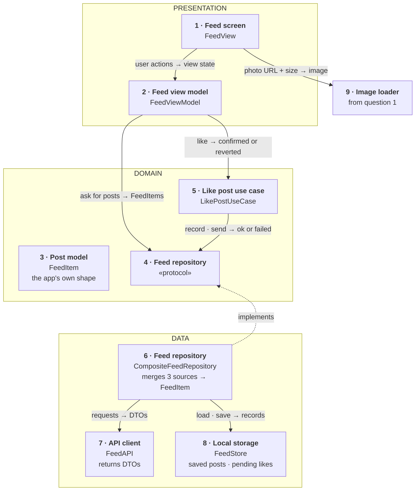
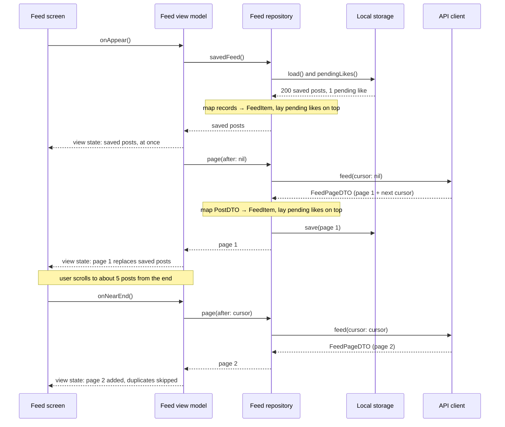
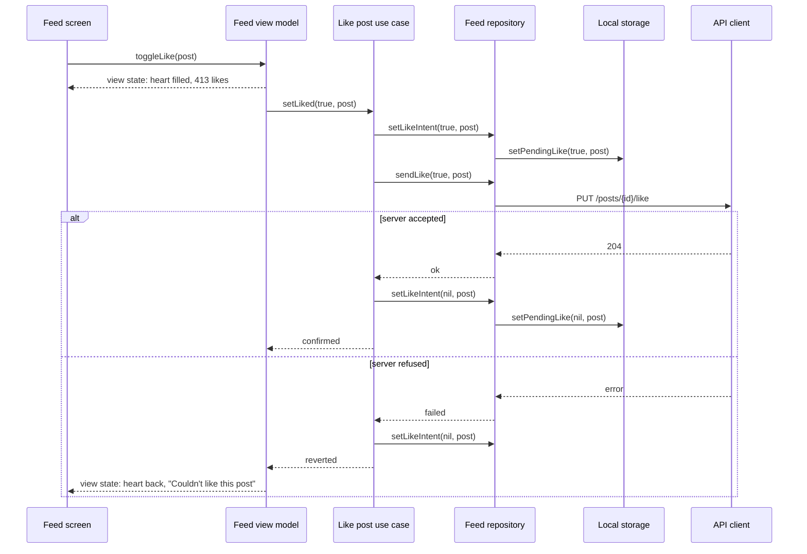
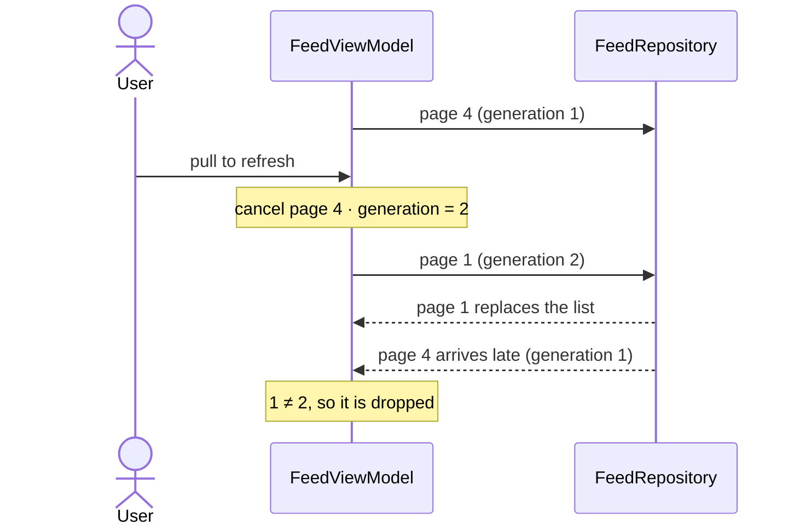
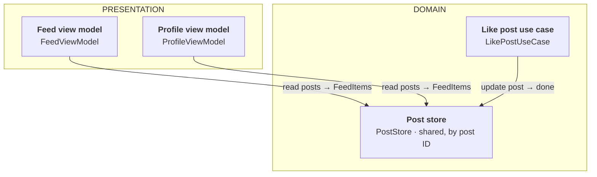

*An image-heavy feed is one of the recurring senior mobile prompts in the first-hand reports collected for this programme. The public corpus interviewers draw on uses a Twitter-style feed as its main worked example, and the pagination advice below matches it: cursors, not offsets.*

> **Interviewer:** "We have a feed of photos — think Instagram's home feed. It scrolls forever. Design the client for me."

## Run it as a round, not as reading

Set a timer. Stand up. Sketch. Talk the whole time. **Do not open a section until its slot is over.**

| Clock | Phase | What you do |
|---|---|---|
| 0:00–0:02 | The prompt | Repeat it back in one sentence and say how you'll use the time |
| 0:02–0:07 | Clarify | Ask yours; then open section 1 and take its answers as the interviewer's |
| 0:07–0:12 | Scope | Out of scope first, then 3–5 functional, then the non-functional ones that matter |
| 0:12–0:24 | High level | Say the idea (1 min) · list the components (2) · sketch them (4) · explain each (4) · trace one request (1) |
| 0:24–0:40 | Deep dives | The interviewer picks; sections 9–11 are the three they pick from |
| 0:40–0:45 | Follow-ups and recap | Whatever they still probe, then the 60-second summary; the question bank afterwards |

## What this question is really testing

It looks like a question about lists. It is a question about **three clocks running at once**: the frame clock (16 ms, or 8 ms on a 120 Hz screen), the network clock (hundreds of milliseconds per page) and the user's thumb, which is faster than both.

- **Do you pick cursor pagination, and can you say why?** Offsets break the moment someone posts while you scroll. This is the single most-checked line in the answer.
- **Do you know the cell's height before the image arrives?** Layout jumps are the visible bug in most feeds, and the fix is in the API, not in the view.
- **Can you keep "load the next page" from firing five times?** That's the concurrency content: a guard that is atomic on the main actor, and a refresh that doesn't race with a page load.
- **Do you treat the image work as solved?** You built it in question 1. Say "the image pipeline from before" and spend the time on the feed.
- **Do you keep it client-side?** Ranking, fan-out and timelines are the server's job. Name them as out of scope in the first minute.

**Traps:** offset pagination; inserting new posts at the top while the user is reading; holding `UIImage`s in the model; a like button that flickers back when the feed refreshes; designing the ranking algorithm.

::: Words used in this chapter
Plain definitions for the technical words this chapter uses. Read once; come back when a word stops you.

- **App, server, API** — the *app* runs on the phone; the *server* is the company's computer that stores every post; the *API* is the agreed set of requests the app may send it (like the forms a counter clerk accepts).
- **Endpoint** — one specific request the API accepts, such as "give me the next posts".
- **Feed, page** — the *feed* is the endless list of posts; it arrives in *pages* of about 20 at a time, so the app never downloads everything at once.
- **Cursor** — a bookmark the server hands back with each page, meaning "you stopped here". The app sends it back to get the page after it.
- **Layer** — a group of parts with the same kind of job. Here: *presentation* (what you see), *domain* (the plain description of the data and what may be asked for), *data* (where the data actually comes from).
- **View model** — the part that holds a screen's current state and decisions, separate from the drawing of it.
- **View state** — one complete description of what a screen shows right now (every row's text, whether a spinner is visible), handed to the screen in a single piece, like a cue sheet.
- **Model** — a plain description of one thing (a post), with no behaviour. The *domain model* is the app's own version.
- **DTO and mapping** — a *DTO* is a copy of the server's format, field for field; *mapping* translates it into the app's domain model, like converting a form from another office into your own.
- **Protocol** — a written promise of what a part can do, without how. Any part that keeps the promise can stand in, including a fake one in a test.
- **Repository** — the one place the app asks for data, which hides whether it came from the server or the phone.
- **Composite** — one repository that gathers pieces from several sources (the server, the phone's copy, likes in progress) and hands back one finished post.
- **Use case** — one complete job the app does, written down once ("like a post: note it, send it, confirm or undo"). It gets its own part only when the job has several steps or a rule.
- **Shared store, change bus** — a *shared store* is one copy of the posts every screen reads, so a change shows everywhere; a *change bus* is an announcement every screen hears ("refetch, things changed"), used when a fresh fetch is the right answer.
- **Cache** — a kept copy of something fetched before, so it's instant next time.
- **Main thread / main actor** — the single lane that draws the screen. Slow work there freezes scrolling, so it's kept short.
- **Optimistic update** — showing the result of a tap (the red heart) immediately, before the server confirms, and undoing it if the server says no.
- **Idempotent** — a request that has the same effect sent once or twice ("set liked to yes"), so repeating it after a network blip is safe.
- **Decode, pixel** — a photo arrives compressed (a JPEG); *decoding* unpacks it into the grid of coloured dots (*pixels*) the screen draws. Unpacked, it's many times bigger.
:::

::: 1 · The interviewer answers your clarifying questions
Ask yours first. These are the answers you'd get, and the assumptions the rest of this chapter runs on.

**"What's in a post?"**
→ *One photo, an author, a caption, a like count and whether I liked it. Carousels and video exist in the real app; leave them out.*

**"Who orders the feed — chronological or ranked?"**
→ *Ranked, by the server. The client gets pages in order and doesn't reorder.*

**"How much should work offline?"**
→ *Opening the app on the U-Bahn should show what you saw last time. Posting and liking offline are nice-to-haves.*

**"Do new posts appear live?"**
→ *We'd like the user to know there's something new. We don't need a live socket for it.*

**"Which interactions matter?"**
→ *Like and unlike from the feed. Comments open a separate screen — out of scope.*

**"Minimum OS, UIKit or SwiftUI?"**
→ *iOS 17 minimum. SwiftUI app, but the feed screen is the most performance-sensitive thing we have — tell me what you'd use.*

**"What hurts today?"**
→ *Stutter when flinging on older phones, the list jumping when images load, and data use.*
:::

::: 2 · Requirements and scope — what you should have said
**Out of scope, stated first:** ranking and the server timeline, posting and the camera, comments, stories, video and carousels, ads, search. The image loading pipeline is in scope only as a dependency — it's question 1, and you say so.

**Functional — four**

1. Show a ranked feed of photo posts that loads more as you scroll, without a visible wait in normal conditions.
2. Pull to refresh; tell the user when newer posts exist, without moving what they're reading.
3. Like and unlike, instantly, surviving a refresh and a flaky network.
4. Show the last-seen feed immediately on launch, including offline.

**Non-functional that matter here**

- **Smoothness** — no dropped frames while flinging on a three-year-old phone. No decode, no JSON parsing, no layout measurement of unknown images on the main actor.
- **Stability** — the content under the user's thumb never moves unless they asked it to.
- **Memory** — bounded however far you scroll; decoded images are the budget, not models.
- **Data and battery** — prefetch a little ahead, not a lot; honour Low Data Mode.
- **Correctness** — no duplicates, no gaps, no stale like state.

Then say the axis: *"Everything here trades how far ahead I load against memory, data and battery. Too little and the user waits; too much and we pay for posts nobody sees."*
:::

::: 3 · The idea, in 30 seconds — before you draw anything
Say the whole design in plain words first, so the interviewer knows where you're going before the first box appears:

> *"The feed is a list that loads pages from the server with a cursor. One view model owns that list and decides when to load more. It gets posts from a repository that combines three sources into one post model: fresh pages from the server, the copy saved on the phone, and any likes still on their way to the server. A like is a small job of its own: the heart changes at once, and a like use case sends it and confirms or undoes it. Each post carries its image's size, so rows know their height before the photo arrives, and the photos come from the image library of question 1. Three layers: presentation, domain, data."*

That's it. If they stop you here, you've already shown the shape of the answer. Everything after this is filling it in.
:::

::: 4 · What we need — the components, before the sketch
List them out loud, in the order you'll draw them. Name each by **what it does**, not by its class name: the interviewer should understand the board without knowing Swift. The type name is a detail you mention while explaining it.

| # | Component | Type name | Layer | Its one job |
|---|---|---|---|---|
| 1 | **Feed screen** | `FeedView` | Presentation | The part of the app you see. Draws exactly the view state it's handed; reports scrolls, pulls and taps. |
| 2 | **Feed view model** | `FeedViewModel` | Presentation | The screen's brain: turns posts and loading into one view state; decides when to fetch more. |
| 3 | **Post model** | `FeedItem` | Domain | The app's own description of one post: who, the caption, the likes, where the photo is and how big. |
| 4 | **Feed repository** (protocol) | `FeedRepository` | Domain | A written list of what may be asked for, without saying how it's done. |
| 5 | **Like post use case** | `LikePostUseCase` | Domain | Handles one like from tap to confirmation: show it now, send it, confirm or undo. |
| 6 | **Feed repository** (the real one) | `CompositeFeedRepository` | Data | Combines the server's pages, the saved copy and pending likes into one post list. |
| 7 | **API client** | `FeedAPI` | Data | The messenger to the company's servers. Brings posts back in the server's own format. |
| 8 | **Local storage** | `FeedStore` | Data | A notebook on the phone: the last 200 posts and the likes not yet confirmed. |
| 9 | **Image loader** | `ImagePipeline` | Reused | The photo library from question 1: fetches photos, shrinks them, remembers them. |

Then say what's deliberately **not** on the list yet: a shared post store for when a second screen shows the same posts (deep dive 11), and a live socket for new posts. *"I'll add those if we go there."*
:::

::: 5 · The sketch


Each card is **what it does** in bold, with the type name underneath. A newcomer to the board reads the bold line; you say the type name as you point at it.

**How to read the arrows.** A solid arrow means *asks*: it points from the part that asks to the part that answers, which is also the direction of dependency. Its label reads **request → reply**, so the data coming back travels the other way along the same arrow. The dashed arrow means *implements*. Section 7 replays the main flows step by step.

**Drawing it on Miro, step by step** (about four minutes, talking the whole time):

1. Three wide frames stacked top to bottom: **Presentation**, **Domain**, **Data**. Label them before putting anything in them.
2. Fill them in the order of your list, one card per component, one colour per layer: blue for presentation, purple for domain, green for data, orange for anything that crosses the network, grey and dashed for the reused image loader.
3. Arrows last, each pointing from the part that asks to the part that answers, labelled **request → reply**: the screen reports what the user did and gets one view state back; the view model asks the repository for posts and hands likes to the like use case; the use case records and sends the like through the repository; the real repository fetches pages from the API client and loads and saves records in local storage; each row asks the image loader for its photo. Then one dashed arrow **up** from the real repository to the protocol, labelled "implements".
4. Write «protocol» on the domain repository card. Every arrow touching it points *at* it: the view model and the like use case use it from above, the real repository implements it from below. Nothing in the domain points down at the data layer, so the domain never depends on networking or storage. That's dependency inversion on the board.

Nine cards, three frames, eight arrows. Say two things while pointing: **"this repository is a composite: one post model out of three sources"**, and **"liking gets a use case because it coordinates several steps and a rule; loading doesn't, because it's one call."**
:::

::: 6 · Each component: its job, its interface, the choice inside it
Point at each card and cover three things: **what it owns**, **its interface** (what others can call or read, which is what an interviewer means by "what does this expose?"), and **the choice you made inside it**. The *Under the hood* notes are for learning; you won't recite them in the room, but they're what lets you answer the follow-up.

### 1 · Feed screen (`FeedView`)

**In plain words:** the part of the app you actually see and scroll. It draws exactly what it's handed and tells the rest of the app what you did: scrolled near the bottom, pulled down to refresh, tapped a heart. Like a shop window dressed from a photo of how it should look: it doesn't decide anything, it just arranges what the photo shows.

**Owns:** nothing. It's **dumb on purpose**: no formatting, no "if the list is empty show…", no decisions.

**Interface:** it's created with a view model, reads **one** thing from it, `viewState`, and calls four (`onAppear`, `onNearEnd`, `refresh`, `toggleLike`). Everything it draws is in that one value; if the screen needs to know something, it goes into the view state.

**The choice inside it:** `UICollectionView` with a diffable data source, wrapped in `UIViewControllerRepresentable`, because it recycles rows, has a prefetch callback, and has been tuned for this for a decade. *Rejected:* SwiftUI `LazyVStack`, which creates rows lazily but is widely reported to keep them, so memory grows with how far you scroll. *Switch condition:* simple rows on iOS 18, where `List` profiles clean on the oldest supported phone.

> **Under the hood.** *In plain words:* the list doesn't build a row for every post. It keeps about a screenful of rows and repaints them as you scroll, like a waiter reusing the same few plates. So a row must never assume what it showed a moment ago.
>
> *The detail:* A collection view keeps only the rows on screen plus a few spare; when a row scrolls off, it's *reused* for the one scrolling on. That's why a row must never assume what it showed before, and why images are requested per row and cancelled on reuse. A *diffable data source* takes a list of IDs, works out what was inserted, removed or moved, and animates only that. It needs every ID to be unique, which is why duplicate posts must be filtered out (a duplicate crashes, rather than glitching).

### 2 · Feed view model (`FeedViewModel`)

**In plain words:** the screen's brain. It keeps the posts, knows whether something is loading or failed, and decides when to fetch the next batch. Then it writes **one complete description of the screen**, the *view state*, like a stage manager handing the crew a single cue sheet: what every row says, whether to show a spinner, an error or the "new posts" pill. The screen only ever reads that sheet.

**Owns:** the screen's state (the posts, the loading phase, the cursor) and the job of turning it into the view state.

**Interface:**

```swift
/// Everything the screen shows, as one value. The screen draws this and nothing else.
struct FeedViewState: Equatable {
    /// One per post, already formatted for display
    let rows: [PostRowState]
    /// Loading, content, loading more, empty, error with its message, end of feed
    let status: Status
    /// "7 new posts", or nil to hide the pill
    let newPostsBanner: String?
}

/// One row, ready to draw: no dates to format, no counts to pluralise.
struct PostRowState: Equatable, Identifiable {
    let id: PostID
    let authorName: String
    let caption: String
    let image: ImageRequest
    /// Width ÷ height, so the row is sized before the photo arrives
    let aspectRatio: Double
    /// Already formatted, e.g. "412 likes"
    let likeCountText: String
    let isLiked: Bool
}

@MainActor @Observable
final class FeedViewModel {
    init(repository: FeedRepository, likePost: LikePostUseCaseType)

    /// The one thing the screen reads, rebuilt from the private state on every change
    var viewState: FeedViewState { get }

    /// Saved posts, then page 1
    func onAppear() async
    /// The only way the next page loads
    func onNearEnd() async
    /// Pull to refresh
    func refresh() async
    /// Changes the heart now; the like use case does the rest
    func toggleLike(_ id: PostID)
}
```

**The choices inside it:**

- **One view state, not a handful of properties.** The screen gets a single `FeedViewState` instead of reading `items`, `phase` and `newerAvailable` and combining them itself. That keeps the view dumb (every decision, every bit of formatting, lives in the view model) and makes the whole screen testable as one value: call `onNearEnd()`, then check `viewState` equals the expected struct. *Rejected:* exposing the raw properties, which is less code but moves "what does loading-while-empty look like?" into the view, where it can't be unit-tested.
- **Private state, derived view state.** Inside, the view model keeps the posts, the cursor and **one `phase`, not five booleans** (separate `isLoading`, `isRefreshing`, `hasError` flags allow states that can't exist, like loading *and* failed). `viewState` is computed from them, never stored and updated separately, so the two can't drift apart.
- **On the main actor**, because the screen reads it every frame. Every change happens in one place, so "is it already loading? if not, start" needs no lock.
- **Why MVVM.** The view model is what makes the feed testable without a screen: give it a fake repository, call `onNearEnd()` twice, check one request went out and the view state shows "loading more". *Rejected:* a single reducer store (TCA-style), which buys a strict event log at the cost of a dependency and a learning curve. *Switch condition:* several screens sharing feed state.

> **Under the hood.** *In plain words:* the screen is a copy machine for the cue sheet: hand it a new sheet and it redraws to match. Because the sheet is one value that can be compared, the screen can tell exactly which rows changed and redraw only those.
>
> *The detail:* `FeedViewState` and `PostRowState` are `Equatable` value types. The list applies `rows` as a diffable snapshot, and rows whose state didn't change are left alone (`reconfigureItems` only for the ones that did), so one like doesn't redraw the feed. With `@Observable` (iOS 17), SwiftUI tracks that the screen read `viewState` and redraws when it changes; the older `ObservableObject` redrew on any `@Published` change. `@MainActor` means "all of this runs on the main thread", enforced by the compiler, so the screen never reads a half-updated state.

### 3 · Post model (`FeedItem`)

**In plain words:** a description of one post, like an index card: who posted it, the caption, the number of likes, whether you liked it, and the address of the photo with its width and height. The card says *where* the photo is, never holds the photo itself.

**Owns:** one post's data. No behaviour.

**Interface:**

```swift
struct FeedItem: Identifiable, Hashable, Sendable {
    let id: PostID
    /// Name, avatar URL
    let author: Author
    let caption: String
    /// URL, pixel width, pixel height, placeholder colour
    let image: ImageRef
    var likeCount: Int
    var likedByMe: Bool
}
```

**The choice inside it:** **no `UIImage` in the model.** The image's width and height are in it, because they decide the row's height before any pixel arrives.

> **Under the hood.** *In plain words:* a post's text is tiny, but its photo, once unpacked for the screen, is thousands of times bigger. So each post carries only the photo's address and size, and the photos themselves live in one place with a size limit.
>
> *The detail:* A post as data is about a kilobyte, so ten thousand of them is about 10 MB. A decoded photo is width × height × 4 bytes: a 12-megapixel photo is about 48 MB. Put images in the model and the model's memory grows with every post scrolled past; leave them to the image loader, whose cache has a fixed budget, and memory stays flat. `Sendable` means the struct can safely be handed from a background task to the main actor, which is how a page travels from the network to the screen.

### 4 · Feed repository, the protocol (`FeedRepository`)

**In plain words:** a written menu of what may be asked for: the posts saved on the phone, the next page, how many new posts there are, "remember that I liked this" and "tell the server". It lists what you can order, not how the kitchen cooks it, so the kitchen can change without the menu changing.

**Owns:** nothing. It's a list of promises the data layer makes to the domain and the view model.

**Interface:**

```swift
protocol FeedRepository: Sendable {
    /// What we stored last time, with pending likes applied, instantly
    func savedFeed() async -> [FeedItem]
    /// Posts + next cursor (nil = no more), with pending likes applied
    func page(after cursor: Cursor?) async throws -> FeedPage
    /// For the "new posts" pill
    func newCount(since token: HeadToken) async throws -> Int
    /// Remembers what the user wants before the server knows; nil forgets it
    func setLikeIntent(_ liked: Bool?, post: PostID) async
    /// Tells the server; throws if it didn't take
    func sendLike(_ liked: Bool, post: PostID) async throws
}
```

**The choice inside it:** this is the one protocol drawn on the board. The view model and the like use case depend on it, never on the real repository, so a test can swap in a fake, and the data layer can change (a database instead of a file, GraphQL instead of REST) without the domain noticing. Recording a like and sending it are **two separate promises** on purpose: the use case decides how they're sequenced; the repository only knows how to do each.

> **Under the hood.** *In plain words:* think of a restaurant. Card 4 is the **menu**: it lists what can be ordered (saved posts, the next page, a like) and says nothing about cooking. Card 6 is the **kitchen** that makes each order, from the server or from the phone's notebook. The dashed arrow pointing **up** is the kitchen promising to cook what's on the menu: the kitchen adapts to the menu, never the other way round. Everyone above only ever reads the menu, so you can swap the kitchen (a test kitchen with fake posts, a different server, a database) and nobody notices, as long as the new kitchen serves what's on the menu. In one line: *the screen depends on a promise, not on whoever keeps it, and whoever keeps it depends on the same promise.*
>
> *The detail:* This is *dependency inversion*: the higher layers (presentation, and the domain's use case) define what they need as a protocol in the domain, and the lower layer (data) conforms to it. The arrows of dependency all point *at* the protocol, so neither the view model nor the use case imports anything about networking or storage. In practice it's what makes both unit-testable.

### 5 · Like post use case (`LikePostUseCase`)

**In plain words:** the person at the counter who handles a like from start to finish. They note down what you want straight away, so the heart stays red even if the feed refreshes; then they tell the server; if the server says no, they cross the note out and let you know. If you tap again before they're done, only your last tap counts.

**Owns:** one like's whole lifecycle, and the rules around it: the newest tap wins, a refusal is undone, a like made offline is kept and sent later.

**Interface:**

```swift
enum LikeOutcome: Equatable { case confirmed, reverted, superseded }

protocol LikePostUseCaseType: Sendable {
    /// Records the intent at once, sends it, then confirms or reverts.
    /// A newer call for the same post supersedes an older one.
    func setLiked(_ liked: Bool, post: PostID) async -> LikeOutcome
}
```

It's built from the repository protocol: `init(repository: FeedRepository)`.

**The choices inside it:**

- **Why a use case here, when loading has none.** Loading a page is one call to the repository, so a `LoadFeedUseCase` would only forward it. Liking is several steps across two sources (the local intent and the server) plus product rules (last tap wins, undo on refusal, keep offline likes). That's logic that belongs to neither the screen nor the data layer, which is exactly when a use case earns its card.
- **What it does, in order:** record the intent through the repository (so every page and refresh shows it); cancel any older like still in flight for that post; send it; on success forget the intent (the server now agrees); on refusal forget it and report `reverted`; with no network keep it, and send it when the network returns.
- *Rejected:* putting this in the view model. A second screen that also has a heart (a profile grid, a post detail) would have to copy it. *Rejected:* putting it in the repository, which would mix product rules about likes into data access. *Switch condition:* a like with no optimistic update and no undo would be a single call, and then no use case.

> **Under the hood.** *In plain words:* a use case is one complete job the app does, written down once like a recipe card: "to like a post: note it, send it, confirm or undo". It gets its own card only when the job needs more than one helper or follows a rule; "get the next page" is one step, so it doesn't.
>
> *The detail:* this is the *use case* (or *interactor*) of clean architecture: domain logic that coordinates repositories and holds business rules, with no UI and no I/O of its own, so it's tested with a fake repository alone. It's an `actor` holding one task per post: a new call cancels the post's previous task and returns `superseded` to the older caller. Sending "liked = true", never "toggle", is what keeps a cancelled request that already left the phone from leaving the post in the wrong state.

### 6 · Feed repository, the real one (`CompositeFeedRepository`)

**In plain words:** the kitchen behind that menu, and a **composite**: what the screen shows as one post is put together from three places. Fresh posts from the server, the copy saved on the phone, and the notes about likes that haven't reached the server yet. The kitchen reads each, translates each into the app's own shape, and lays the pending likes on top, so you always see your own latest tap.

**Owns:** the decision of where posts come from, keeping the disk copy fresh, **combining** the three sources into one `FeedItem`, and **translating** between each source's format and the app's.

**Interface:** it conforms to `FeedRepository` (above) and is built from the two things it reads: `init(api: FeedAPIType, store: FeedStoreType)`. Nothing else is public.

**The choices inside it:**

- **Three sources, one model.** `savedFeed()` reads the saved copy; `page(after:)` fetches from the server (and after a successful page 1, rewrites the saved copy); both then **lay the pending likes over the result**: for any post with an intent, `likedByMe` becomes the intent and the count moves by one. That's why a refresh that returns `likedByMe: false` (the server hasn't seen the like yet) can't make the heart flicker off.
- **Mapping at the boundary.** The API client hands back `PostDTO`s, the server's shape; the saved copy has its own record; the repository turns each into a `FeedItem` in one small function per source. That's where a string date becomes a `Date`, a missing optional gets a default, and a post that can't be shown (no image URL, say) is dropped and logged instead of crashing a screen. All of it runs off the main actor, so callers receive finished values.
- *Rejected:* decoding the JSON straight into `FeedItem`. One type for both looks simpler, until the server renames a field or makes one optional and every screen that uses posts has to change. *Rejected:* letting the view model merge pending likes itself; then every screen showing posts would need the same merge. *Switch condition:* a throwaway prototype, or an API you own and version together with the app.

> **Under the hood.** *In plain words:* the repository is the single counter you ask for posts. Behind the counter, someone gathers the pieces from several shelves (the server, the phone's notebook, the sticky notes of likes in progress) and hands you one finished post. You never see the shelves.
>
> *The detail:* this is the *repository pattern* in its *composite* form: several data sources behind one interface, combined into one domain model. The server is the truth for posts; the saved copy is only for opening fast and offline; the pending intents are the truth for *your own* unconfirmed actions, so they win over server data until the server catches up. Doing the merge in one place is what keeps every screen consistent.

> **Under the hood.** *In plain words:* the server sends posts on its own form, and the app uses its own form. The repository copies one onto the other. When the server changes its form, only that copying step changes, not every screen that shows a post.
>
> *The detail:* A *DTO* (data transfer object) is a type that exists only to match the outside world's format, field for field: the server's JSON, or the shape you save on disk. The *domain model* is the app's own idea of the same thing, in the types the app wants. Keeping them separate means each changes for its own reason: the server team can rename `likes_count` and only the DTO and one mapping line change. The mapping lives in the data layer (here the repository), because the domain must not know the server exists — the same rule as dependency inversion, applied to data.

### 7 · API client (`FeedAPI`)

**In plain words:** the messenger to the company's servers. It knows their addresses and the format messages must be in, sends the request, and brings back the answer. Nothing else in the app talks to the servers.

**Owns:** the HTTP details: URLs, headers, auth, and decoding the JSON into DTOs that mirror it exactly.

**Interface:**

```swift
/// The server's shape, field for field. Lives in the data layer; never reaches a screen.
struct FeedPageDTO: Decodable, Sendable {
    let items: [PostDTO]
    let nextCursor: String?
    let headToken: String
}

struct PostDTO: Decodable, Sendable {
    let id: String
    let author: AuthorDTO
    let caption: String?
    /// URL, width, height, placeholder colour
    let image: ImageDTO?
    let likeCount: Int
    let likedByMe: Bool
    /// ISO 8601 text; becomes a Date when mapped
    let createdAt: String
}

protocol FeedAPIType: Sendable {
    func feed(cursor: Cursor?, limit: Int) async throws -> FeedPageDTO
    func newCount(since token: HeadToken) async throws -> Int
    /// PUT or DELETE
    func setLiked(_ liked: Bool, post: PostID) async throws
}
```

**The choices inside it:** pages by **cursor**, likes as **idempotent** `PUT` and `DELETE` (endpoints in section 8). It returns **DTOs, not `FeedItem`s**: the API client knows the server's format and nothing about the app's models, so it can be tested against recorded JSON on its own.

> **Under the hood.** *In plain words:* asking for "the 20 posts after this one" works like a bookmark. Asking for "posts 41 to 60" breaks as soon as new posts arrive at the top and push everything down, so you see some twice.
>
> *The detail:* *Offset* pagination asks for "posts 41–60"; if five posts were added at the top meanwhile, 41–60 now contains five you've already seen. A *cursor* asks for "the 20 after this one", which doesn't move when posts are added above. *Idempotent* means sending the same request twice has the same effect as once: "liked = true" twice is still liked, while "toggle" twice is unliked. That's what makes retries safe.

### 8 · Local storage (`FeedStore`)

**In plain words:** a notebook on the phone with two pages: the last 200 or so posts you saw, so the app opens with something on screen even with no signal, and a short list of likes you made that the server hasn't confirmed yet.

**Owns:** the saved posts and their cursor, and the pending like intents, on disk.

**Interface:**

```swift
protocol FeedStoreType: Sendable {
    /// Posts + cursor, or nil on first launch
    func load() async -> SavedFeed?
    /// After each successful page 1
    func save(_ feed: SavedFeed) async
    /// Likes not yet confirmed by the server, by post
    func pendingLikes() async -> [PostID: Bool]
    /// Records or (with nil) forgets one
    func setPendingLike(_ liked: Bool?, post: PostID) async
    /// On logout
    func clear() async
}
```

**The choice inside it:** two small `Codable` files, each written atomically: the saved feed in `Library/Caches` (it can always be downloaded again) and the pending likes in Application Support (they exist nowhere else, so the system must not delete them). `SavedFeed` is the store's own record, mapped to and from `FeedItem` in the repository like the API's DTOs. *Rejected:* SwiftData or SQLite, which earn their place only when other screens query posts.

> **Under the hood.** *In plain words:* the app writes the new copy beside the old one and swaps them in a single move, so a crash halfway through never leaves a half-written notebook. And it keeps the "likes in progress" page somewhere the phone never tidies away, because that's the only copy.
>
> *The detail:* An *atomic* write saves to a temporary file and then renames it over the old one. A rename can't be half done, so a crash leaves either the old file or the new one, never a broken mix. `Library/Caches` may be emptied by the system when storage runs low, which is fine for the saved feed (a missing file means "first launch") but not for pending likes, which is why they live in Application Support.

### 9 · Image loader (`ImagePipeline`, from question 1)

**In plain words:** the photo library designed in question 1. Each row on screen asks it for its photo at the size it's shown; it downloads it, shrinks it to fit and remembers it for next time.

**Owns:** everything about pixels: downloading, shrinking to the row's size, caching.

**Interface** (the part this feed uses): `image(for: ImageRequest) async throws -> UIImage`, plus `prefetch(_:)` and `cancelPrefetch(_:)` for the rows about to appear. An `ImageRequest` is a URL plus the pixel size the row will show.

**The choice:** reuse it, don't redesign it. Say *"that's question 1"* and move on. The boundary is the point: **the model carries URLs and sizes; only rows ever hold pixels.**

### Why these nine, and not fewer

Each changes for a different reason: the screen with the design, the view model with the screen's behaviour, the like use case with the product's rules for likes, the repository with where data lives and how it's combined, the API client with the server, local storage with the storage format. One "FeedManager" would change for all of them. And none of them only forwards a call. *"I split where the reasons to change differ, not per noun."*
:::

::: 7 · Key flows through the sketch
Now trace the main flows across the cards you drew, so the interviewer sees them working together. One reading flow and one writing flow, each in its own sketch.

**Flow 1 — opening the feed, then loading more.**



In words: the app opens with what the user saw last time, replaces it with fresh posts, and asks for the next page about a screen before the end. Every page passes through the composite merge, so a like still in flight is always shown.

**Flow 2 — liking a post.**



In words: the heart changes before anything else happens; the use case writes the intent down first, so any refresh in the meantime still shows it; then it asks the server, and either forgets the note (the server now agrees) or forgets it and tells the view model to undo. Solid arrows are requests, each a method from section 6; dashed arrows are the replies.
:::

::: 8 · The server contract
The interface between the app and the backend. This is the API every mobile design round asks for.

```
GET /v1/feed?cursor={opaque}&limit=20
200 {
  "items": [ { "id": "p_81f", "author": {...}, "caption": "...",
               "image": { "url": "https://img.../p_81f", "width": 3024,
                          "height": 4032, "placeholder": "#7A6A58" },
               "likeCount": 412, "likedByMe": false, "createdAt": "..." } ],
  "nextCursor": "eyJyIjo...",        // null at the end
  "headToken": "h_93a"               // what "newest" meant for this session
}

GET  /v1/feed/head?since={headToken}   → { "newCount": 7 }
PUT    /v1/posts/{id}/like              → 204   (idempotent)
DELETE /v1/posts/{id}/like              → 204   (idempotent)
```

- **Cursor, not offset.** With `?page=3`, five new posts at the top shift everything down, so page 3 repeats five you've seen; a cursor asks for "the next 20 after *this one*", and insertions above it change nothing. The cursor is **opaque**: the client never parses it, so the server can change ranking without an app release.
- **Width and height in the payload.** The row sizes itself from the aspect ratio before the image exists, so nothing jumps when it arrives; the placeholder colour fills the box meanwhile. If the server can't provide dimensions, ask for them first. It's cheaper than any client workaround.
- **Like as PUT and DELETE, never "toggle".** Retries and offline replays are then safe.
- **`headToken`** pins what "newest" meant when the session started, so "how many are new?" has a stable answer.
:::

::: 9 · Deep dive — "The user flings to the bottom. Walk me through loading more."
**Decision: one trigger, one guard, one in-flight task — and a refresh that cancels it.**

**The trigger.** Ask for the next page when the user is within about one screen — five to ten posts — of the end. In UIKit that's `willDisplay` for an index past `items.count - threshold`, or the prefetch data source; in SwiftUI, the visibility of a post near the end via `onScrollTargetVisibilityChange` (iOS 18) or `.onAppear` on a sentinel row. *Alternative rejected:* fetching when the last cell appears. On a fling the user hits the bottom before the response, and sees a spinner every page. *Switch condition:* on a constrained network, widen the threshold and shrink the page — the round trip is the cost, not the bytes.

**The guard — the concurrency content of this question.**

Explain it as what happens when "near the end" fires:

1. **If something is already loading, or there are no more pages, ignore it.**
2. **Otherwise mark the state as "loading more" immediately**, with no waiting between the check and the mark, then ask the repository for the page after the cursor.
3. **When the page comes back, first check that no refresh happened meanwhile** (the generation number, below). If one did, throw the page away. If not, add the new posts and go back to idle, or to "no more pages" when the server sent no next cursor.
4. **If it fails**, show an inline retry row, unless it failed because it was cancelled, which just means the user refreshed.

**Why step 2 says "immediately".** The trigger fires for every cell past the threshold, so five calls in one fling is normal. The view model lives on the main actor, so if nothing waits between checking the state and setting it, the first call wins and the other four see "already loading" and stop. Put any waiting between those two and two calls both get through: the same bug as question 1's double download, in a different coat.

**Refresh races with load-more.** The user pulls to refresh while page 4 is in flight. Page 4 returns after the refresh has replaced the list with fresh page 1 — and gets appended to it, with a cursor from the old session. Two fixes, used together: the refresh **cancels** the load-more task, and a **generation counter** bumped on every refresh makes any response — or error — from an older generation drop itself without touching `phase`. Cancellation alone isn't enough, because it's cooperative — a response already decoded can still arrive.



**Merging.** Append by id, skipping ids already present. Ranked feeds occasionally return an item again across pages; a duplicate id in a diffable snapshot is a crash, not a glitch. Keep a `Set<PostID>` beside the array.

**Prefetch the next images, not the next pages.** When page N+1 arrives, hand its first few image requests to the pipeline's prefetcher at low priority, with `allowsConstrainedNetworkAccess = false` so Low Data Mode skips them. Cancel prefetches for rows the user has flung past (`cancelPrefetchingForItemsAt`). That's what makes images appear already loaded, and it's question 1's API doing the work.
:::

::: 10 · Deep dive — "It stutters on an iPhone 12, and the list jumps. Why?"
**Each frame has 8–16 ms of main-thread time. Find what's spending it.** Start in Instruments — the Hangs and Animation Hitches instruments, plus `os_signpost` around cell configuration — not with guesses. The usual culprits, in the order they turn up:

1. **Decoding full-size images on the main thread.** A 12-megapixel photo decodes to about 48 MB and takes tens of milliseconds. Fixed by question 1: downsample to the cell's pixel size, off the main actor, before the image reaches the view.
2. **Measuring cells whose height depends on the image.** Self-sizing that waits for the image means the cell is laid out twice, and the content above the viewport changes height — that's the jump. **Fix: size from the model.** `height = width × image.height / image.width`, known when the post arrives. Text height is the only measured part, and caching it per post id and width makes it a dictionary lookup.
3. **Reloading instead of reconfiguring.** A like changes one number. `reloadItems` throws away the cell and builds a new one; `reconfigureItems` (iOS 15) updates the existing cell in place. In SwiftUI, Observation gives you the same thing for free if the cell reads only its own post.
4. **Too much view per cell.** Nested stacks, shadows with no `shadowPath`, rounded-corner masks on images. Flatten the hierarchy; give layers explicit shadow paths.
5. **Work in `cellForItemAt`.** Date formatting, string building, attributed text. Precompute in the model mapping on the repository side, so the cell assigns finished values.

**Keeping the user's place stable.** Three rules: never insert above the visible rows unless the user asked (that's the "new posts" pill in section 11); know every row's height before it's inserted; and on refresh, if the user has scrolled, keep the old list on screen until they tap to jump to the top.

**Memory, however far they scroll.** Models are cheap; decoded images are not. Cells hold images only while visible, and the pipeline's memory cache has a byte budget, so memory is bounded by the cache, not by the scroll distance. *Alternative rejected:* trimming the model array as the user scrolls (windowing). It bounds memory that wasn't the problem and makes scroll-up need a second, backwards cursor. *Switch condition:* sessions of tens of thousands of posts with heavy models — then keep a window of pages and page backwards too.
:::

::: 11 · Deep dive — "New posts, the like button, and a second screen."
**New posts: tell, don't insert.**

*Decision:* check `GET /feed/head?since=` when the app returns to the foreground and every couple of minutes while the feed is visible; if `newCount > 0`, show a "7 new posts" pill. Tapping it scrolls to the top and loads page 1. The content under the user's thumb never moves on its own.

*Alternative rejected:* a WebSocket or server-sent events for live insertion. It costs a held connection, battery, reconnect logic and a server component, and it buys immediacy a ranked photo feed doesn't need — ranking already means "newest" isn't the point. *Alternative rejected:* silent push to trigger a refresh. Delivery is throttled by the system and not guaranteed, so it can't be the mechanism; it can be a hint. *Switch condition:* a chronological, conversational feed — chat-like, sports scores — where seconds matter. Then a socket earns its cost, and that's question 3's design.

**The like: optimistic, idempotent, last tap wins.** The flow is drawn in section 7; the decisions behind it:

1. **The view model changes the heart and the count at once**, before any network call: 300 ms of waiting for a tap feels broken.
2. **The like use case records the intent first.** Because the composite repository lays pending intents over every page it returns, a refresh that arrives before the server has seen the like can't make the heart flicker off.
3. **It sends "liked = true", never "toggle".** Sent twice, it's still liked; that's what makes retries and replays safe.
4. **A newer tap supersedes an older one.** The use case cancels the post's previous attempt; even a request that already left the phone can't leave the wrong state, because the newest request also says the final state. (If ordering matters on the server, a per-post sequence number settles it.)
5. **Refused → undone; offline → kept.** A refusal clears the intent and the view model rolls the heart back with a quiet message. With no network the intent stays in local storage and is sent when `NWPathMonitor` reports a path; say the trade-off: the user sees "liked" for something the server hasn't recorded yet.

*Alternative rejected:* waiting for the server before changing the heart. Correct, and it feels broken. *Switch condition:* actions with real cost (a purchase, a follow that notifies someone) wait for the server and show progress.

**When a second screen shows the same post.** The interviewer adds a profile grid that also shows posts with hearts: *"I like a post in the feed. Does the profile grid show it?"* Not with per-screen lists: each screen holds its own copy, and they drift.



1. **One shared post store**, keyed by post ID, `@MainActor` and `@Observable`, created once and injected into every view model that shows posts. It's the single source of truth for posts in memory.
2. **Screens hold lists of IDs, not copies of posts.** The feed keeps its order of IDs; the profile grid keeps its own; both read each post from the store.
3. **Writers update the store, once.** The repository puts fetched posts into it; the like use case updates the post there. Because the store is observable, every screen showing that post redraws by itself: no messages, no refetch.
4. **A change bus is for the other kind of change.** Some events mean "what you fetched is no longer right": the user blocked someone, changed a content filter, signed out. Those are announced on a small one-to-many bus (*"feed invalidated"*), and every feed that hears it refetches. Same idea as a trigger every component subscribes to, used only where refetching is the right answer.

*Alternative rejected:* a refetch trigger for likes. Every like would cost a network round trip on every open screen, and the heart would flicker while it lands. *Alternative rejected:* screens notifying each other directly, which couples every screen to every other. *Switch condition:* with only one screen showing posts, none of this: the feed's own list is enough, which is why it isn't on the first sketch.

> **Under the hood.** *In plain words:* a shared store is one whiteboard everyone in the office reads: change it once and everybody sees the change. A change bus is a loudspeaker announcement, "the old plan is cancelled, check your inbox": nobody's copy is updated, everyone is told to fetch a fresh one. Use the whiteboard for small edits, the loudspeaker for "start over".
>
> *The detail:* the store is the *single source of truth* pattern applied in memory; `@Observable` gives each screen fine-grained redraws for exactly the posts it read. The bus is *publish–subscribe*: on iOS 17 it can itself be an `@Observable` object holding a counter per topic that observers read (posting increments it, readers redraw or refetch), or an `AsyncStream` per subscriber when the listener isn't a view. Either way it carries *that* something changed, never the data itself.
:::

::: 12 · Failure modes and 10×
- **Offline at launch.** Show the stored feed with "Last updated 2 h ago". Load-more at the end of stored content shows an inline retry row, not an error screen.
- **First page fails.** With a stored feed: keep it and show a banner. Without one: a full-screen error with retry. Never replace good content with an error.
- **Page N fails.** Inline retry row at the bottom; `phase = .failed`, and the next "near end" or a tap retries. One automatic retry with jittered backoff for timeouts and 5xx, none for 4xx.
- **Cursor expired** (server says 410 or "invalid cursor" after a long background). Reload from page 1 and keep the user's place if the post they were on comes back in it; otherwise jump to top with a pill-style hint.
- **Duplicates and gaps.** Duplicates: merge by id. Gaps: impossible with cursors unless the server breaks its contract — log them, don't paper over.
- **Races.** Double load-more: the main-actor guard. Refresh versus load-more: cancel plus generation. Late like response: the like use case's per-post task, newest wins.
- **Memory pressure.** The image cache purges; models stay. Visible cells re-request their images at the same size and hit the disk cache.
- **Killed mid-scroll.** Nothing to recover: the store holds the last successful first page, local storage holds pending likes, both written atomically.
- **Low Data Mode.** No image prefetch, smaller image width bucket, same feed.

**At 10×** — ten times more posts per session, or heavier posts:
- **Scroll distance:** memory still bounded by the image cache; model array grows linearly, fine into the tens of thousands, then window it.
- **Heavier posts (carousels, video):** a cell that holds a player is the new memory hog. One player, reused, attached to the most-visible cell only.
- **More interactions per post:** the composite's overlay generalises — one pending intent per post per field — each action gets a use case only if it has steps and rules of its own, and once two screens show posts, the shared post store of deep dive 11 pays for itself.
- **Data:** the CDN width bucket and Low Data Mode carry it; the client's job is to ask for the smallest bucket that looks sharp.
:::

::: 13 · Question bank — everything they can push on
Grouped by the checklist from the first chapter. Read the question, answer it out loud, *then* open it. Each area ends with a follow-up chain, because a real interviewer doesn't change topic after your first answer; they go one level deeper.

### Clarify and scope

<details>
<summary>"Where would you start?"</summary>

With questions, not boxes: what's in a post, who orders the feed, what must work offline, whether new posts appear live, which interactions matter, minimum OS. Then out of scope first (ranking, posting, comments, video), then four features.
</details>

<details>
<summary>"Why is ranking out of scope? It's the most interesting part."</summary>

It's the server's job. The client receives pages in order and must not reorder them. Designing a ranking algorithm in a mobile round is the classic way to spend 15 minutes on something that isn't graded.
</details>

<details>
<summary>"What are your non-functional requirements?"</summary>

Smooth scrolling on an old phone, nothing moving under the user's thumb, memory bounded however far they scroll, modest data use with Low Data Mode honoured, and no duplicates or stale likes. Then the axis: how far ahead I load against memory, data and battery.
</details>

<details>
<summary>"What's the smallest version you'd ship?"</summary>

Cursor pages with a main-actor guard, cells sized from the payload, and the image pipeline. The offline cache, the new-posts pill and offline likes come after, in that order.
</details>

<details>
<summary>Follow-up chain: "What does the feed show offline?"</summary>

1. *"What does the feed show offline?"* → The last ~200 posts I stored, with "last updated" time.
2. *"Why 200 and not everything?"* → It's what a user scrolls in a session; more costs disk and launch time for content nobody reaches.
3. *"And if they scroll past 200 offline?"* → An inline "you're offline, retry" row at the end. Never an error screen over good content.
</details>

### Architecture and layers

<details>
<summary>"Walk me through the layers."</summary>

Presentation: a dumb view that draws one `FeedViewState`, and a view model that owns the posts, the phase and the cursor and turns them into that view state. Domain: the `FeedItem` model, the `FeedRepository` protocol and the like use case. Data: a composite repository that combines the server, the saved copy and pending likes into `FeedItem`s. Each changes for a different reason, which is why they're separate.
</details>

<details>
<summary>"Why MVVM and not MVC, VIPER or TCA?"</summary>

The view model is the seam that lets me test the feed's behaviour with no view: a fake repository, call "near end" twice, assert one request. MVC puts that logic in a view controller I can't test easily. VIPER adds a router, presenter and interactor for one screen. TCA buys a strict event log at the cost of a dependency and a learning curve; I'd switch to it if several screens shared complex state.
</details>

<details>
<summary>"What does the view model expose to the view?"</summary>

One `FeedViewState` struct: the rows already formatted for display, a status (loading, content, empty, error, end of feed) and the new-posts banner text. The view draws it and forwards user actions; it makes no decisions. Tests assert the whole state as one value, and because it's `Equatable` the list redraws only rows that changed.
</details>

<details>
<summary>"Why does liking get a use case and loading doesn't?"</summary>

A use case earns its place when a job coordinates several sources or holds a business rule. Loading a page is one repository call, so a `LoadFeedUseCase` would only forward it. Liking records an intent, sends it, confirms or undoes, and lets the newest tap win: steps and rules that belong to neither the screen nor the data layer.
</details>

<details>
<summary>"Why a repository and not the view model calling the API directly?"</summary>

The view model shouldn't know whether a post came from the network or from disk. The repository owns that decision, and its protocol is what I swap for a fake in tests.
</details>

<details>
<summary>"Would you decode the JSON straight into the model the UI uses?"</summary>

No. The API client decodes into DTOs that mirror the server; the repository maps them to `FeedItem`. A renamed or newly optional server field then changes one DTO and one mapping line instead of every screen, and invalid posts are filtered once, at the boundary. For a prototype, or an API versioned with the app, one type is an acceptable shortcut.
</details>

<details>
<summary>"Show me where dependency inversion is."</summary>

The view model depends on the `FeedRepository` protocol in the domain; the implementation in the data layer conforms to it, so the arrow points up. Concrete types are created once at the composition root and injected.
</details>

<details>
<summary>"Where does the like state live?"</summary>

Two places, on purpose. The user's unconfirmed intent lives in local storage, and the composite repository lays it over every page, so refreshes can't undo it. The confirmed value comes from the server. If a second screen shows the same post, posts move into a shared observable store that every screen reads.
</details>

<details>
<summary>Follow-up chain: "Two screens show the same post."</summary>

1. *"A profile grid and the feed show the same post. The user likes it in one. What happens in the other?"* → With per-screen state, nothing: they drift.
2. *"Fix it."* → One shared `@MainActor`, `@Observable` post store keyed by ID. Both view models read from it; the like use case writes to it once, and both screens redraw by themselves.
3. *"Why not a refresh trigger every screen listens to?"* → A refetch per like costs a network round trip on every screen and flickers. A change bus is for "what you fetched is wrong now" (blocked a user, changed filters): then every feed refetches.
4. *"Isn't that a global singleton?"* → It's one instance, but injected, not reached for. Tests give each view model its own.
5. *"When would you not do this?"* → With one screen. It's complexity you add when the second consumer appears.
</details>

### API and networking

<details>
<summary>"Design the endpoint."</summary>

`GET /v1/feed?cursor=&limit=20` returns items, `nextCursor` (null at the end) and a `headToken`. Each item carries the image URL with its width, height and a placeholder colour. Likes are `PUT` and `DELETE /v1/posts/{id}/like`. A cheap `GET /feed/head?since=` returns the count of newer posts.
</details>

<details>
<summary>"Why not offset pagination? It's simpler."</summary>

Insertions above your position shift every later page, so you see repeats; deletions skip posts. A cursor asks for "the next 20 after this one", which is stable under both. Opaque cursors also let the server change ranking without a client release.
</details>

<details>
<summary>"Why is like a PUT and DELETE, not a toggle?"</summary>

They're idempotent: "liked = true" sent twice is still liked, while "toggle" retried once is unliked. That's what makes retries and offline replays safe.
</details>

<details>
<summary>"REST, GraphQL or something else?"</summary>

REST is enough for one feed with a fixed shape. GraphQL earns its place when many screens need different slices of the same objects and over-fetching costs real data. I'd follow what the backend already offers.
</details>

<details>
<summary>"How do you handle errors and retries?"</summary>

One automatic retry with jittered backoff for timeouts and 5xx, none for 4xx. Page failures show an inline retry row. An expired cursor (410) reloads from the first page and tries to keep the user's place.
</details>

<details>
<summary>"How do you find out about new posts?"</summary>

Poll `/feed/head` on foreground and every couple of minutes while the feed is visible, and show a "7 new posts" pill. A socket costs battery and a server component for immediacy a ranked feed doesn't need.
</details>

<details>
<summary>Follow-up chain: "The server can't send image sizes."</summary>

1. *"The backend says image dimensions are hard to add. Now what?"* → First, push back: it's the cheapest fix for the most visible bug.
2. *"They still say no."* → Use a fixed aspect ratio box (square crop) so nothing jumps, and accept cropping.
3. *"Product wants the real ratio."* → Read the dimensions from the image header with ImageIO on the first bytes, before the full download, and cache them by URL. Slower and more code than the API field, which is why I asked for the field first.
</details>

### Pagination and the list

<details>
<summary>"When do you load the next page?"</summary>

About one screen before the end, five to ten posts, via `willDisplay` or the prefetch data source in UIKit, or a near-end row's visibility in SwiftUI. Waiting for the last cell means a spinner on every fling.
</details>

<details>
<summary>"How do you avoid loading the same page five times?"</summary>

One `phase` enum on the main-actor view model, checked and set with no `await` in between. The first call flips it to loading; the other four return.
</details>

<details>
<summary>"What happens on pull to refresh while a page is loading?"</summary>

The refresh cancels the load-more task, and a generation counter bumped on each refresh makes any late response from the old generation drop itself. Cancellation alone isn't enough because it's cooperative.
</details>

<details>
<summary>"The server returns a post you already have. What happens?"</summary>

Merge by id and skip it. A duplicate id in a diffable snapshot crashes, so I keep a set of ids beside the array.
</details>

<details>
<summary>"UICollectionView or SwiftUI List?"</summary>

For the app's most performance-critical screen, `UICollectionView` with a diffable data source, wrapped for SwiftUI, because I control reuse and prefetch. On iOS 18 with simple cells, `List` is fine if it profiles clean on the oldest supported phone.
</details>

<details>
<summary>"How do you stop the list jumping?"</summary>

Never insert above the visible rows unless the user asked, know every row's height before it's inserted (from the payload), and keep the old list on refresh if the user has scrolled.
</details>

<details>
<summary>Follow-up chain: "Infinite scroll for an hour."</summary>

1. *"A user scrolls for an hour. What grows?"* → The model array, about a kilobyte per post. Decoded images don't: the pipeline's cache has a byte budget.
2. *"10,000 posts?"* → About 10 MB of models. Fine.
3. *"100,000 with heavy models?"* → Then keep a window of pages and drop the far ones, which means scroll-up needs a backwards cursor too. I wouldn't build that until a profile shows the need.
</details>

### Caching and offline

<details>
<summary>"What do you store on disk, and in what?"</summary>

The first ~200 posts and the cursor after them, as one Codable file written atomically after each successful first page. SwiftData or SQLite only if other screens query posts.
</details>

<details>
<summary>"What happens on launch?"</summary>

Show the stored feed immediately, then load the first page and replace it. If the user has already scrolled, keep their view and offer the new content behind a pill.
</details>

<details>
<summary>"The user likes a post offline. What happens?"</summary>

The heart changes at once and the like use case keeps the intent in local storage; when the network returns it sends it. The idempotent PUT makes the replay safe. The alternative, roll back with a message, is simpler but annoying for something as small as a like.
</details>

<details>
<summary>"How stale can the stored feed be?"</summary>

As stale as the last successful load, and the screen says so ("updated 2 h ago"). It's a fallback for opening the app, not a source of truth.
</details>

<details>
<summary>Follow-up chain: "Offline likes conflict."</summary>

1. *"User likes offline, then unlikes on another device, then this phone comes online. What wins?"* → The last intent by time, if the server compares a client timestamp per post.
2. *"Clocks lie."* → A per-post sequence number from the server's last known state, or accept last-write-wins: for a like, the cost of being wrong is tiny.
3. *"Would you do the same for a payment?"* → No. Anything with real cost waits for the server and never replays blindly.
</details>

### Concurrency

<details>
<summary>"What runs on the main actor?"</summary>

The view model: its state and the check-and-set guards. JSON decoding, disk reads and image decoding happen elsewhere; the repository is `Sendable` and returns finished values.
</details>

<details>
<summary>"Why @MainActor and not a lock?"</summary>

The view reads this state every frame, and all mutations happen on one actor, so check-then-set needs no lock. A lock also can't be held across an `await`.
</details>

<details>
<summary>"The user taps like three times quickly."</summary>

The like use case is an actor with one task per post; each new tap cancels the older one, and each request says "liked = true/false" rather than "toggle", so the final state is the last tap whichever request lands first.
</details>

<details>
<summary>"Where is actor re-entrancy a risk here?"</summary>

Any `await` between checking `phase` and setting it. Put one there and two calls both pass the check and both load: the same bug as the image library's double download.
</details>

<details>
<summary>Follow-up chain: "Refresh drops the heart."</summary>

1. *"User likes, then refreshes, and the heart turns off. Why?"* → The refresh returned server state from before the PUT landed.
2. *"Fix it."* → The like use case records the intent before sending, and the composite repository lays pending intents over every page it returns, so the local value wins until the server agrees.
3. *"And when the PUT fails?"* → The use case clears the intent and returns `reverted`; the view model rolls the heart back with a quiet message.
</details>

### Performance and memory

<details>
<summary>"It stutters on an iPhone 12. Where do you start?"</summary>

Instruments (Hangs and Animation Hitches) plus `os_signpost` around cell configuration, not guesses. Usual culprits: full-size decodes on main, cells measured after the image arrives, `reloadItems` instead of `reconfigureItems`, heavy cell hierarchies, formatting in `cellForItemAt`.
</details>

<details>
<summary>"What does a decoded photo cost?"</summary>

Width × height × 4 bytes, whatever the file size. A 12-megapixel photo is about 48 MB decoded, which is why cells ask for the displayed pixel size.
</details>

<details>
<summary>"Why no UIImage in the model?"</summary>

A model is about a kilobyte; a decoded image is megabytes. Pixels belong to visible cells, borrowed from the pipeline's bounded cache.
</details>

<details>
<summary>"How far ahead do you prefetch?"</summary>

Images for the next few rows at low priority, off in Low Data Mode, cancelled for rows flung past. Pages one screen ahead. Further costs data and battery for posts nobody sees.
</details>

<details>
<summary>Follow-up chain: "Memory warning mid-scroll."</summary>

1. *"A memory warning arrives while scrolling. What happens?"* → The image cache purges; models stay.
2. *"Visible cells go blank?"* → They re-request at the same size and hit the disk cache, so it's a frame or two.
3. *"It still gets killed in the field."* → MetricKit exit reasons confirm it; then lower the memory budget and the width bucket, behind a remote flag.
</details>

### Testing

<details>
<summary>"How do you test pagination?"</summary>

A fake repository that returns scripted pages and can hold a response open. Call "near end" five times, assert one request. No view, no network.
</details>

<details>
<summary>"How do you test the refresh race?"</summary>

Hold page 4 open in the fake, refresh, then release page 4 and assert it was not appended. Wait by yielding, never by sleeping.
</details>

<details>
<summary>"What do you test in the view?"</summary>

Little: a snapshot test per cell state if the team uses them. The logic lives in the view model, which is where the unit tests go.
</details>

<details>
<summary>"How do you test liking?"</summary>

Two places. The like use case with a fake repository: a refusal must clear the intent and return reverted; two quick calls must return superseded to the first. The composite repository with fake sources: a page saying likedByMe false plus a pending intent must come back liked.
</details>

<details>
<summary>Follow-up chain: "Your tests are flaky."</summary>

1. *"Your async tests pass alone and fail in CI."* → They wait on wall-clock time, which other tests steal under parallel load.
2. *"Fix it."* → Fakes whose responses the test releases, and waits bounded by a count of `Task.yield()`s.
3. *"And for the real API?"* → A contract test against recorded responses, run separately from the unit suite.
</details>

### Observability, rollout, security and accessibility

<details>
<summary>"How do you know it's smooth in production?"</summary>

MetricKit's hitch rate and hang diagnostics, signposts around configuration and decode, and the image cache hit rate. Prefetch distance behind a remote flag so it can be tuned without a release.
</details>

<details>
<summary>"How would you roll this out?"</summary>

Behind a feature flag to a small percentage, watching hitch rate, crash rate and time-to-first-post against the old feed, then ramping. The flag is also the kill switch.
</details>

<details>
<summary>"Anything security-sensitive here?"</summary>

The stored feed can include private accounts' posts, so it uses file protection and is cleared on logout. Auth tokens live in the Keychain, never in the store.
</details>

<details>
<summary>"What about accessibility?"</summary>

Each cell is one accessibility element with author, caption and like state, plus a custom action for like. Dynamic Type changes text height, which is why that height is measured and cached per width rather than assumed.
</details>

<details>
<summary>Follow-up chain: "Time to first post got worse."</summary>

1. *"After launch, time-to-first-post regressed 300 ms. How do you find it?"* → A signpost from launch to first rendered post, split by phase: store read, first page, first image.
2. *"It's the store read."* → The file grew; read it off the main actor and show it as soon as it decodes, or store fewer posts.
3. *"How do you stop this regressing again?"* → A performance test in CI on that signpost, and an alert on the field metric.
</details>

### Scale and change

<details>
<summary>"Add video posts."</summary>

A cell that holds a player is the new memory hog. One player, reused, attached to the most visible cell only; the rest show a poster frame.
</details>

<details>
<summary>"Add comments and shares on each post."</summary>

The composite's overlay generalises to one pending intent per post per field. Each action gets a use case only if it has steps and rules of its own; a comment count that just displays doesn't.
</details>

<details>
<summary>"Make the feed live, like chat."</summary>

Then a socket earns its cost: seconds matter and order is chronological. That's a different design, the chat question, not a change to this one.
</details>

<details>
<summary>"Ten times more users. What changes on the client?"</summary>

Almost nothing: load is the server's problem. The client's levers are page size, prefetch distance and image width buckets, all behind flags.
</details>

<details>
<summary>Follow-up chain: "Two weeks instead of six."</summary>

1. *"You have two weeks. What do you cut?"* → Offline likes, the new-posts pill and the disk store.
2. *"What can't you cut?"* → Cursor pages, the load-more guard, and sizing cells from the payload. Those are the visible bugs.
3. *"What's the risk you're accepting?"* → Opening offline shows nothing, and likes fail when the network does. Both are recoverable in the next release.
</details>
:::

::: 14 · Scorecard — mark yourself, 0 / 1 / 2
The first five rows are the public exercise's grading criteria; the rest are specific to this question.

| | Did you… | 0–2 |
|---|---|---|
| 1 | Narrate continuously, and listen when interrupted | |
| 2 | Clarify before designing, and state your assumptions | |
| 3 | Attach a rejected alternative and a switch condition to each choice | |
| 4 | Say plainly where your knowledge ends | |
| 5 | Name a smaller version that would be enough | |
| 6 | Say out of scope **first**, including ranking | |
| 7 | Choose cursor pagination and say why in one sentence | |
| 8 | Size cells from width and height in the payload | |
| 9 | Guard load-more on the main actor, and handle refresh racing it | |
| 10 | Keep pixels out of the model; reuse the image pipeline | |
| 11 | Make likes optimistic and idempotent, and survive a refresh | |
| 12 | Merge the server, saved copy and pending likes into one model, and give liking (not loading) a use case | |
| 13 | Say the idea, list the components, *then* sketch: three layers, about eight cards, one seam | |
| 14 | Land the recap inside 60 seconds | |

14+ is a pass in a real round.<!--private--> Anything scored 0 goes in the progress log and comes back as a recall prompt.<!--/private--><!--public--> A zero is worth more than the total: it names the thing to read about before the next one.<!--/public-->
:::

::: 15 · The 60-second recap
A photo feed is three clocks — the frame, the network and the user's thumb — and the design keeps the frame clock safe while the other two catch up. A main-actor view model owns one ordered array of small value models and a single phase enum, and hands a dumb screen one view state to draw. Pages come from the server by opaque cursor, so new posts never shift what's already loaded; the next page is requested a screen before the end, behind a guard that's atomic because nothing awaits between the check and the set, and a refresh cancels any page in flight and drops late answers by generation. Every post carries its image's width and height, so cells are sized before any pixel arrives and nothing jumps. Pixels never live in the model: cells ask the image pipeline from question 1 for the exact size they show, with prefetch a few rows ahead and off in Low Data Mode. New posts are announced with a pill, not inserted under the user's thumb. Likes change the screen at once; a like use case records the intent, sends it as an idempotent PUT or DELETE and confirms or undoes it, and the composite repository lays pending intents over every page, so a refresh never undoes a tap. A second screen would read one shared post store. The last feed is on disk, so the app opens with content even offline.
:::
