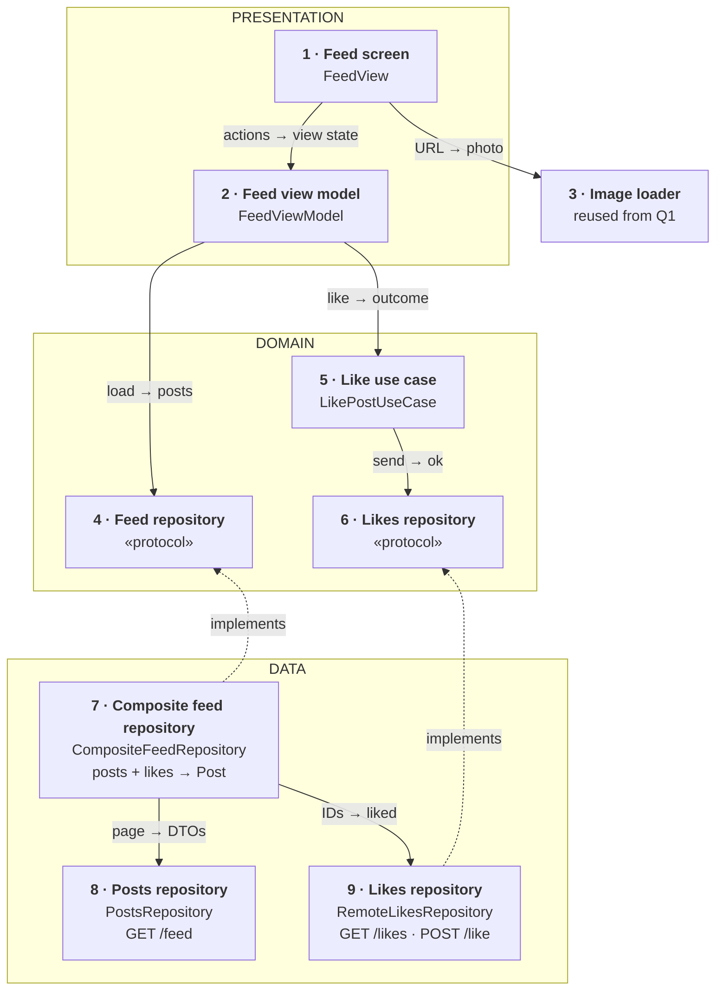
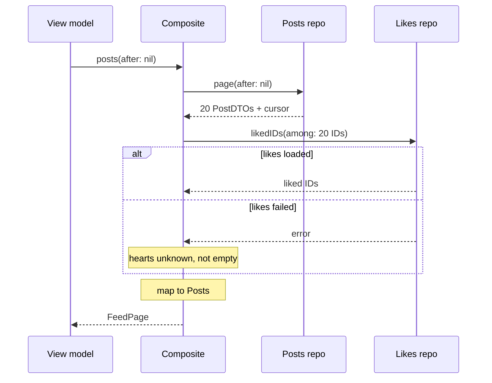
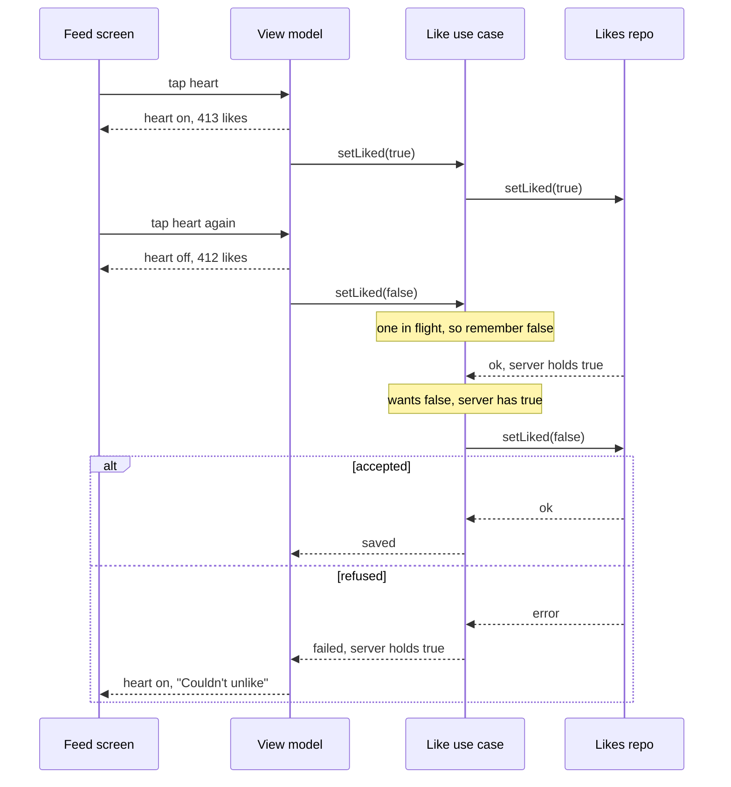

*An image-heavy feed is one of the most common senior mobile prompts. The answer below stays small on purpose: three endpoints, one repository per source, and a like that stays correct however fast the user taps. Start simple; add parts only when the interviewer asks for them.*

> **Interviewer:** "We have a feed of photos — think Instagram's home feed. It scrolls forever. Design the client for me."

## Run it as a round, not as reading

Set a timer. Sketch. Talk the whole time. Open a section only when its slot is over.

| Clock | Phase | What you do |
|---|---|---|
| 0:00–0:02 | The prompt | Repeat it back in one sentence |
| 0:02–0:07 | Clarify | Ask yours, then read section 1 |
| 0:07–0:12 | Scope | Out of scope first, then required, then later |
| 0:12–0:24 | High level | The idea · the parts · the sketch · each part · two flows |
| 0:24–0:40 | Deep dives | The interviewer picks one of sections 9–11 |
| 0:40–0:45 | Recap | Follow-ups, then the 60-second summary |

## What this question is really testing

- **Cursor pagination**, and knowing the server, not the cursor, owns the ordering.
- **Rows that know their height before the photo arrives**, so nothing jumps.
- **"Load more" that fires once**, and old pages that can't land after a refresh.
- **A like that feels instant and stays correct** when the user taps three times fast.
- **Knowing what not to build.** Ranking is the server's job. The photos come from question 1's image loader.

**Traps:** page numbers instead of a cursor; saying "a cursor guarantees no duplicates"; caching the personal feed on a CDN; "cancel the old request, last tap wins"; showing "not liked" when the likes call failed.

::: Words used in this chapter
- **Server, API, endpoint** — the server stores the posts; the API is the list of requests it accepts; an endpoint is one of those requests.
- **Page, cursor** — posts arrive about 20 at a time (a page). The cursor is a bookmark the server hands back with each page. Only the server can read it.
- **Layer** — a group of parts with the same kind of job: *presentation* (what you see), *domain* (the app's own rules and data), *data* (where data comes from).
- **View model, view state** — the view model is the screen's brain. The view state is one value that describes everything the screen shows.
- **Model, DTO, mapping** — the *model* is the app's own description of a post. A *DTO* is the server's format. *Mapping* turns one into the other.
- **Protocol** — a promise of what a part can do, without saying how. A fake can keep the same promise in tests.
- **Repository** — the one place the app asks for one kind of data. **Composite** — a repository that combines two sources into one model.
- **Use case** — one job of the app with its own rules, like "like a post".
- **Optimistic update** — show the result of a tap at once, and correct it if the server refuses.
- **Idempotent** — sending the same request twice has the same effect as once.
- **CDN** — servers near the user that keep copies of files, like photos, that are the same for everyone.
:::

::: 1 · The interviewer answers your clarifying questions
**"What's in a post?"** → *One photo, an author, a caption, a like count. Skip video and carousels.*

**"Who orders the feed?"** → *The server ranks it, per user. Your feed is personal, even though each post in it is shared. Show pages in the order you get them.*

**"How do I know which posts I liked?"** → *Today, a separate likes endpoint. A post doesn't say whether you liked it.*

**"Offline?"** → *Nice to have. An error with a retry button is fine for now.*

**"New posts live?"** → *No. Pull to refresh is enough.*

**"How many users?"** → *Say ten million a day. Don't design the backend.*

**"Minimum OS, UIKit or SwiftUI?"** → *iOS 17, SwiftUI. Tell me if you'd use UIKit for the list.*

**"What hurts today?"** → *Stutter on older phones, and the list jumping when photos load.*
:::

::: 2 · Requirements and scope — what you should have said
**Out of scope, said first:** ranking, posting, comments, stories, video, ads, search. The image loader is reused from question 1.

**Required for the prompt**

1. Show the feed and load more as the user scrolls.
2. Pull to refresh.
3. Like and unlike, instantly, and correctly under fast taps.

**What must feel good:** smooth on an old phone · rows never jump · bounded image memory · no duplicate posts, no wrong hearts.

**Production considerations** (say them, don't draw them): token refresh, retries and timeouts, image CDN sizes, metrics. They're in section 12.

**Optional follow-ups** (add only when asked):

```text
A second screen shows the same posts → a shared post store
Offline reading                       → a saved copy of the last pages
Offline likes                         → a small persistent queue of likes
New posts while reading               → a "new posts" pill
Live updates                          → push, or a socket — only if required
```

*"I'll start simple and add each of these when the requirement appears."*
:::

::: 3 · The idea, in 30 seconds — before you draw anything
> *"The server gives me pages of my feed with an opaque cursor, in the order to show them. A posts repository calls `GET /feed`, a likes repository calls `GET /likes` and `POST /like`, and a composite combines them into one Post model. The view model loads pages, guards against double loads and stale pages, and gives the screen one view state. Liking is a use case: the heart changes at once, and it sends one request at a time per post, always the latest state the user wants. Three layers: presentation, domain, data."*
:::

::: 4 · What we need — the components, before the sketch
| # | Part | Type | Layer | Its one job |
|---|---|---|---|---|
| 1 | **Feed screen** | `FeedView` | Presentation | Draws the view state. |
| 2 | **Feed view model** | `FeedViewModel` | Presentation | Turns posts into a view state. |
| 3 | **Image loader** | `ImagePipeline` | Reused | Delivers each photo, from question 1. |
| 4 | **Feed repository** | `FeedRepository` | Domain | Promises pages of posts. |
| 5 | **Like use case** | `LikePostUseCase` | Domain | Sends likes, one at a time per post. |
| 6 | **Likes repository** | `LikesRepository` | Domain | Promises likes: read and save. |
| 7 | **Composite feed repository** | `CompositeFeedRepository` | Data | Combines posts and likes into `Post`. |
| 8 | **Posts repository** | `PostsRepository` | Data | Fetches pages of posts. |
| 9 | **Likes repository** | `RemoteLikesRepository` | Data | Reads and saves the user's likes. |

The `Post` model isn't a card: it's what the composite returns, written on its card. The HTTP client the two data repositories share isn't drawn either.

Not on the list yet: everything under "optional follow-ups" in section 2.
:::

::: 5 · The sketch


**How to read it.** A solid arrow points from the part that asks to the part that answers: *request → reply*. The dashed arrows mean *implements*. The grey dashed card is reused from question 1.

**Dependency inversion, in one line.** The domain writes the two promises (cards 4 and 6); the data layer keeps them (cards 7 and 9). Both dashed arrows point **up**, so the view model and the use case never depend on networking, and tests swap in fakes.

**On Miro:** three frames (blue, purple, green), nine cards, nine arrows. Point at card 7 and say: *"two sources, one composite, one model — and if the backend added `isLiked` to the feed, this card would go away."*
:::

::: 6 · Each component: its job, its interface, the choice inside it
**The model everyone shares.** It's what the composite returns; the screen never sees a DTO.

```swift
struct Post: Identifiable, Hashable, Sendable {
    let id: PostID
    let author: Author
    let caption: String
    /// URL, width, height
    let image: ImageRef
    var likeCount: Int
    /// liked, notLiked, or unknown (the likes call failed)
    var like: LikeState
}
```

The photo's **size** is in the model, the photo itself isn't. Pixels live in the image loader's bounded cache.

### 1 · Feed screen (`FeedView`)

**Job:** draws what the view model hands it and reports taps and scrolls. It decides nothing.

**Interface:** reads `viewModel.viewState`; calls `onAppear()`, `onNearEnd()`, `refresh()`, `toggleLike(_:)`.

**Choice:** SwiftUI `List` or a lazy stack first, since the prompt says SwiftUI. *Switch to* a `UICollectionView` wrapped for SwiftUI if it stutters on the oldest phone: it gives you cell reuse and a prefetch callback.

### 2 · Feed view model (`FeedViewModel`)

**Job:** keeps the rows and the loading state, guards loads, flips hearts at once, and turns it all into one view state.

**Interface:**

```swift
struct FeedViewState: Equatable {
    let rows: [PostRow]
    /// loading, loaded, failed(message) — the first page
    let initialLoad: LoadState
    /// idle, loading, failed(message), end — the pages after it
    let pagination: PaginationState
}

struct PostRow: Equatable, Identifiable {
    let id: PostID
    let author: String
    let caption: String
    let imageURL: URL
    /// width ÷ height, so the row has its size before the photo
    let aspectRatio: Double
    /// already formatted, e.g. "412 likes"
    let likes: String
    /// filled, empty, or dimmed while unknown
    let heart: HeartState
}

@MainActor @Observable
final class FeedViewModel {
    init(feed: FeedRepository, likePost: LikePostUseCaseType)

    var viewState: FeedViewState { get }

    func onAppear() async
    func onNearEnd() async
    func refresh() async
    func toggleLike(_ id: PostID) async
}
```

**Choices:**

- **One view state**, so the screen stays dumb and a test checks one value.
- **Two small states, not one status enum.** A feed can have rows *and* be loading more, or have rows *and* a failed next page. `initialLoad` and `pagination` say both without a dozen cases.
- **Optimistic UI lives here.** `toggleLike` flips the heart and the count at once, then asks the use case. It only corrects the heart if the use case reports a failure for the *latest* tap.
- **Main actor**, so "check, then mark loading" needs no lock.

### 3 · Image loader (`ImagePipeline`, from question 1)

**Job:** gives each row its photo at the size the row shows.

**Interface:** the row asks with the photo's URL and its display size, and cancels when the row goes away.

**Choice:** reused, not redesigned. Say "the image loader from question 1" and list what it does in one breath: memory cache, disk cache, one download per URL, cancellation, downsizing off the main thread. Section 10 has the parts the feed leans on.

### 4 · Feed repository (`FeedRepository`)

**Job:** the promise the view model needs: pages of finished posts.

```swift
protocol FeedRepository: Sendable {
    /// Posts in display order, plus the next cursor (nil = end)
    func posts(after cursor: Cursor?) async throws -> FeedPage
}
```

**Choice:** a protocol, because it earns two things: the view model is tested with a fake, and it never knows there are two sources. Not because "every repository needs a protocol".

### 5 · Like use case (`LikePostUseCase`)

**Job:** sends likes to the server, one request at a time per post, always the latest state the user wants.

```swift
enum LikeOutcome: Equatable, Sendable {
    /// The server holds what the user wants
    case saved
    /// A newer tap on this post took over and will report instead
    case superseded
    /// The latest state was refused; this is what the server holds
    case failed(serverState: Bool)
}

protocol LikePostUseCaseType: Sendable {
    /// wasLiked is the heart before the user's first tap
    func setLiked(_ liked: Bool, post: PostID, wasLiked: Bool) async -> LikeOutcome
}
```

Built with `init(likes: LikesRepository)`.

**Choices:**

- **It sends the final state** ("liked: true"), never "toggle". Sent twice, it's still liked; a toggle sent twice undoes itself.
- **One request at a time per post**, not "cancel the old one". Cancelling a task doesn't un-send a request the server may already have, and two requests in flight can arrive in either order.
- **Why this earns a use case and loading doesn't:** it has a rule (serialize, send the latest). Loading a page is one call; a use case there would only pass it through.

### 6 · Likes repository (`LikesRepository`)

**Job:** the promise for likes: which posts the user liked, and saving a like.

```swift
protocol LikesRepository: Sendable {
    /// Which of these posts the user has liked
    func likedIDs(among posts: [PostID]) async throws -> Set<PostID>
    /// Saves the final state on the server
    func setLiked(_ liked: Bool, post: PostID) async throws
}
```

**Choice:** its own small protocol, because the like use case needs likes and nothing else. A change to posts can't break liking.

### 7 · Composite feed repository (`CompositeFeedRepository`)

**Job:** gets a page of posts and the user's likes for them, and combines them into `Post`s.

**Interface:** conforms to `FeedRepository`. Built with `init(posts: PostsRepositoryType, likes: LikesRepository)`.

**How it combines:**

1. Ask the posts repository for a page → `PostDTO`s and the next cursor.
2. Ask the likes repository which of those IDs are liked.
3. Map each `PostDTO` to a `Post`: `liked` or `notLiked` from the set — or `unknown` for the whole page if step 2 failed.

**Choices:**

- **One source failing never hides the feed.** No likes → posts with `unknown` hearts, not empty ones.
- **Mapping happens here.** DTOs never leave the data layer.
- **The trade-off, said out loud:** two sources keep ownership clean, but two requests add latency. In production I'd ask the backend to return `isLiked` with each feed item; then this composite and the likes read disappear, and nothing above the domain changes.

### 8 · Posts repository (`PostsRepository`)

**Job:** fetches pages of posts from `GET /feed`.

```swift
protocol PostsRepositoryType: Sendable {
    /// The server's page, as it sent it
    func page(after cursor: Cursor?) async throws -> FeedPageDTO
}
```

**Choice:** it passes the cursor back untouched. The feed is personal and signed-in, so it isn't shared through a CDN; only the photos are.

### 9 · Likes repository (`RemoteLikesRepository`)

**Job:** reads likes from `GET /likes` and saves them with `POST /like`.

**Interface:** conforms to `LikesRepository`.

**Choice:** plain and stateless. Ordering rules live in the use case, display rules in the view model, so this stays a thin adapter over two endpoints.

**Why these parts, and no more.** Each one changes for a different reason: the screen with design, the view model with screen behaviour, the use case with like rules, each repository with its endpoint. Each protocol earns its place: a fake for tests, or a smaller promise for a smaller caller. What I'd *not* add yet: a use case for loading, a protocol for the view model, a DI container, a generic repository. Constructor injection is enough.
:::

::: 7 · Key flows through the sketch
**Flow 1 — opening the feed.** Loading more is the same, with the cursor.



**Flow 2 — like, then unlike, while the first request is still out.**



The first `setLiked(true)` call returns `superseded`, so the view model ignores it. Only the latest tap can change the heart back.
:::

::: 8 · The server contract
```
GET  /v1/feed?cursor={opaque}&limit=20
     → { "items": [ { "id", "author", "caption",
                      "image": { "url", "width", "height" },
                      "likeCount" } ],
         "nextCursor": "…" }            // null at the end

GET  /v1/likes?postIds=p1,p2,…
     → { "liked": ["p1", "p7"] }

POST /v1/posts/{id}/like   { "liked": true }
     → 200 { "liked": true, "likeCount": 413 }
```

- **An opaque cursor, owned by the server.** The client sends it back untouched. Inside, the server might encode the last item's sort position or a feed snapshot ID; the client doesn't need to know. A cursor avoids the shifting that page numbers suffer when new posts arrive, but only if the server keeps a stable order for that pagination session. That's a backend promise, so the client still skips IDs it already shows.
- **Width and height in the post**, so rows are sized before the photo loads. Image URLs can carry the display width, so the CDN sends a resized copy.
- **The like request carries the final state**, and the reply carries the server's truth, so the client can reconcile.
- **Personal vs shared.** The feed response is per user: cached on the server where it makes sense, never on a shared CDN. Photos are the same for everyone: cached hard on the CDN.
:::

::: 9 · Deep dive — "The user flings to the bottom, then pulls to refresh."
**Trigger:** ask for the next page about one screen before the end, not at the last row.

**Guard — load once, not five times:**

1. If a page is loading, or there are no more pages, return.
2. Otherwise mark `pagination = .loading` **at once**, before any `await`.
3. Await the page, then append it, skipping IDs already shown (a duplicate ID breaks a diffable list).
4. Failure → `pagination = .failed`; the rows stay, and a retry row appears.

The view model is on the main actor, so step 2 needs no lock: the first call wins, the others see "loading".

**Refresh starts a new session:**

1. Bump a `generation` counter and cancel the old page task.
2. Load the first page with no cursor.
3. Replace the rows and the cursor, and reset `pagination`.
4. Any page that arrives tagged with an old generation is dropped.

*Why both cancel and a counter:* cancellation in Swift is cooperative. A request that already returned can still finish and try to append. The counter makes that harmless.

**Scroll position:** pull to refresh happens at the top, so replacing is fine. Never replace rows under a user who is reading further down; that's what the "new posts" pill is for.
:::

::: 10 · Deep dive — "It stutters on an iPhone 12, and the list jumps. Why?"
Measure first (Instruments: Hangs, Animation Hitches). The usual causes:

1. **Full-size photos decoded on the main thread.** The image loader downsizes them off the main thread, to the row's pixel size.
2. **Rows measured after the photo arrives.** That's the jump. Size from the model: `height = width ÷ aspectRatio`.
3. **Reloading a whole row for one like.** Update it in place (`reconfigureItems` in UIKit).
4. **Formatting in the cell.** Format once, in the view state.

**What the feed needs from the image loader:** one download per URL even if two rows ask; cancel when a row scrolls away; and a check that the photo arriving still belongs to the row (a reused cell must not show the previous post's photo). Ask the CDN for the display width, not the original.

**Prefetching is an optimization, not a correctness mechanism.** In UIKit, `UICollectionViewDataSourcePrefetching` can start photos before rows appear, and its cancel callback stops them. The callbacks aren't guaranteed, so a row must still load its own photo when it appears. Visible rows go first; prefetches run at lower priority. In SwiftUI there's no prefetch callback: start a row's photo when it appears and cancel when it disappears (lazy stacks usually build rows a little before they're on screen).

**Memory:** posts are small; decoded photos are big. The image cache has a cost limit and empties on a memory warning, so image memory stays bounded however far you scroll. The app's total memory still moves; the point is that it doesn't grow with scroll depth.
:::

::: 11 · Deep dive — "The user taps like three times, fast. Then the likes call fails."
**Three quick taps** (like, unlike, like). The use case keeps, per post, the state the user wants now:

1. Remember the wanted state.
2. If a request for this post is in flight, stop: the earlier call becomes `superseded`.
3. Otherwise send the wanted state.
4. When it finishes, if the wanted state differs from what the server now holds, send again. Otherwise report `saved`, or `failed(serverState)` if the latest request was refused.

Like, unlike, like while the first request is out: one request, `liked: true`, and the third tap gets `saved`. No second request was needed.

**Why not "cancel the old one, last tap wins"?** Cancelling a task doesn't recall a request the server already received, and two requests in flight can land in either order. The server could end on "unliked" while the screen shows "liked". One at a time per post makes order a non-issue.

**Safe rollback.** The view model only corrects the heart on `failed`, and only the latest call can return it. An old request failing can never undo a newer tap. On `failed`, the heart goes to `serverState`, not to "the opposite".

**A refresh during a like.** The view model keeps the heart for any post whose like hasn't settled and lays it over the refreshed page. A refresh can't flip a heart the user is still changing.

**The likes call fails.** Failing is not "not liked". The rows show a dimmed, disabled heart (`unknown`), and the next page or refresh tries again. *The simpler option:* show empty hearts. Rejected: it tells the user something false, and they'd tap to like a post they already liked.

**A second screen shows the same post** (a profile grid). Two copies drift. When that screen exists, move the posts into one shared, observable post store that both view models read and the like use case updates. Not before.
:::

::: 12 · Failure modes, production and scale
**Failures**

| Failure | Client behaviour |
|---|---|
| First page fails | Full-screen error with retry |
| Later page fails | Keep the rows, show a retry row |
| Photo fails | Placeholder; retry on tap or when the row reappears |
| Likes unavailable | Keep known hearts; unknown ones dimmed, never shown as "not liked" |
| Like refused | Heart goes to the server's state, short message |
| Cursor expired | Start a new feed session from the first page |
| Signed-in token expired | Refresh the token, retry the request once |
| Offline | Show cached content if there is any, else an error with retry |

**Production notes** (short, not on the board)

- **Networking:** a timeout per request; retry only what's safe (timeouts, 5xx, with backoff); honour `Retry-After` on 429; cancel work for screens that are gone.
- **Caching:** HTTP caching for the feed only where the server allows it; photos in memory and on disk, with the CDN's cache headers deciding freshness.
- **Metrics:** first-page time, page failure rate, image cache hit rate, image load and decode time, scroll hitches, like failure rate.
- **Security:** HTTPS only; the server checks who may see and like what; signed, expiring image URLs when photos are private.

**Scale, back of the envelope.** Use the interviewer's numbers; the shape is what matters.

```text
daily users × sessions a day × pages a session × posts a page = feed items read
photos shown × average photo size                            = CDN bandwidth
```

10M × 5 × 3 × 20 is three billion items a day. That's why page size, photo size per screen width, and cache hit rate are what move cost, not the client architecture.

**Grow only when asked**

```text
One screen                → one view model
A second screen           → a shared post store
Offline reading           → persist the last pages, show them first
Offline likes             → a small persistent queue (now you own sync and conflicts)
Live updates              → push or a socket, only if the product needs it
```
:::

::: 13 · Question bank — everything they can push on
Answer out loud first, then open.

### Scope and architecture

<details>
<summary>"Walk me through the layers."</summary>

Presentation: screen and view model. Domain: Post, the feed and likes protocols, the like use case. Data: a posts repository, a likes repository, and a composite that combines them.
</details>

<details>
<summary>"Why does liking get a use case and loading doesn't?"</summary>

Liking has a rule: one request at a time per post, always the latest state. Loading a page is one call; a use case would only pass it through.
</details>

<details>
<summary>"Why two repositories and a composite, not one?"</summary>

Posts and likes come from different endpoints and change for different reasons. The composite is the one place they meet. If the feed returned isLiked, I'd drop it.
</details>

<details>
<summary>"Show me dependency inversion."</summary>

The feed and likes protocols live in the domain; the composite and the remote likes repository implement them. Both arrows point up, so the view model and use case never import networking.
</details>

<details>
<summary>"Where does mapping happen?"</summary>

In the composite, where the post DTOs and the liked IDs meet. DTOs never leave the data layer.
</details>

<details>
<summary>"Isn't this a lot of protocols for one screen?"</summary>

Two, each with a reason: a fake for the view model's tests, and a smaller promise for the use case. I wouldn't add one for the view model or the screen.
</details>

<details>
<summary>"Why is ranking out of scope, and is the feed the same for everyone?"</summary>

Ranking is the server's job. The feed is personal: membership and order are per user, while each post object is shared.
</details>

### Pagination

<details>
<summary>"Why a cursor and not page numbers?"</summary>

New posts shift page numbers, so you see repeats. A cursor says "continue from here", and the server decides what that means.
</details>

<details>
<summary>"What's inside the cursor?"</summary>

I don't know, and I don't need to: it's opaque. The server might encode the last item's sort position or a snapshot ID.
</details>

<details>
<summary>"What guarantees you get no duplicates?"</summary>

The server's stable ordering for the session. The client still skips IDs it already shows, because that guarantee lives on another machine.
</details>

<details>
<summary>"What if ranking changes between pages?"</summary>

That's why the server pins the order for a pagination session. If it doesn't, you may see a repeat or miss a post; dedupe handles repeats, refresh starts a fresh session.
</details>

<details>
<summary>"What if the cursor expires?"</summary>

The server returns an error for it; the client starts a new session from the first page.
</details>

<details>
<summary>"What happens if two load-more triggers fire?"</summary>

The first marks pagination loading before any await, on the main actor. The second sees it and returns.
</details>

<details>
<summary>Follow-up chain: "Refresh during a page load."</summary>

1. *"User refreshes while page 4 loads."* → The refresh bumps the generation and cancels page 4.
2. *"Page 4 still arrives."* → It carries the old generation, so it's dropped.
3. *"Why isn't cancel enough?"* → Cancellation is cooperative; a reply already back can still try to land.
</details>

### Likes

<details>
<summary>"What if the user taps like three times quickly?"</summary>

The heart follows each tap at once. The use case sends one request at a time per post and, when it finishes, sends the latest state only if it differs.
</details>

<details>
<summary>"What if request 1 finishes after request 2?"</summary>

It can't: there's only one request per post in flight. That's the reason to serialize instead of cancelling.
</details>

<details>
<summary>"Why send liked: true instead of toggle?"</summary>

A final state is safe to retry or repeat. A toggle sent twice undoes itself.
</details>

<details>
<summary>"An old request fails after a newer tap. Do you roll back?"</summary>

No. Only the latest call gets an outcome; older ones are superseded. The heart is corrected only when the latest state is refused, and then to the server's state.
</details>

<details>
<summary>"What happens if the likes request fails?"</summary>

Hearts become unknown: dimmed and disabled until the next page or refresh. Showing "not liked" would be false.
</details>

<details>
<summary>Follow-up chain: "A second screen."</summary>

1. *"A profile grid shows the same post. User likes it in the feed."* → With separate copies, the grid is wrong.
2. *"Fix it."* → One shared observable post store; both screens read it, the use case updates it.
3. *"Why not refetch everywhere?"* → A network call per like on every screen, and flicker.
4. *"When wouldn't you do this?"* → With only one screen.
</details>

### Images and performance

<details>
<summary>"How do you avoid downloading full-resolution photos?"</summary>

Ask the CDN for the row's pixel width, and downsample when decoding.
</details>

<details>
<summary>"How do you stop a reused cell showing the wrong image?"</summary>

Cancel the old request when the cell is reused, and check the arriving photo still matches the row's current URL before showing it.
</details>

<details>
<summary>"What does prefetching do?"</summary>

Starts photos for rows about to appear. It's an optimization: callbacks aren't guaranteed, so each row still loads its own photo.
</details>

<details>
<summary>"How do you bound image memory?"</summary>

The memory cache has a cost limit and clears on memory warnings. Photos never live in the Post model.
</details>

<details>
<summary>"How do you stop the list jumping?"</summary>

Size each row from the width and height in the post, before the photo arrives. Never insert above what the user is reading.
</details>

<details>
<summary>"UICollectionView or SwiftUI List?"</summary>

List first, since we're in SwiftUI. A wrapped collection view if profiling on the oldest phone says so.
</details>

### Production and change

<details>
<summary>"What would you add for offline support?"</summary>

Persist the last pages and show them first. Offline likes need a small persistent queue, which means owning sync and conflicts, so only if required.
</details>

<details>
<summary>"What would you measure in production?"</summary>

First-page time, page failures, image cache hit rate, decode time, scroll hitches, like failures.
</details>

<details>
<summary>"What changes at 10x traffic?"</summary>

Mostly the server. On the client: page and photo sizes, cache hit rate, and backing off on 429s.
</details>

<details>
<summary>"How do you test liking?"</summary>

The use case with a fake likes repository that holds its reply: tap like, unlike, like; check one request was sent. The view model with a fake use case returning failed: check the heart goes to the server state.
</details>

<details>
<summary>Follow-up chain: "Two weeks instead of six."</summary>

1. *"What do you cut?"* → Offline and the second-screen store.
2. *"What can't you cut?"* → Cursor pages, the load guard, rows sized from the post, serialized likes.
3. *"Risk?"* → No content offline. Fixable next release.
</details>
:::

::: 14 · Scorecard — mark yourself, 0 / 1 / 2
| | Did you… | 0–2 |
|---|---|---|
| 1 | Talk the whole time, and listen when interrupted | |
| 2 | Clarify before designing | |
| 3 | Give a trade-off for each choice | |
| 4 | Say out of scope first; separate required from later | |
| 5 | Say the idea, list the parts, then sketch | |
| 6 | Keep the sketch to about nine cards | |
| 7 | Explain the cursor as opaque and server-owned | |
| 8 | Name the three endpoints, and the two-request trade-off | |
| 9 | Keep DTOs out of the domain | |
| 10 | Make the like optimistic and serialized per post | |
| 11 | Roll back only the latest tap, to the server's state | |
| 12 | Guard load-more, and drop stale pages after refresh | |
| 13 | Size rows from the post; prefetch as an optimization | |
| 14 | Land the recap inside 60 seconds | |

14+ is a pass.<!--private--> Anything scored 0 goes in the progress log and comes back as a recall prompt.<!--/private--><!--public--> A zero names the thing to read about next.<!--/public-->
:::

::: 15 · The 60-second recap
The server gives me my personal feed in pages, with an opaque cursor it owns; I send it back untouched and still skip IDs I already show. A main-actor view model loads the next page a screen before the end, marks it loading before any await so it fires once, and drops stale pages after a refresh with a generation counter. Posts and likes each have a repository and a composite combines them into one `Post`; in production I'd ask for `isLiked` in the feed and drop the second call. Rows are sized from the post, photos come from question 1's image loader, and prefetching only makes it faster. Liking flips the heart at once, and a use case sends one request per post at a time, always the latest state, so only the latest tap can be corrected. Offline, a second screen and live updates come when they're asked for.
:::
