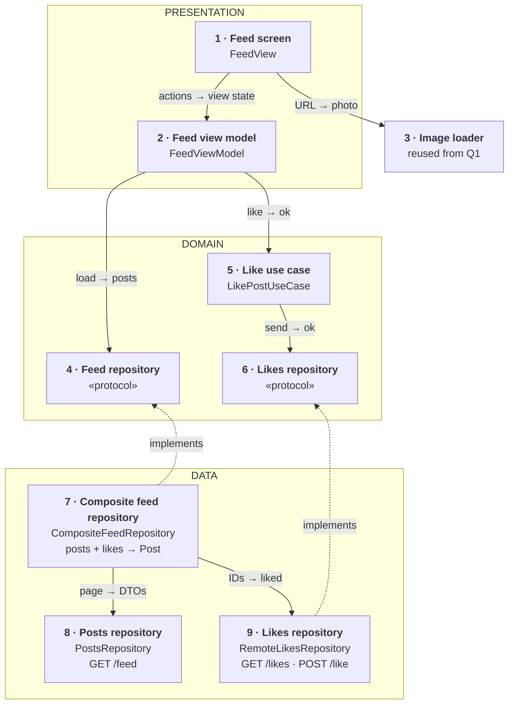
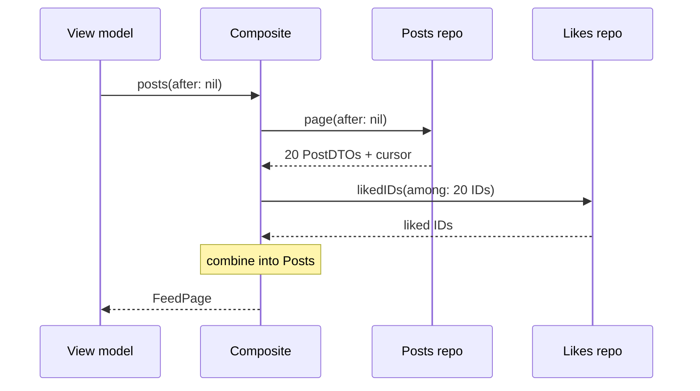
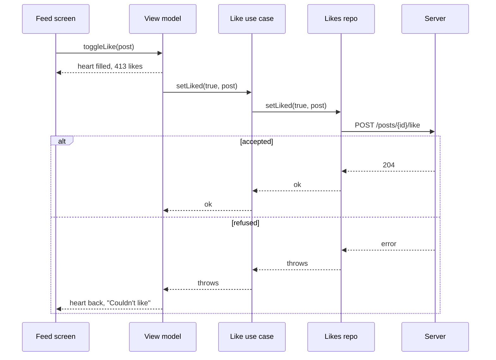
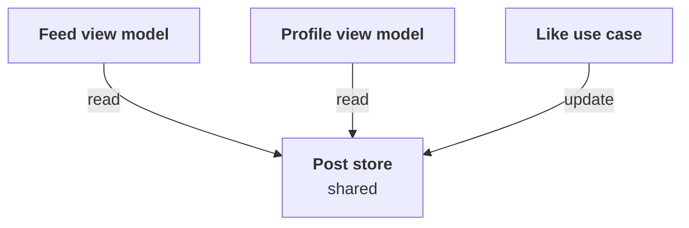

*An image-heavy feed is one of the most common senior mobile prompts. The answer below stays small on purpose: one repository per source, one composite to combine them, three endpoints.*

> **Interviewer:** "We have a feed of photos — think Instagram's home feed. It scrolls forever. Design the client for me."

## Run it as a round, not as reading

Set a timer. Sketch. Talk the whole time. Open a section only when its slot is over.

| Clock | Phase | What you do |
|---|---|---|
| 0:00–0:02 | The prompt | Repeat it back in one sentence |
| 0:02–0:07 | Clarify | Ask yours, then read section 1 |
| 0:07–0:12 | Scope | Out of scope first, then features, then what must feel good |
| 0:12–0:24 | High level | The idea · the parts · the sketch · each part · two flows |
| 0:24–0:40 | Deep dives | The interviewer picks one of sections 9–11 |
| 0:40–0:45 | Recap | Follow-ups, then the 60-second summary |

## What this question is really testing

- **Cursor pagination**, and why not page numbers.
- **Rows that know their height before the photo arrives**, so nothing jumps.
- **"Load more" that fires once**, not five times.
- **A like that feels instant** and is undone if the server says no.
- **Keeping it small.** Ranking is the server's job. The photos come from question 1's image loader.

**Traps:** page numbers instead of a cursor; photos stored inside the post model; inserting new posts above what the user is reading; designing the ranking.

::: Words used in this chapter
- **Server, API, endpoint** — the server stores the posts; the API is the list of requests it accepts; an endpoint is one of those requests.
- **Page, cursor** — posts arrive about 20 at a time (a page). The cursor is a bookmark the server sends with each page: "you stopped here".
- **Layer** — a group of parts with the same kind of job: *presentation* (what you see), *domain* (the app's own rules and data), *data* (where data comes from).
- **View model, view state** — the view model is the screen's brain. The view state is one value that describes everything the screen shows.
- **Model, DTO, mapping** — the *model* is the app's own description of a post. A *DTO* is the server's format. *Mapping* turns one into the other.
- **Protocol** — a promise of what a part can do, without saying how. A fake can keep the same promise in tests.
- **Repository** — the one place the app asks for data.
- **Composite** — a repository that combines several sources into one model.
- **Use case** — one job of the app with its own rules, like "like a post".
- **Optimistic update** — show the result of a tap at once, undo it if the server refuses.
- **Idempotent** — sending the same request twice has the same effect as once.
:::

::: 1 · The interviewer answers your clarifying questions
**"What's in a post?"** → *One photo, an author, a caption, a like count. Skip video and carousels.*

**"Who orders the feed?"** → *The server ranks it. The app shows pages in the order it gets them.*

**"How do I know which posts I liked?"** → *There's a separate likes endpoint. Posts are the same for everyone, so they don't say whether you liked them.*

**"Offline?"** → *Nice to have. An error with a retry button is fine for now.*

**"New posts live?"** → *No. Pull to refresh is enough.*

**"Minimum OS, UIKit or SwiftUI?"** → *iOS 17, SwiftUI. Tell me if you'd use UIKit for the list.*

**"What hurts today?"** → *Stutter on older phones, and the list jumping when photos load.*
:::

::: 2 · Requirements and scope — what you should have said
**Out of scope, said first:** ranking, posting, comments, stories, video, ads, search. The image loader is reused from question 1.

**Features**

1. Show the feed and load more as the user scrolls.
2. Pull to refresh.
3. Like and unlike, instantly.

**What must feel good**

- **Smooth** — no dropped frames, even on an old phone.
- **Stable** — rows never jump under the user's thumb.
- **Bounded memory** — however far they scroll.
- **Correct** — no duplicate posts, no wrong hearts.
:::

::: 3 · The idea, in 30 seconds — before you draw anything
> *"One repository per source: a posts repository calls `GET /feed`, a likes repository calls `GET /likes` and `POST /like`. A composite feed repository combines the two into one Post model. The view model loads pages from it with a cursor and gives the screen one view state. Liking is a use case that talks only to the likes repository: the heart changes at once and is undone if the server refuses. Three layers: presentation, domain, data."*
:::

::: 4 · What we need — the components, before the sketch
| # | Part | Type | Layer | Its one job |
|---|---|---|---|---|
| 1 | **Feed screen** | `FeedView` | Presentation | Draws the view state. |
| 2 | **Feed view model** | `FeedViewModel` | Presentation | Turns posts into a view state. |
| 3 | **Image loader** | `ImagePipeline` | Reused | Delivers each photo, from question 1. |
| 4 | **Feed repository** | `FeedRepository` | Domain | Promises pages of posts. |
| 5 | **Like use case** | `LikePostUseCase` | Domain | Sends a like. |
| 6 | **Likes repository** | `LikesRepository` | Domain | Promises likes: read and save. |
| 7 | **Composite feed repository** | `CompositeFeedRepository` | Data | Combines posts and likes into `Post`. |
| 8 | **Posts repository** | `PostsRepository` | Data | Fetches pages of posts. |
| 9 | **Likes repository** | `RemoteLikesRepository` | Data | Reads and saves the user's likes. |

The `Post` model isn't a card: it's what the composite returns, written on its card. The HTTP client the two data repositories share isn't drawn either.

Not on the list yet: a saved copy for offline, a "new posts" pill, a shared store for a second screen. *"I'll add those if we go there."*
:::

::: 5 · The sketch


**How to read it.** A solid arrow points from the part that asks to the part that answers: *request → reply*. The dashed arrows mean *implements*. The grey dashed card is reused from question 1.

**Dependency inversion, in one line.** The domain writes the two promises (cards 4 and 6); the data layer keeps them (cards 7 and 9). Both dashed arrows point **up**, so the domain never depends on the network.

**One owner per source.** Posts come only from card 8, likes only from card 9. The composite (card 7) is the one place they meet. The like use case never touches posts.

**On Miro:** three frames (blue, purple, green), nine cards, nine arrows. Point at card 7 and say: *"two repositories, one composite, one model."*
:::

::: 6 · Each component: its job, its interface, the choice inside it
**The model everyone shares.** It's what the composite returns; the screen never sees a DTO.

```swift
struct Post: Identifiable, Hashable, Sendable {
    let id: PostID
    let author: Author
    let caption: String
    /// URL, width, height
    let image: ImageRef
    var likeCount: Int
    var isLiked: Bool
}
```

The photo's **size** is in the model, the photo itself isn't. Pixels live in the image loader's cache, which has a memory limit.

### 1 · Feed screen (`FeedView`)

**Job:** draws what the view model hands it and reports taps and scrolls. It decides nothing.

**Interface:** reads `viewModel.viewState`; calls `onAppear()`, `onNearEnd()`, `refresh()`, `toggleLike(_:)`.

**Choice:** `UICollectionView` wrapped for SwiftUI, because it reuses rows and has prefetching. *Switch to* SwiftUI `List` if it profiles smooth on the oldest phone.

### 2 · Feed view model (`FeedViewModel`)

**Job:** keeps the posts and the loading state, and turns them into one view state.

**Interface:**

```swift
struct FeedViewState: Equatable {
    let rows: [PostRow]
    /// loading, loaded, loadingMore, failed(message), end
    let status: Status
}

struct PostRow: Equatable, Identifiable {
    let id: PostID
    let author: String
    let caption: String
    let imageURL: URL
    /// width ÷ height, so the row has its size before the photo
    let aspectRatio: Double
    /// already formatted, e.g. "412 likes"
    let likes: String
    let isLiked: Bool
}

@MainActor @Observable
final class FeedViewModel {
    init(feed: FeedRepository, likePost: LikePostUseCaseType)

    var viewState: FeedViewState { get }

    func onAppear() async
    func onNearEnd() async
    func refresh() async
    func toggleLike(_ id: PostID)
}
```

**Choices:**

- **One view state**, so the screen stays dumb and a test checks one value.
- **One `status` enum**, not several booleans, so "loading and failed" can't happen.
- **Optimistic like:** `toggleLike` flips the heart and the count at once, calls the use case, and flips them back if it throws.

### 3 · Image loader (`ImagePipeline`, from question 1)

**Job:** gives each row its photo at the size the row shows.

**Interface:** the row asks with the photo's URL and its display size, and cancels when the row is reused.

**Choice:** reused, not redesigned. Say "the image loader from question 1" and spend the time on the feed.

### 4 · Feed repository (`FeedRepository`)

**Job:** the promise the view model needs: pages of finished posts.

```swift
protocol FeedRepository: Sendable {
    /// Posts with isLiked filled in, plus the next cursor (nil = end)
    func posts(after cursor: Cursor?) async throws -> FeedPage
}
```

**Choice:** a protocol in the domain, so the view model is tested with a fake and never knows there are two sources.

### 5 · Like use case (`LikePostUseCase`)

**Job:** sends a like. If the user taps again, only the last tap counts.

```swift
protocol LikePostUseCaseType: Sendable {
    /// Throws if the server refused
    func setLiked(_ liked: Bool, post: PostID) async throws
}
```

Built with `init(likes: LikesRepository)`.

**Choices:**

- **It sends the final state** ("liked = true"), never "toggle", so a retry is safe.
- **A new tap cancels the older request** for the same post.
- **Why a use case for liking but not for loading:** loading is one call; liking has a rule (last tap wins). A rule is what earns a use case.

### 6 · Likes repository (`LikesRepository`)

**Job:** the promise for likes: which posts the user liked, and saving a like.

```swift
protocol LikesRepository: Sendable {
    /// Which of these posts the user has liked
    func likedIDs(among posts: [PostID]) async throws -> Set<PostID>
    /// Saves the user's like on the server
    func setLiked(_ liked: Bool, post: PostID) async throws
}
```

**Choice:** its own protocol, because the like use case needs likes and nothing else. It depends on the smallest promise that does the job.

### 7 · Composite feed repository (`CompositeFeedRepository`)

**Job:** gets a page of posts and the user's likes for them, and combines them into `Post`s.

**Interface:** conforms to `FeedRepository`. Built with `init(posts: PostsRepositoryType, likes: LikesRepository)`.

**How it combines:**

1. Ask the posts repository for a page → `PostDTO`s and the next cursor.
2. Ask the likes repository which of those IDs are liked → a set of IDs.
3. Map each `PostDTO` to a `Post`, with `isLiked = likedIDs.contains(id)`.

**Choices:**

- **It owns no source of its own.** It only combines, so adding a third source later (a saved copy for offline) changes this one class.
- **Mapping happens here.** DTOs never leave the data layer; a renamed server field changes one line.

### 8 · Posts repository (`PostsRepository`)

**Job:** fetches pages of posts from `GET /feed`.

```swift
protocol PostsRepositoryType: Sendable {
    /// The server's page, as it sent it
    func page(after cursor: Cursor?) async throws -> FeedPageDTO
}
```

**Choice:** posts are the same for every user, so this source can be cached by the server and the CDN. It knows nothing about likes.

### 9 · Likes repository (`RemoteLikesRepository`)

**Job:** reads likes from `GET /likes` and saves them with `POST /like`.

**Interface:** conforms to `LikesRepository`.

**Choices:**

- **It remembers likes still being sent.** `likedIDs` lays them over the server's answer, so a refresh during a like can't turn the heart off. That fix lives with the likes, where it belongs.
- **One owner of like state.** Reading and writing likes in the same place means they can't disagree.
:::

::: 7 · Key flows through the sketch
**Flow 1 — opening the feed.** Loading more is the same, with the cursor.



**Flow 2 — liking a post.**


:::

::: 8 · The server contract
```
GET  /v1/feed?cursor={opaque}&limit=20
     → { "items": [ { "id", "author", "caption",
                      "image": { "url", "width", "height" },
                      "likeCount" } ],
         "nextCursor": "…" }            // null at the end

GET  /v1/likes?postIds=p1,p2,…
     → { "liked": ["p1", "p7"] }

POST /v1/posts/{id}/like   { "liked": true }
     → 204
```

- **Cursor, not page numbers.** New posts at the top would shift page 3 and show repeats. A cursor means "the 20 after this one".
- **Width and height in the post**, so rows are sized before the photo loads.
- **The like request says the final state**, so sending it twice is harmless.
:::

::: 9 · Deep dive — "The user flings to the bottom. Walk me through loading more."
**Trigger:** ask for the next page about one screen before the end, not at the last row.

**Guard — load once, not five times:**

1. If already loading, or there are no more pages, do nothing.
2. Otherwise set `status = .loadingMore` **at once**, with no `await` before it.
3. Append the new posts, skipping IDs already shown (a duplicate ID crashes a diffable list).

The view model is on the main actor, so step 2 needs no lock: the first call wins, the others see "loading".

**Refresh while a page is loading:** the refresh cancels the page task, and a counter bumped on every refresh lets a late page see it's stale and drop itself.
:::

::: 10 · Deep dive — "It stutters on an iPhone 12, and the list jumps. Why?"
Measure first (Instruments: Hangs, Animation Hitches). The usual causes:

1. **Full-size photos decoded on the main thread.** The image loader downsizes them off the main thread.
2. **Rows measured after the photo arrives.** That's the jump. Size from the model: `height = width ÷ aspectRatio`.
3. **Reloading a whole row for one like.** Use `reconfigureItems` to update it in place.
4. **Formatting in the cell.** Format once, in the view state.

**Memory:** posts are tiny; photos are big. Photos live only in the image loader's cache, so memory stays flat however far you scroll.
:::

::: 11 · Deep dive — "Likes: refresh, double taps, and a second screen."
**Refresh during a like.** The like is still in flight, the refresh's `GET /likes` says "not liked", and the heart turns off. *Fix:* the likes repository remembers likes still being sent and lays them over the server's answer until they finish. The fix lives with the likes, not in the view model.

**Three quick taps.** Each sends the final state, and each new tap cancels the older one, so the last tap wins.

**A second screen shows the same post** (say, a profile grid). Each screen with its own copy drifts. *Fix:* one shared, observable post store. Both view models read from it; the like use case updates it once.



For "everything is stale" events (signed out, blocked someone), a small change bus tells every screen to reload. Only add the store when the second screen exists.
:::

::: 12 · Failure modes and 10×
- **First page fails** → full-screen error with retry.
- **Later page fails** → retry row at the bottom.
- **Likes endpoint fails** → the composite returns the posts with empty hearts and retries likes once; one source failing never hides the feed.
- **Like refused** → heart goes back, short message.
- **Cursor expired** → reload from the first page.

**At 10×:**

- **Longer sessions** → memory still bounded by the image cache.
- **Offline** → add a saved copy as a third source inside the composite repository. Nothing above it changes.
- **Video posts** → one shared player, attached to the most visible row.
:::

::: 13 · Question bank — everything they can push on
Answer out loud first, then open.

### Scope and architecture

<details>
<summary>"Why is ranking out of scope?"</summary>

It's the server's job. The app shows pages in the order it gets them.
</details>

<details>
<summary>"Walk me through the layers."</summary>

Presentation: screen and view model. Domain: Post, the feed and likes repository protocols, the like use case. Data: a posts repository, a likes repository, and a composite that combines them.
</details>

<details>
<summary>"Why does liking get a use case and loading doesn't?"</summary>

Loading is one call. Liking has a rule: the last tap wins. A rule earns a use case; a pass-through doesn't.
</details>

<details>
<summary>"Why don't posts include isLiked?"</summary>

Posts are the same for everyone, so the server and CDN can cache them. Likes are personal, so they come from their own endpoint and their own repository, and the composite combines the two.
</details>

<details>
<summary>"Why two repositories and a composite, not one feed repository?"</summary>

Posts and likes are different sources that change for different reasons. One repository each keeps them small; the composite is the one place they meet, and the like use case depends only on likes.
</details>

<details>
<summary>"Why does the like use case talk to the likes repository, not the feed repository?"</summary>

It only needs likes. Depending on the smallest promise means a change to posts can never break liking.
</details>

<details>
<summary>"Where does mapping happen?"</summary>

In the composite repository, where the posts' DTOs and the liked IDs meet. DTOs never leave the data layer; a server change touches one mapping.
</details>

<details>
<summary>"Show me dependency inversion."</summary>

Two protocols live in the domain: the feed repository and the likes repository. The composite and the remote likes repository implement them. Both arrows point up, so the domain never imports networking.
</details>

<details>
<summary>"What does the view model give the screen?"</summary>

One `FeedViewState`: formatted rows and a status. The screen draws it and decides nothing.
</details>

### API and pagination

<details>
<summary>"Why a cursor and not page numbers?"</summary>

New posts shift page numbers, so you'd see repeats. A cursor says "after this post", which doesn't move.
</details>

<details>
<summary>"Why does the like request say liked: true instead of toggle?"</summary>

So a retry can't flip it back. Sent twice, it's still liked.
</details>

<details>
<summary>"Two calls per page. Isn't that slow?"</summary>

The likes call is small and follows right after. If it matters, ask the backend for one endpoint that does both: only the composite changes.
</details>

<details>
<summary>"When do you load the next page?"</summary>

About one screen before the end, so a fast scroll rarely sees a spinner.
</details>

<details>
<summary>"How do you avoid loading the same page five times?"</summary>

Check and set `status` on the main actor with no `await` in between. The first call wins.
</details>

<details>
<summary>"The server returns a post you already have."</summary>

Skip it by ID. A duplicate ID crashes a diffable list.
</details>

<details>
<summary>Follow-up chain: "Refresh during a page load."</summary>

1. *"User refreshes while page 4 loads."* → The refresh cancels page 4.
2. *"Page 4 still arrives."* → A refresh counter marks it stale; it's dropped.
3. *"Why isn't cancel enough?"* → Cancel is cooperative; a reply already decoded can still land.
</details>

### Likes

<details>
<summary>"What happens when the user taps the heart?"</summary>

The heart and count change at once. The use case sends the like. If it fails, the view model undoes it and shows a short message.
</details>

<details>
<summary>"User likes, then refreshes, and the heart turns off."</summary>

The refresh read likes before the server saved this one. The likes repository keeps likes still in flight and lays them over its answer.
</details>

<details>
<summary>"The user taps like three times fast."</summary>

Each tap cancels the older request and sends the final state, so the last tap wins.
</details>

<details>
<summary>Follow-up chain: "A second screen."</summary>

1. *"A profile grid shows the same post. User likes it in the feed."* → With separate copies, the grid is wrong.
2. *"Fix it."* → One shared observable post store both screens read; the use case updates it.
3. *"Why not refetch everywhere?"* → A network call per like on every screen, and flicker. Refetch is for "everything is stale" events.
4. *"When wouldn't you do this?"* → With only one screen.
</details>

### Performance and memory

<details>
<summary>"It stutters. Where do you start?"</summary>

Instruments first. Usual causes: decoding photos on the main thread, measuring rows after the photo, reloading whole rows, formatting in cells.
</details>

<details>
<summary>"How do you stop the list jumping?"</summary>

Size each row from the photo's width and height in the post, before the photo arrives. Never insert above what the user is reading.
</details>

<details>
<summary>"Why no image in the Post model?"</summary>

A post is about a kilobyte; a decoded photo is megabytes. Photos stay in the image loader's limited cache.
</details>

<details>
<summary>"UICollectionView or SwiftUI List?"</summary>

Collection view for the most performance-critical screen, for reuse and prefetch. `List` if it profiles smooth.
</details>

### Offline, testing and change

<details>
<summary>"Make it work offline."</summary>

Add a saved copy of the last pages as a third source inside the composite repository. The view model doesn't change.
</details>

<details>
<summary>"How do you test loading more?"</summary>

A fake repository that holds a reply. Call `onNearEnd()` five times; check one request went out.
</details>

<details>
<summary>"How do you test the composite repository?"</summary>

A fake posts repository returning three posts and a fake likes repository returning one ID; check only that post comes back with `isLiked = true`.
</details>

<details>
<summary>"How do you test liking?"</summary>

A fake use case that throws; check the view state's heart goes back. The use case itself with a fake likes repository: two quick calls, only the last is sent.
</details>

<details>
<summary>"Add a 'new posts' pill."</summary>

One more endpoint that returns a count since the first post; poll it on foreground. Show a pill; never insert under the thumb.
</details>

<details>
<summary>Follow-up chain: "Two weeks instead of six."</summary>

1. *"What do you cut?"* → Offline and the second-screen store.
2. *"What can't you cut?"* → Cursor pages, the load-more guard, rows sized from the post.
3. *"Risk?"* → No content offline. Fixable next release.
</details>
:::

::: 14 · Scorecard — mark yourself, 0 / 1 / 2
| | Did you… | 0–2 |
|---|---|---|
| 1 | Talk the whole time, and listen when interrupted | |
| 2 | Clarify before designing | |
| 3 | Give a rejected alternative for each choice | |
| 4 | Say out of scope first, including ranking | |
| 5 | Say the idea, list the parts, then sketch | |
| 6 | Keep the sketch to about nine cards | |
| 7 | Choose a cursor and say why in one sentence | |
| 8 | Name the three endpoints | |
| 9 | One repository per source, a composite that combines them | |
| 10 | Keep DTOs out of the domain | |
| 11 | Make the like optimistic, and undo it on failure | |
| 12 | Guard load-more so it fires once | |
| 13 | Size rows from the post, not the photo | |
| 14 | Land the recap inside 60 seconds | |

14+ is a pass.<!--private--> Anything scored 0 goes in the progress log and comes back as a recall prompt.<!--/private--><!--public--> A zero names the thing to read about next.<!--/public-->
:::

::: 15 · The 60-second recap
The feed loads pages by cursor, so new posts never shift what's loaded. A main-actor view model asks for the next page a screen before the end, guards it so it fires once, and gives a dumb screen one view state. Posts and likes each have their own repository, and a composite combines them into one `Post` model; the server's DTOs never leave the data layer. Each post carries its photo's size, so rows never jump, and the photos come from question 1's image loader. Liking is a use case that talks only to the likes repository: the heart changes at once, the final state is sent, the last tap wins, and the view model undoes it if the server refuses. The likes repository remembers likes in flight, so a refresh can't undo a tap. Offline, a new-posts pill and a second screen are additions, not rewrites.
:::
