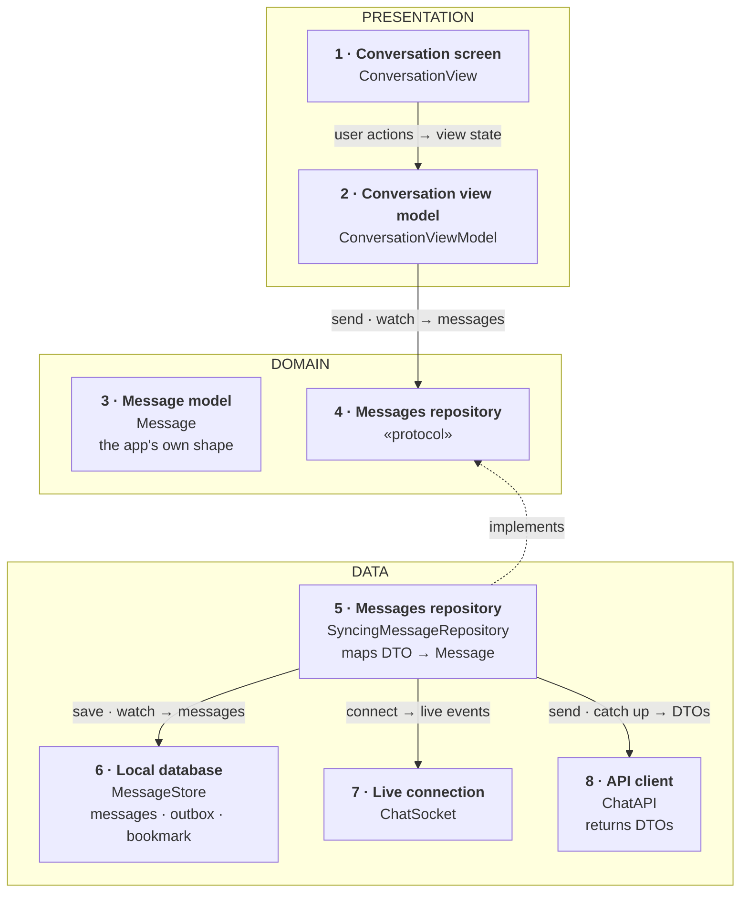
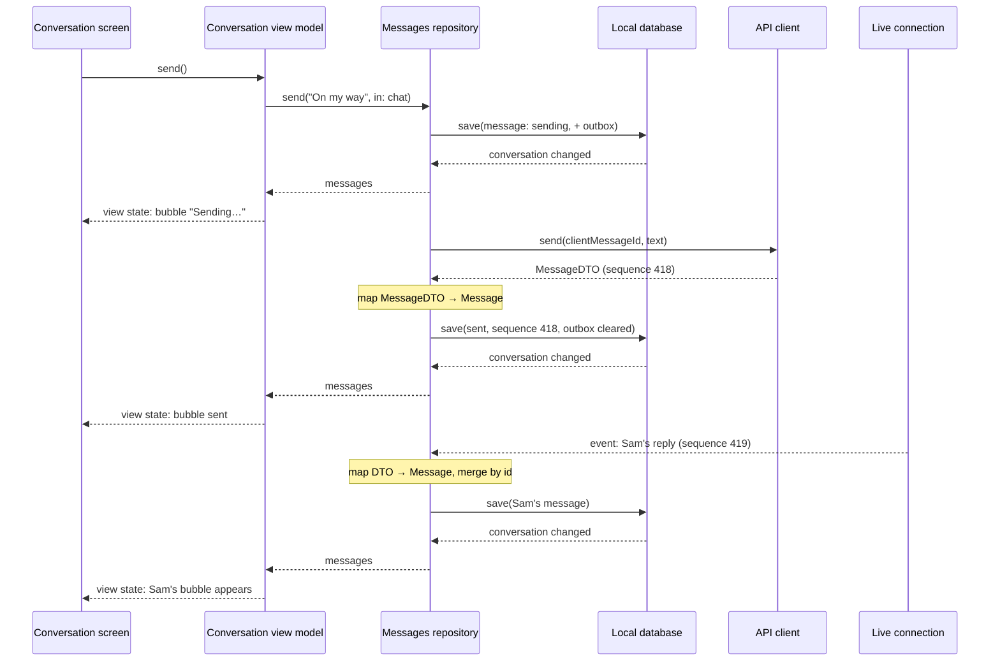
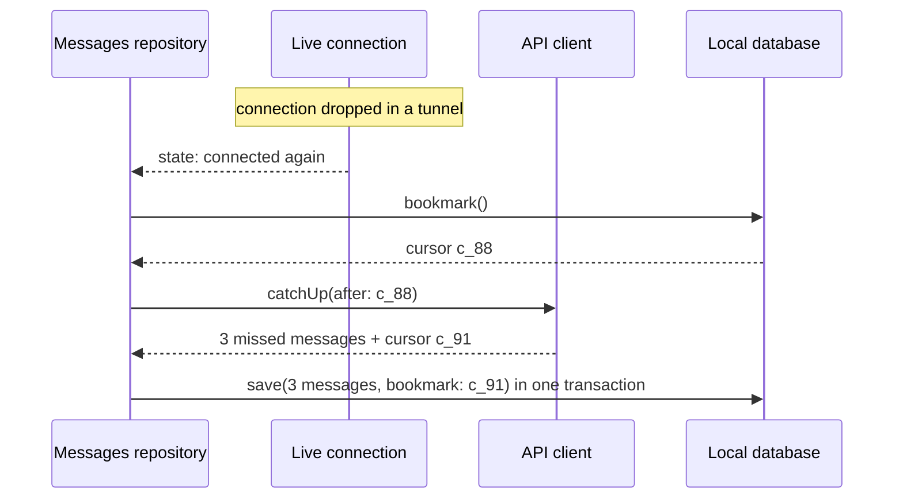

*A recurring senior mobile prompt in first-hand interview reports, and one of the public exercises interviewers draw their wording from (weeeBox's chat-app brief).*

> **Interviewer:** "Let's design the client side of a chat app. One-to-one and small group conversations. Where would you start?"

## Run it as a round, not as reading

Set a timer. Stand up. Sketch. Talk the whole time. **Do not open a section until its slot is over.**

| Clock | Phase | What you do |
|---|---|---|
| 0:00–0:02 | The prompt | Repeat it back in one sentence and say how you'll use the time |
| 0:02–0:07 | Clarify | Ask yours; then open section 1 and take its answers as the interviewer's |
| 0:07–0:12 | Scope | Out of scope first, then 3–5 functional, then the non-functional ones that matter |
| 0:12–0:24 | High level | Say the idea (1 min) · list the components (2) · sketch them (4) · explain each (4) · trace one request (1) |
| 0:24–0:40 | Deep dives | The interviewer picks; sections 9–11 are the three they pick from |
| 0:40–0:45 | Follow-ups and recap | Whatever they still probe, then the 60-second summary; the question bank afterwards |

## What this question is really testing

It looks like a question about sockets. It's a question about **a conversation that has to stay correct while the network comes and goes**: messages that must never be lost, never appear twice, and always appear in the same order on every device.

- **Who decides the order?** Not the phone's clock. The server gives every accepted message a sequence number per conversation, and that number is the order. This is the single most-checked point.
- **What does "send" do when there's no signal?** The message appears at once, is saved on the phone, and goes out when the network returns, exactly once. That needs a client-made ID and an outbox.
- **Where does the screen read from?** The local database, always. The network only ever *writes* into it. This is the big difference from the photo feed: here the phone's copy is what you show.
- **What happens after a reconnect?** You fetch everything you missed since a saved bookmark, not "the last 50 messages".
- **Do you keep it client-side?** Fan-out, presence servers and message storage at scale are the backend's job. Name them as out of scope.

**Traps:** ordering by the phone's clock; a send button that waits for the server; resending a failed message as a *new* message (so it arrives twice); treating push notifications as reliable delivery; designing the server's fan-out; showing the list straight from the socket instead of from the database.

::: Words used in this chapter
Plain definitions for the technical words this chapter uses. Read once; come back when a word stops you.

- **Client, server** — the *client* is the app on the phone; the *server* is the company's computer that passes messages between people and keeps the history.
- **WebSocket** — a phone line kept open between the app and the server, so the server can tell the app "new message" the moment it happens, instead of the app asking every few seconds.
- **API, endpoint** — the agreed set of requests the app may send the server, and one of those requests.
- **Push notification** — a message Apple delivers to the phone when the app is closed. It can be late or dropped, so it's a *nudge*, never the delivery itself.
- **Sequence number** — a counter the server stamps on each message in a conversation: 417, 418, 419. It's the true order, and a jump from 418 to 421 means two are missing.
- **Client ID (idempotency key)** — a unique ID the phone gives a message before sending it. If the message is sent twice by accident, the server sees the same ID and keeps only one.
- **Optimistic** — showing the message as sent-ish immediately, before the server confirms, and marking it "failed" if it never gets through.
- **Outbox** — the list of messages written on the phone but not yet accepted by the server, kept on disk so they survive the app being closed.
- **Cursor (sync bookmark)** — a marker the server hands back meaning "you've seen everything up to here"; after a reconnect the app asks for everything after it.
- **Source of truth** — the one place the screen reads from. Here: the database on the phone.
- **Layer** — a group of parts with the same kind of job: *presentation* (what you see), *domain* (the plain description of the data and what may be asked for), *data* (where the data actually comes from).
- **View state** — one complete description of what a screen shows right now, handed to the screen in a single piece.
- **Protocol** — a written promise of what a part can do, without how. Anything that keeps the promise can stand in, including a fake one in a test.
- **DTO and mapping** — a *DTO* is a copy of the server's format, field for field; *mapping* translates it into the app's own model.
- **Backoff** — waiting a little longer after each failed retry (1 s, 2 s, 4 s…), so a struggling server isn't hammered.
:::

::: 1 · The interviewer answers your clarifying questions
Ask yours first. These are the answers you'd get, and the assumptions the rest of this chapter runs on.

**"One-to-one only, or groups too?"**
→ *Both, but groups are small, up to about 50 people. Not broadcast channels.*

**"What can a message contain?"**
→ *Text for this round. Photos exist, but treat attachments as out of scope; we'll talk about uploads another time.*

**"Should it work offline?"**
→ *You should be able to read your conversations with no signal, and write a message that goes out later.*

**"One device per user, or several?"**
→ *A user can be signed in on a phone and an iPad at once. Both must show the same conversation in the same order.*

**"What status does a sent message show?"**
→ *Sending, sent, delivered, read. And failed, with a way to retry.*

**"Typing indicators, online presence?"**
→ *Typing is nice to have. Presence is out.*

**"Is it end-to-end encrypted?"**
→ *Not for this round. Assume TLS to the server. Mention what would change if it were.*

**"Minimum OS, SwiftUI?"**
→ *iOS 17, SwiftUI.*
:::

::: 2 · Requirements and scope — what you should have said
**Out of scope, stated first:** the server (fan-out, storage, presence service), attachments and media upload, voice and video calls, message editing and deletion, search, end-to-end encryption (mentioned, not designed), sign-in.

**Functional — four**

1. Open a conversation and see its messages immediately, including offline, newest at the bottom.
2. Send a message: it appears at once, goes out when possible, exactly once, with sending / sent / delivered / read / failed.
3. Receive new messages live while the conversation is open, and catch up on everything missed after being offline or in the background.
4. Scroll back through older history.

**Non-functional that matter here**

- **Correctness** — never lose a message, never show one twice, the same order on every device.
- **Responsiveness** — sending never waits on the network; opening a conversation never waits on the network.
- **Resilience** — survives tunnels, network switches, the app being killed mid-send.
- **Battery and data** — no polling loop; one connection only while the app is in the foreground.
- **Privacy** — the message database is protected on disk and cleared on sign-out.

Then say the axis: *"Everything here trades immediacy against correctness. The screen must react instantly, but only the server can say what really happened, so the design is about showing a fast guess and reconciling it with the truth."*
:::

::: 3 · The idea, in 30 seconds — before you draw anything
Say the whole design in plain words first:

> *"The screen always reads from a database on the phone, so a conversation opens instantly, even offline. When you send, the message is saved there first and shown straight away as 'sending', then goes to the server with an ID the phone chose, so a retry can never create a duplicate. While the app is open, a live connection brings new messages in; after any gap, the app asks the server for everything since its last bookmark. The server's sequence numbers, not the phone's clock, decide the order. Three layers: presentation, domain, data."*

Then the axis, in one sentence: *"show a fast guess, then reconcile it with the server's truth."*
:::

::: 4 · What we need — the components, before the sketch
List them out loud, in the order you'll draw them. Name each by **what it does**, not by its class name.

| # | Component | Type name | Layer | Its one job |
|---|---|---|---|---|
| 1 | **Conversation screen** | `ConversationView` | Presentation | Draws exactly the view state it's handed; reports typing, sending, scrolling and retries. |
| 2 | **Conversation view model** | `ConversationViewModel` | Presentation | The screen's brain: turns messages and connection status into one view state. |
| 3 | **Message model** | `Message` | Domain | The app's own description of one message: who, what, when, its order and its status. |
| 4 | **Messages repository** (protocol) | `MessageRepository` | Domain | The list of what the screen may ask for: watch messages, send, retry, load older, mark read. |
| 5 | **Messages repository** (the real one) | `SyncingMessageRepository` | Data | Keeps the phone's database in step with the server and translates the server's format. |
| 6 | **Local database** | `MessageStore` | Data | Every message on the phone, the outbox of unsent ones, and the sync bookmark. |
| 7 | **Live connection** | `ChatSocket` | Data | The open line to the server that brings new messages in while the app is open. |
| 8 | **API client** | `ChatAPI` | Data | Ordinary requests: send a message, fetch older history, catch up after a gap. |

Then say what's deliberately **not** on the list yet: the conversation list screen (it reads the same database), push notifications, typing indicators, attachments. *"I'll add those if we go there."*
:::

::: 5 · The sketch


Each card is **what it does** in bold, with the type name underneath. A newcomer to the board reads the bold line; you say the type name as you point at it.

**How to read the arrows.** A solid arrow means *asks*: it points from the part that asks to the part that answers, which is also the direction of dependency. Its label reads **request → reply**, so the data coming back travels the other way along the same arrow. The dashed arrow means *implements*. Section 7 replays the same flow step by step.

**Drawing it on Miro, step by step** (about four minutes, talking the whole time):

1. Three wide frames stacked top to bottom: **Presentation**, **Domain**, **Data**. Label them before putting anything in them.
2. Fill them in the order of your list, one card per component, one colour per layer: blue for presentation, purple for domain, green for data, orange for the two cards that cross the network (live connection and API client).
3. Arrows last, each from the part that asks to the part that answers, labelled **request → reply**: the screen reports what the user did and gets one view state back; the view model sends and watches messages through the repository; the real repository saves to and watches the local database, connects the live line and receives events, and sends and catches up through the API client. Then one dashed arrow **up** from the real repository to the protocol, labelled "implements".
4. Write «protocol» on the domain repository card. Both arrows touching it point *at* it: the view model uses it, the real repository implements it, and nothing in the domain points down at the network or the database. That's dependency inversion on the board.

Eight cards, three frames, six arrows. Say one thing out loud while pointing at the local database: **"the screen only ever reads from here."**
:::

::: 6 · Each component: its job, its interface, the choice inside it
Point at each card and cover three things: **what it owns**, **its interface**, and **the choice you made inside it**. The *Under the hood* notes are for learning; they're what lets you answer the follow-up.

### 1 · Conversation screen (`ConversationView`)

**In plain words:** the part of the app you see: the bubbles, the text box, the send button. It draws exactly what it's handed and reports what you did: typed, tapped send, scrolled up, tapped "retry". Like a noticeboard someone else pins notices on: it never decides what goes up.

**Owns:** nothing. It's **dumb on purpose**: no formatting, no deciding which status to show.

**Interface:** it's created with a view model, reads **one** thing, `viewState`, and calls five: `onAppear`, `updateDraft`, `send`, `retry`, `loadOlder`, plus `onBottomVisible` when the newest message is on screen (that's what marks the conversation read).

**The choice inside it:** a SwiftUI `ScrollView` with a `LazyVStack` anchored to the bottom (`defaultScrollAnchor(.bottom)`, iOS 17), so new messages appear at the bottom and loading older ones doesn't jump the view. *Rejected:* a `UICollectionView`. Chat rows are simple and a conversation is rarely thousands of rows on screen at once, so the SwiftUI version is less code. *Switch condition:* very long conversations that profile badly on the oldest supported phone.

> **Under the hood.** *In plain words:* a chat screen is a list stuck to the bottom: new messages push older ones up, and when you load older history, the message you're looking at must stay exactly where it was.
>
> *The detail:* `defaultScrollAnchor(.bottom)` keeps the scroll position pinned to the newest message when content is added below, and keeps it pinned to the current position when content is added above (older history). Each row is identified by the message's ID, so SwiftUI can tell an update ("sending" → "sent") from a new row and doesn't rebuild the list.

### 2 · Conversation view model (`ConversationViewModel`)

**In plain words:** the screen's brain. It listens to the conversation's messages and to whether the app is online, and writes one complete description of the screen, the *view state*: every bubble's text, time and status, whether to show "waiting for network", what's in the text box. The screen only ever reads that.

**Owns:** the draft text, whether older history is loading, and the job of turning messages into the view state.

**Interface:**

```swift
/// Everything the screen shows, as one value.
struct ConversationViewState: Equatable {
    let title: String
    /// One per message, oldest first, already formatted
    let rows: [MessageRowState]
    /// Shows a spinner at the top while older history loads
    let isLoadingOlder: Bool
    /// "Waiting for network…", or nil when connected
    let connectionBanner: String?
    let draft: String
    let isSendEnabled: Bool
}

/// One bubble, ready to draw.
struct MessageRowState: Equatable, Identifiable {
    let id: MessageID
    let text: String
    let isMine: Bool
    /// Already formatted, e.g. "14:02"
    let timeText: String
    /// "Sending…", "Read", "Failed · tap to retry", or nil
    let statusText: String?
    let canRetry: Bool
}

@MainActor @Observable
final class ConversationViewModel {
    init(conversation: ConversationID, repository: MessageRepository)

    /// The one thing the screen reads, rebuilt from the private state on every change
    var viewState: ConversationViewState { get }

    /// Starts watching the conversation
    func onAppear() async
    func updateDraft(_ text: String)
    func send()
    func retry(_ id: MessageID)
    /// The user scrolled to the top
    func loadOlder() async
    /// The newest message is on screen, so mark the conversation read
    func onBottomVisible()
}
```

**The choices inside it:**

- **One view state.** The screen never decides what "failed" looks like or how to format a time; it draws `viewState`. Tests check the whole screen as one value: send while offline, then check the last row says "Sending…" and the banner says "Waiting for network…".
- **It watches, it doesn't fetch.** `onAppear` subscribes to the repository's message stream and keeps updating `viewState` as the database changes, whether the change came from the user sending, the live connection, or a catch-up. One path for every change.
- **Why MVVM.** It makes the conversation testable without a screen or a network: a fake repository, scripted message lists, assert the view state. *Rejected:* a reducer store (TCA-style); it fits well too, but adds a dependency for one screen. *Switch condition:* several screens sharing complex chat state.

> **Under the hood.** *In plain words:* the view model is subscribed to the database like a newspaper subscription: whenever the conversation changes, a fresh copy arrives and the screen is redrawn from it. Nobody has to remember to "refresh".
>
> *The detail:* the repository returns an `AsyncStream<[Message]>`; the view model loops over it in a task tied to the screen (`.task` in SwiftUI, cancelled when the screen goes away) and stores the latest list privately. `viewState` is computed from that list plus the draft and connection status, and it's `Equatable`, so `@Observable` redraws only when something visible changed. All of it is `@MainActor`, so the screen never reads a half-updated state.

### 3 · Message model (`Message`)

**In plain words:** the app's own description of one message: who sent it, the text, when, its place in the conversation, and how far it got (sending, sent, delivered, read, failed).

**Owns:** one message's data. No behaviour.

**Interface:**

```swift
struct Message: Identifiable, Equatable, Sendable {
    /// Made by the phone before sending; also the key that stops duplicates
    let id: MessageID
    let conversationID: ConversationID
    let senderID: UserID
    let text: String
    /// When it was written, for display only, never for ordering
    let createdAt: Date
    /// The server's order number; nil until the server accepts the message
    var serverSequence: Int?
    var status: DeliveryStatus
}
```

**The choice inside it:** two different "times". `createdAt` is for showing "14:02"; `serverSequence` is the order. A message the server hasn't accepted yet has no sequence number and sits at the bottom, below everything that has one.

> **Under the hood.** *In plain words:* phones' clocks disagree, and people change them by hand. If the order came from each phone's clock, two people could see the same conversation in different orders. So the server, the one place everyone shares, numbers each message as it arrives, and that number is the order.
>
> *The detail:* the server assigns a per-conversation, strictly increasing sequence number when it accepts a message. Ordering by `serverSequence` gives the same order on every device; a gap (418 then 421) tells the client it missed messages and must catch up. Unsent messages are ordered after all sequenced ones, by `createdAt`, until they get their number.

### 4 · Messages repository, the protocol (`MessageRepository`)

**In plain words:** a written menu of what the screen's brain may ask for: watch a conversation, send, retry, load older messages, mark as read. It lists what you can order, not how the kitchen cooks it.

**Owns:** nothing. It's a list of promises the data layer makes to the view model.

**Interface:**

```swift
protocol MessageRepository: Sendable {
    /// A new list every time the conversation changes, from the phone's database
    func messages(in conversation: ConversationID) -> AsyncStream<[Message]>
    /// Saves locally and shows at once; delivery happens in the background
    func send(_ text: String, in conversation: ConversationID) async
    /// Re-sends a failed message with the same ID
    func retry(_ id: MessageID) async
    /// Fetches older history into the database
    func loadOlder(in conversation: ConversationID) async throws
}
```

(`markRead(upTo:)` belongs here too; it's one more line of the same shape.)

**The choice inside it:** this is the one protocol drawn on the board. The view model depends on it, never on the real repository, so a test can use a fake, and the data layer (the database library, the transport) can change without the screen noticing. *Rejected:* use-case classes between the two; each would only forward a call.

> **Under the hood.** *In plain words:* think of a restaurant. This card is the **menu**: it lists what the screen can order. Card 5 is the **kitchen** that makes each order, using the database and the network. The dashed arrow pointing **up** is the kitchen promising to cook what's on the menu: the kitchen adapts to the menu, never the other way round. The screen only ever reads the menu, so you can swap the kitchen (a test kitchen with fake messages, a different chat server) and the screen never notices. *The screen depends on a promise, not on whoever keeps it, and whoever keeps it depends on the same promise.*
>
> *The detail:* this is dependency inversion: the presentation layer defines what it needs as a protocol in the domain, and the data layer conforms to it. The dependency arrows all point at the protocol, so the view model never imports networking or database code, and the composition root is the only place that creates `SyncingMessageRepository`.

### 5 · Messages repository, the real one (`SyncingMessageRepository`)

**In plain words:** the kitchen behind that menu. It writes every new message to the phone's database first, sends the unsent ones in order, puts whatever arrives from the server into the database, and translates the server's format into the app's. The screen sees all of it through the database.

**Owns:** keeping the local database in step with the server: draining the outbox, merging incoming messages, catching up after a gap, and mapping DTOs to `Message`.

**Interface:** it conforms to `MessageRepository` (above) and is built from the three things it coordinates: `init(store: MessageStoreType, socket: ChatSocketType, api: ChatAPIType)`. Nothing else is public.

**The choices inside it:**

- **Database first, always.** `send` writes the message (status *sending*) and an outbox entry in one database write, then returns. The screen updates from the database; the network work happens after.
- **One sender, in order.** A single loop sends outbox entries oldest first, one at a time, so messages from one person can't overtake each other. It starts when the app launches, when the network comes back, and after each send.
- **Merge by ID.** Everything arriving (a send's reply, a live event, a catch-up page) is saved by message ID: if it exists, it's updated; if not, it's added. That's what makes a message delivered twice show once.
- **Mapping at the boundary.** The API and the live connection hand back `MessageDTO`s; this is the only place that turns them into `Message` (string dates into `Date`, unknown status values into a safe default, malformed messages dropped and logged).

> **Under the hood.** *In plain words:* the database is the single noticeboard everyone reads; the network is just one of the people pinning notes on it. Because the screen only reads the board, it doesn't matter whether a message came from you, the live line or a catch-up: it appears the same way.
>
> *The detail:* this is "single source of truth" with the local store as the read model and the server as the authority on order. Writes are *at-least-once* (the outbox retries until the server confirms) and the server is *idempotent* on the client ID, so the overall effect is exactly-once. DTOs stay in the data layer, so a renamed server field changes one DTO and one mapping line.

### 6 · Local database (`MessageStore`)

**In plain words:** a filing cabinet on the phone with every message you've seen, a tray of messages waiting to go out, and a bookmark saying how far the app is caught up. It's what lets you read and write on a plane.

**Owns:** messages, the outbox, and the sync bookmark, on disk.

**Interface:**

```swift
protocol MessageStoreType: Sendable {
    /// Emits again whenever the conversation's messages change
    func messages(in conversation: ConversationID) -> AsyncStream<[MessageRecord]>
    /// Insert or update by message ID, and move the bookmark, in one transaction
    func save(_ records: [MessageRecord], bookmark: SyncCursor?) async throws
    /// Messages written but not yet accepted by the server, oldest first
    func pendingOutgoing() async -> [MessageRecord]
    /// Where catch-up resumes after a reconnect
    func bookmark() async -> SyncCursor?
}
```

**The choice inside it:** SQLite (through SwiftData or GRDB). Chats need queries a single file can't serve: "the 50 messages before sequence 418", "everything still unsent", an index on conversation and order. Saving messages and the bookmark **in one transaction** means a crash can't leave the bookmark ahead of the messages it promises. *Rejected:* one `Codable` file per conversation, fine for a cache but not for an outbox and partial updates.

> **Under the hood.** *In plain words:* a transaction is "all of these changes, or none": like moving money between two accounts, you never want the money gone from one and not yet in the other. Here, "these messages are saved" and "the bookmark moved past them" must happen together.
>
> *The detail:* `MessageRecord` is the store's own row type, mapped to and from `Message` in the repository, so the database schema can change without touching the domain. The file lives in Application Support (it's not a re-downloadable cache: the outbox can't be re-fetched) with complete file protection, and is deleted on sign-out.

### 7 · Live connection (`ChatSocket`)

**In plain words:** an open phone line to the server, kept up while the app is on screen, so new messages and read receipts arrive the moment they happen. When the line drops, it quietly redials.

**Owns:** one WebSocket, reconnecting with backoff, and turning incoming frames into events.

**Interface:**

```swift
protocol ChatSocketType: Sendable {
    func connect() async
    func disconnect()
    /// New messages, receipts and typing, as the server's DTOs
    func events() -> AsyncStream<ChatEventDTO>
    /// Connected, connecting, or waiting for network
    func states() -> AsyncStream<ConnectionState>
}
```

**The choice inside it:** `URLSessionWebSocketTask` (iOS 13), connected only while the app is in the foreground. It **receives**; sending goes through the API client, because an HTTP request has a clear reply and retry semantics. It reconnects with jittered backoff, waits for `NWPathMonitor` to report a usable network before retrying, and pings now and then (`sendPing`) to notice a dead line. *Rejected:* polling every few seconds, which wastes battery and is still seconds late. *Switch condition:* very chatty traffic (typing, live presence) also goes over the socket.

> **Under the hood.** *In plain words:* asking the server "anything new?" every five seconds is like phoning a friend every five seconds to ask if they've called. A WebSocket is one call left open, so the server simply speaks when there's news.
>
> *The detail:* a WebSocket is an HTTP connection upgraded to a two-way channel. iOS suspends the app shortly after it leaves the screen, which ends the connection, so the socket is a foreground-only optimisation: correctness never depends on it, because every reconnect is followed by a catch-up from the bookmark. *Jitter* (a random part in the retry delay) stops thousands of phones that lost signal together from all redialling at the same instant.

### 8 · API client (`ChatAPI`)

**In plain words:** the messenger for ordinary requests: deliver this message, give me older history, tell me everything I missed since my bookmark. It brings answers back in the server's own format.

**Owns:** the HTTP details and decoding JSON into DTOs that mirror it exactly.

**Interface:**

```swift
/// The server's shape, field for field. Lives in the data layer only.
struct MessageDTO: Decodable, Sendable {
    let id: String
    let clientMessageId: String?
    let conversationId: String
    let senderId: String
    let text: String
    let sequence: Int
    /// ISO 8601 text; becomes a Date when mapped
    let sentAt: String
}

protocol ChatAPIType: Sendable {
    /// Idempotent on the client ID: sending twice stores one message
    func send(clientMessageId: String, text: String, in conversation: String) async throws -> MessageDTO
    func history(in conversation: String, before sequence: Int, limit: Int) async throws -> [MessageDTO]
    /// Everything since the bookmark, across all conversations, plus the new bookmark
    func catchUp(after cursor: String?) async throws -> CatchUpDTO
}
```

**The choice inside it:** plain HTTPS for anything that needs a definite answer. A send gets back the stored message with its sequence number, which is the "sent" tick. Endpoints are in section 8.

> **Under the hood.** *In plain words:* the phone writes its own ID on every message before posting it, like writing a reference number on a cheque. If the post office delivers the cheque twice, the bank sees the same number and cashes it once.
>
> *The detail:* `clientMessageId` makes the send *idempotent*: if the request times out after the server stored the message, the retry returns the existing message instead of creating a second one. That's what lets the outbox retry blindly.

### Why these eight, and not fewer

Each changes for a different reason: the screen with the design, the view model with the screen's behaviour, the repository with the sync rules, the database with storage, the live connection with the transport, the API client with the server's endpoints. One "ChatManager" would change for all of them. *"I split where the reasons to change differ, not per noun."*
:::

::: 7 · One request through the sketch
Trace one real flow across the cards: you send a message, then a reply arrives on the live connection.



In words: your message is on screen before the network is touched; the server's reply only upgrades it to "sent"; and Sam's reply comes in by a different route but reaches the screen the same way, through the database. Solid arrows are requests, each a method from section 6; dashed arrows are the replies, the data flowing back up to the screen.
:::

::: 8 · The server contract
The interface between the app and the backend.

```
POST /v1/conversations/{id}/messages
     { "clientMessageId": "9F2C…", "text": "On my way" }
201  { "id": "m_771", "clientMessageId": "9F2C…", "sequence": 418,
       "senderId": "u_1", "sentAt": "2026-10-02T14:02:11Z", ... }
     (same clientMessageId again → 200 with the same message, never a second one)

GET  /v1/conversations/{id}/messages?before={sequence}&limit=50
200  { "items": [ ...older messages... ], "hasMore": true }

GET  /v1/sync?cursor={opaque}
200  { "events": [ messages, receipts ], "cursor": "c_9a1" }

POST /v1/conversations/{id}/read   { "upToSequence": 419 }

WSS  /v1/live   → server pushes { "type": "message" | "receipt" | "typing", ... }
```

- **Sequence numbers, per conversation.** The order, and the way to spot a gap.
- **`clientMessageId` makes send idempotent.** Retries and outbox replays are safe.
- **History pages by sequence, not by time:** "50 before 418" is exact; "before 14:02" breaks when two messages share a second or a clock is wrong.
- **One `sync` cursor for all conversations.** After any gap the app asks once for everything it missed, instead of re-fetching each conversation.
- **Read receipts say "up to 419"**, not one request per message.
:::

::: 9 · Deep dive — "Messages arrive out of order, twice, or not at all. How do you keep the conversation right?"
**Decision: the server's sequence number is the order; the message ID removes duplicates; a gap triggers a catch-up.**

What happens to every incoming message, whichever route it came by:

1. **Save it by ID.** If a message with that ID (or that client ID) is already in the database, update it; otherwise add it. Delivered twice, it still shows once.
2. **Place it by sequence number.** The list is sorted by `serverSequence`, so a message that arrives late still lands in the right place.
3. **Check for a gap.** If the newest number in a conversation jumps (418 straight to 421), something was missed: ask the server to catch up from the bookmark.
4. **Catch up after every reconnect.** The live connection may have dropped messages while it was down; one `sync` call returns everything since the bookmark, saved together with the new bookmark.

**Why step 4 matters most.** The live connection is fast but never complete: it drops in tunnels, when the app is backgrounded, when the network switches. The catch-up is what guarantees completeness. So correctness comes from the bookmark, and the socket only makes things *quicker*.



*Alternative rejected:* ordering by the time on the sender's phone. Clocks drift and can be changed by hand, so two devices would disagree. *Alternative rejected:* "on reconnect, reload the last 50 messages". It misses anything beyond 50 and re-downloads what you already have. *Switch condition:* none for ordering. Ordering by the server's numbers is the answer.
:::

::: 10 · Deep dive — "I send a message in a tunnel, then close the app."
**Decision: save first, show at once, send from a persistent outbox with the same ID every time.**

What happens when you tap send:

1. **Write it down.** The message and an outbox entry are saved in one transaction, status *sending*. It's on screen immediately.
2. **Try to send.** The single sender loop takes the oldest outbox entry and sends it with its client ID.
3. **No network?** Leave it in the outbox. When `NWPathMonitor` reports a usable path, or the app next launches, the loop starts again.
4. **Temporary failure (timeout, 5xx)?** Retry with jittered backoff. **Permanent failure (4xx, e.g. too long)?** Mark it *failed* and show "tap to retry"; a retry sends the **same** ID.
5. **App going to the background mid-send?** Ask for a little extra time (`beginBackgroundTask`) so an in-flight request can finish; if it doesn't, the outbox simply resends on the next launch, and the server's idempotency makes that safe.

**Why "the same ID" is the whole trick.** A request can fail *after* the server stored the message (the reply was lost). If a retry used a new ID, the friend would get the message twice. With the same ID, the server answers "already have it" and returns the stored message.

*Alternative rejected:* disabling the send button while offline. Safe, and it feels broken: people expect to write on a plane. *Alternative rejected:* sending outbox messages in parallel, which can deliver them out of order. *Switch condition:* attachments, which are uploaded separately first (the photo-upload question) and then referenced by a small message.
:::

::: 11 · Deep dive — "Scroll back two years. And how do read receipts work?"
**Older history: from the database first, then from the server, page by page.**

1. **Show what's on the phone.** The database usually holds recent history; the list reads it instantly.
2. **At the top, ask for more.** `loadOlder` asks the server for "50 before the oldest sequence I have" and saves them; the list updates from the database.
3. **Keep the reader's place.** The list stays anchored to the message they were reading, so new rows appear above without a jump.
4. **Stop at the beginning.** When the server says `hasMore: false`, stop asking.

*Rejected:* keeping every message forever on the phone. Storage grows without limit for big groups. *Switch condition:* an offline-first product promise ("all your history on the device"), then keep everything and index it.

**Read receipts: one number, not one request per message.**

1. When the newest message is visible, the view model calls `markRead` with that message's sequence number.
2. The repository sends "read up to 419" at most every couple of seconds (debounced), and only if the number went up.
3. The other side receives a receipt event and marks all its messages up to 419 as *read*: one event updates every tick.

**Why "up to" matters.** Reading is cumulative: if you've read 419, you've read 418. One number per conversation means one tiny request whatever the scroll speed, and receipts can't arrive in a contradictory order.
:::

::: 12 · Failure modes and 10×
- **Offline.** Conversations open from the database; sends queue in the outbox; a "Waiting for network…" banner from the connection state. Nothing is lost.
- **App in the background or closed.** The socket is gone. A **push notification** tells the user about a new message; a `UNNotificationServiceExtension` (a separate process with a few seconds to run) can save it into the database, if that database lives in an App Group container both share, so the conversation is ready when they tap. But push is never relied on: the catch-up on next launch is what guarantees completeness.
- **Socket flapping** (bad signal). Jittered backoff, connect only when `NWPathMonitor` says the path is usable, and a catch-up after each successful reconnect.
- **Duplicates.** Merge by ID on receive; idempotent send on the server.
- **Missing messages.** Gaps in sequence numbers trigger a catch-up.
- **App killed mid-send.** The outbox is on disk; the next launch resends with the same ID.
- **Two devices.** Both read the server's order; your own message sent from the iPad arrives on the phone through catch-up or the live line, like anyone else's.
- **Clock wrong on the phone.** Only display times are affected; order is untouched.
- **Signed out.** Database deleted, socket closed, push token unregistered.
- **End-to-end encryption, if asked.** Keys in the Keychain; the server only relays ciphertext, so search and previews have to happen on the device, and a new device needs keys shared to it. That's a different, bigger design.

**At 10×** — ten times more conversations, members or history:

- **Big groups:** receipts become "read by 12", fetched on demand, not one event per reader.
- **Long history:** keep a window per conversation on the phone and page the rest from the server; trim old messages in a low-priority background task.
- **Many conversations:** one sync cursor still covers them all; the conversation list reads summaries (last message, unread count) kept up to date in the same transaction.
- **More traffic:** batch database writes from a burst of events into one transaction, so the screen redraws once, not fifty times.
:::

::: 13 · Question bank — everything they can push on
Grouped by the checklist from the first chapter. Read the question, answer it out loud, *then* open it. Each area ends with a follow-up chain.

### Clarify and scope

<details>
<summary>"Where would you start?"</summary>

Questions first: one-to-one or groups, what a message can contain, offline expectations, multiple devices, which statuses to show, typing and presence, encryption, minimum OS. Then out of scope first (the server, attachments, calls, editing, search, E2E), then four features.
</details>

<details>
<summary>"Why is the server out of scope? Delivery happens there."</summary>

Fan-out, storage and presence are the backend's design. The client's job is to treat the server as an API contract and stay correct when the network misbehaves, which is where the interesting client problems are.
</details>

<details>
<summary>"What are your non-functional requirements?"</summary>

Never lose or duplicate a message, the same order on every device, sending and opening never wait on the network, survive tunnels and kills, no polling, protected storage.
</details>

<details>
<summary>"What's the smallest version you'd ship?"</summary>

Local database as the source of truth, send with a client ID and an outbox, and a catch-up from a bookmark on every launch and foreground. The live socket, receipts and typing come after: without them it's slower but still correct.
</details>

<details>
<summary>Follow-up chain: "Do we need the WebSocket at all?"</summary>

1. *"Could you skip the socket?"* → Yes for correctness: catch-up on foreground plus push would be complete. But new messages would only appear on the next fetch.
2. *"So what does the socket buy?"* → Immediacy while the conversation is open, and cheap receipts and typing.
3. *"And costs?"* → Battery and reconnect logic, which is why it's foreground-only.
</details>

### Architecture and layers

<details>
<summary>"Walk me through the layers."</summary>

Presentation: a dumb screen that draws one view state, and a view model that watches messages and builds that state. Domain: the `Message` model and the `MessageRepository` protocol. Data: the real repository, the local database, the live connection and the API client. Each changes for a different reason.
</details>

<details>
<summary>"What does the view model expose to the view?"</summary>

One `ConversationViewState`: formatted rows with their status text, a loading flag, the connection banner, the draft and whether send is enabled. The view draws it and forwards actions; it makes no decisions.
</details>

<details>
<summary>"Why MVVM and not TCA or VIPER?"</summary>

The view model makes the conversation testable with a fake repository and no screen. TCA fits well too but adds a dependency for one screen; VIPER adds layers that would only forward calls.
</details>

<details>
<summary>"Why no use cases?"</summary>

Each would forward one call to the repository. I'd add one for real logic owned by neither screen nor data, such as "send a message with an attachment" that coordinates an upload and a send.
</details>

<details>
<summary>"Show me where dependency inversion is."</summary>

The view model depends on the `MessageRepository` protocol in the domain; the real repository in the data layer implements it, so the arrow points up. Nothing in the domain imports networking or the database.
</details>

<details>
<summary>"Would you show messages straight from the socket?"</summary>

No. Everything goes through the database, and the screen reads only the database. One path means a message from the socket, a catch-up or my own send all appear the same way, and the screen still works offline.
</details>

<details>
<summary>Follow-up chain: "The conversation list."</summary>

1. *"Add the list of conversations."* → A second screen and view model reading the same database: last message and unread count per conversation.
2. *"How does it stay up to date?"* → The repository updates each conversation's summary in the same transaction that saves its messages.
3. *"Does it need its own network code?"* → No. It's another reader of the same source of truth.
</details>

### API and transport

<details>
<summary>"WebSocket, polling, or push?"</summary>

WebSocket while in the foreground for immediacy; push when the app isn't running, as a nudge; a catch-up call from a bookmark for completeness. Each covers what the others can't.
</details>

<details>
<summary>"Why send over HTTP and not over the socket?"</summary>

An HTTP request has a clear reply (the stored message with its sequence number) and well-understood retries; a socket send needs a home-made acknowledgement protocol. I'd move it onto the socket if latency measurements showed it mattered.
</details>

<details>
<summary>"How is send made safe to retry?"</summary>

The client ID. The server treats a repeated `clientMessageId` as the same message and returns the stored one.
</details>

<details>
<summary>"How do history pages work?"</summary>

By sequence number: "50 before 418". Exact, and not fooled by two messages in the same second or a wrong clock.
</details>

<details>
<summary>"What's in the sync cursor?"</summary>

It's opaque to the client: a server bookmark meaning "everything up to here was delivered". The client stores it and sends it back; it never parses it.
</details>

<details>
<summary>Follow-up chain: "The socket drops every few seconds."</summary>

1. *"Users on bad networks see the socket flapping. What happens?"* → Backoff with jitter, and only reconnect when the network path is usable.
2. *"And the messages missed meanwhile?"* → A catch-up after every successful reconnect, so nothing is lost.
3. *"How do you notice a dead socket that never closed?"* → Periodic pings; no pong within a timeout means reconnect.
</details>

### Ordering, delivery and sync

<details>
<summary>"Who decides message order?"</summary>

The server, with a per-conversation sequence number assigned when it accepts a message. Never the phone's clock.
</details>

<details>
<summary>"Where do unsent messages go in the list?"</summary>

At the bottom, after everything with a sequence number, ordered by when they were written. When the server accepts one, it gets its number and settles into place.
</details>

<details>
<summary>"How do you detect a missing message?"</summary>

A jump in sequence numbers within a conversation. That triggers a catch-up.
</details>

<details>
<summary>"What does 'delivered' mean?"</summary>

The recipient's device has the message. The server learns it when that device acknowledges it in a catch-up or over the socket, and sends a receipt event back to the sender.
</details>

<details>
<summary>"Exactly-once delivery, how?"</summary>

At-least-once sending (the outbox retries until confirmed) plus idempotent storage (the client ID) plus dedupe on receive (merge by ID). Together they behave like exactly-once.
</details>

<details>
<summary>Follow-up chain: "Two devices."</summary>

1. *"I send from my iPad. When does my phone show it?"* → Through the live connection or the next catch-up, like any other message.
2. *"Does the phone show it as 'mine'?"* → Yes: the sender ID is mine, so it renders on my side.
3. *"Could the phone show it twice?"* → No: it's saved by message ID.
</details>

### Caching, storage and offline

<details>
<summary>"Why a database and not a file?"</summary>

The outbox, partial updates by ID and queries like "50 before sequence 418" need indexes and transactions. A single file would have to be rewritten on every message.
</details>

<details>
<summary>"Why save the bookmark in the same transaction?"</summary>

So the bookmark can never move past messages that weren't saved. After a crash, the catch-up resumes from a point that's actually true.
</details>

<details>
<summary>"Caches folder or Application Support?"</summary>

Application Support. The outbox holds messages that exist nowhere else; the system may empty Caches.
</details>

<details>
<summary>"What happens on sign-out?"</summary>

Delete the database, close the socket, unregister the push token. The next user starts empty.
</details>

<details>
<summary>Follow-up chain: "Storage keeps growing."</summary>

1. *"A user in 200 groups. Storage grows forever."* → Keep a window per conversation, for example the latest few thousand messages.
2. *"And older ones?"* → Paged from the server when scrolled to.
3. *"When do you trim?"* → In a low-priority background task, never on the launch path.
</details>

### Concurrency

<details>
<summary>"What runs on the main actor?"</summary>

The view model and its view state. Database writes, decoding and networking run elsewhere; the view model receives finished `Message` lists through the stream.
</details>

<details>
<summary>"Why one sender loop?"</summary>

So outbox messages go out in the order they were written, and two tasks can never send the same entry at once.
</details>

<details>
<summary>"A live event and a catch-up deliver the same message at the same time."</summary>

Both save by message ID inside the database's transactions, so the second write updates the first instead of adding a row.
</details>

<details>
<summary>"How is the stream cancelled when the screen goes away?"</summary>

The view model's loop over the stream runs in the screen's `.task`, which SwiftUI cancels when the screen disappears; cancelling it ends the subscription.
</details>

<details>
<summary>Follow-up chain: "A burst of 200 messages."</summary>

1. *"A catch-up brings 200 messages. What does the screen do?"* → They're saved in one transaction, so the stream emits once.
2. *"Why does that matter?"* → One redraw instead of 200, and no flicker.
3. *"And on the main thread?"* → Only the final `viewState` computation; mapping and saving happen off it.
</details>

### Performance and memory

<details>
<summary>"Opening a conversation feels slow. Where do you look?"</summary>

A signpost from tap to first row drawn. Usually it's the database query without an index on conversation and sequence, or loading the whole history instead of the last page.
</details>

<details>
<summary>"How much do you load when opening?"</summary>

The latest page from the database, about 50 messages; older ones as the user scrolls up.
</details>

<details>
<summary>"Does the socket cost battery in the background?"</summary>

No: it's closed when the app leaves the foreground. In the background, push does the waking.
</details>

<details>
<summary>"Scrolling a long conversation stutters."</summary>

Measure first. Then: a lazy list with stable IDs, rows that read only their own state, text measured once, and a collection view if SwiftUI still profiles badly on the oldest device.
</details>

<details>
<summary>Follow-up chain: "Typing indicators."</summary>

1. *"Add typing indicators."* → Over the socket only, foreground only, never stored.
2. *"How often do you send them?"* → At most every few seconds while typing, plus a "stopped" after a pause.
3. *"What if they're lost?"* → Nothing breaks; they expire on the receiving side after a few seconds.
</details>

### Testing

<details>
<summary>"How do you test that a retry doesn't duplicate?"</summary>

A fake API that stores the message, then fails to reply. The outbox retries; assert the fake received the same client ID twice and the database holds one message.
</details>

<details>
<summary>"How do you test ordering?"</summary>

Feed the repository messages out of order and twice (sequence 3, 1, 2, 2); assert the stream emits 1, 2, 3 once each.
</details>

<details>
<summary>"How do you test the view model?"</summary>

A fake repository whose stream the test controls. Emit a list with a failed message and assert the row says "Failed · tap to retry" and `retry` calls the repository with that ID.
</details>

<details>
<summary>"How do you test reconnect?"</summary>

A fake socket that reports disconnected, then connected. Assert a catch-up call with the stored bookmark and that the new bookmark is saved with the messages.
</details>

<details>
<summary>Follow-up chain: "The flaky test."</summary>

1. *"The reconnect test passes alone and fails in CI."* → It waits on real time for backoff delays.
2. *"Fix it."* → Inject the clock and the sleeper, so the test advances time itself.
3. *"And the network check?"* → Behind a protocol too, so the test decides when the network is up.
</details>

### Observability, rollout, security and accessibility

<details>
<summary>"How do you know messages aren't being lost in production?"</summary>

Count sends that stay in the outbox longer than a few minutes, catch-ups that found gaps, and socket reconnects per session. A rising gap count means the live path is dropping messages.
</details>

<details>
<summary>"How would you roll out a new sync protocol?"</summary>

Behind a feature flag, with the server supporting both versions, ramped by percentage while watching gap and outbox metrics.
</details>

<details>
<summary>"What's sensitive here?"</summary>

The message database: complete file protection, deleted on sign-out, never backed up unencrypted. Auth tokens in the Keychain. No message text in logs or analytics.
</details>

<details>
<summary>"What about accessibility?"</summary>

Each bubble is one element reading sender, text, time and status ("Sam, on my way, 14:02, read"); a failed message exposes "retry" as a custom action; new incoming messages are announced only when the user is at the bottom.
</details>

<details>
<summary>Follow-up chain: "End-to-end encryption."</summary>

1. *"Make it end-to-end encrypted."* → Messages are encrypted on the phone with keys the server never sees; it relays ciphertext.
2. *"What breaks?"* → Server-side search and previews; a new device needs keys shared to it from an existing one.
3. *"Where do keys live?"* → In the Keychain, device-only, never synced in plain form.
</details>

### Scale and change

<details>
<summary>"Groups of 5,000."</summary>

Receipts become counts fetched on demand, typing is limited or off, and the client pages members instead of loading them all.
</details>

<details>
<summary>"Add photo messages."</summary>

Upload the photo first (resumable, background), then send a small message referencing it. The outbox entry waits for its upload.
</details>

<details>
<summary>"Add message editing and deletion."</summary>

They're new events with their own sequence numbers; deletion is a tombstone (a "this was deleted" record), so other devices learn of it in catch-up.
</details>

<details>
<summary>"Ten times more traffic."</summary>

Batch writes per burst, one transaction per catch-up page, and keep the socket's work to decoding and handing off.
</details>

<details>
<summary>Follow-up chain: "Two weeks, not six."</summary>

1. *"What do you ship in two weeks?"* → Database as the source of truth, send with client ID and outbox, catch-up on foreground.
2. *"What's missing?"* → Live updates while open, receipts, typing.
3. *"What's the risk?"* → New messages appear only on the next foreground or push, but nothing is lost or duplicated.
</details>
:::

::: 14 · Scorecard — mark yourself, 0 / 1 / 2
The first five rows are the public exercise's grading criteria; the rest are specific to this question.

| | Did you… | 0–2 |
|---|---|---|
| 1 | Narrate continuously, and listen when interrupted | |
| 2 | Clarify before designing, and state your assumptions | |
| 3 | Attach a rejected alternative and a switch condition to each choice | |
| 4 | Say plainly where your knowledge ends | |
| 5 | Name a smaller version that would be enough | |
| 6 | Say out of scope **first**, including the server | |
| 7 | Make the server's sequence number the order, not the phone's clock | |
| 8 | Give every message a client ID and make send idempotent | |
| 9 | Save first and send from a persistent outbox | |
| 10 | Make the local database the screen's only source | |
| 11 | Catch up from a bookmark after every reconnect | |
| 12 | Say the idea, list the components, *then* sketch: three layers, about eight cards, one seam | |
| 13 | Land the recap inside 60 seconds | |

13+ is a pass in a real round.<!--private--> Anything scored 0 goes in the progress log and comes back as a recall prompt.<!--/private--><!--public--> A zero is worth more than the total: it names the thing to read about before the next one.<!--/public-->
:::

::: 15 · The 60-second recap
A chat client has to stay correct while the network comes and goes. The screen always reads from a database on the phone, so conversations open instantly and work offline. Sending saves the message there first, shows it as "sending", and an outbox sends it in order with an ID the phone chose, so retries after a timeout or a crash can never create a duplicate. The server gives every accepted message a per-conversation sequence number, and that number, not any phone's clock, is the order on every device. While the app is open, a WebSocket brings new messages and receipts in; but correctness comes from a bookmark: after any reconnect the app asks for everything since it, and saves messages and the new bookmark in one transaction. Everything arriving is merged by ID, so duplicates disappear, and a jump in sequence numbers triggers a catch-up. Push notifications only nudge. A dumb screen draws one view state built by a view model that watches the database; the view model depends on a repository protocol that the syncing repository implements, mapping the server's DTOs into the app's messages at the boundary.
:::
