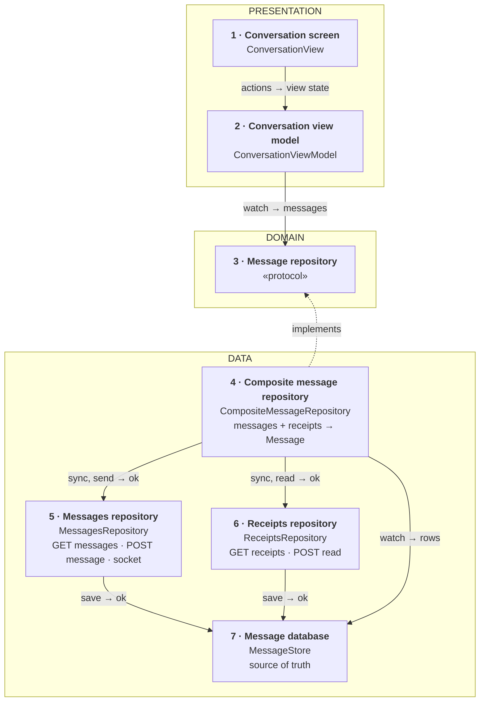
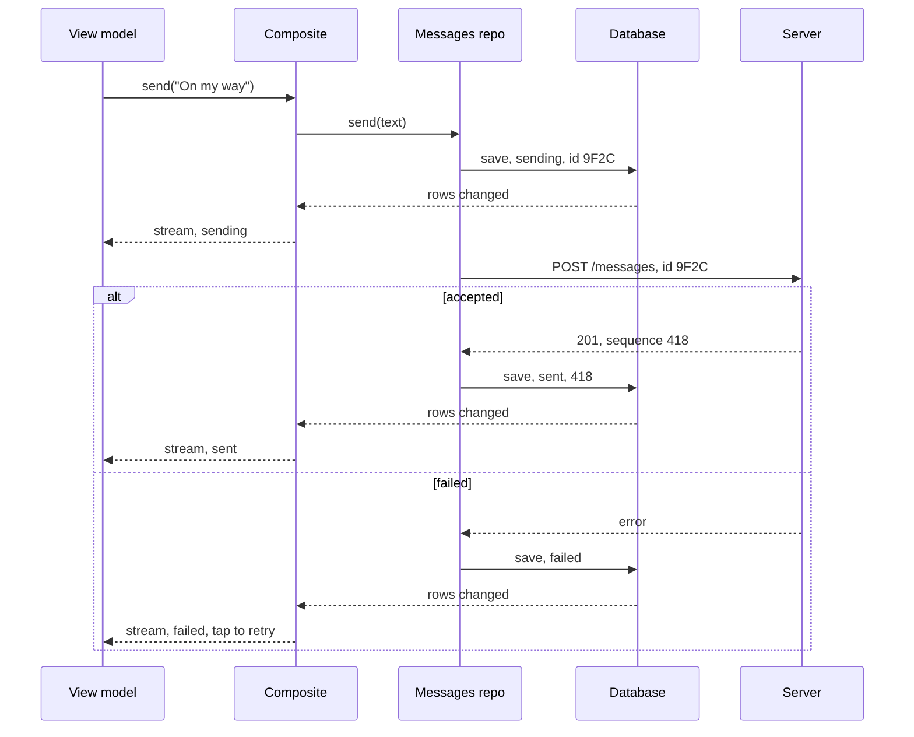
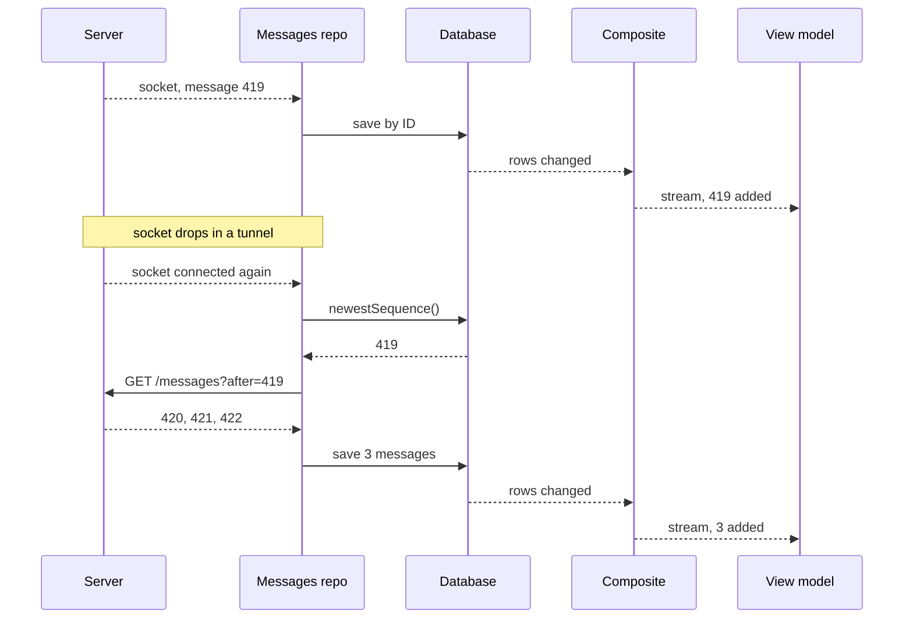
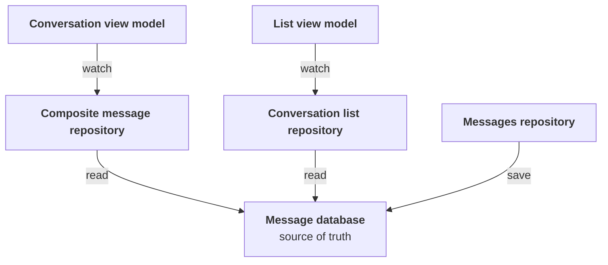

*A recurring senior mobile prompt, and one of the public exercises interviewers draw their wording from. The answer below stays small on purpose: one repository per source, one composite to combine them, five endpoints and one socket.*

> **Interviewer:** "Let's design the client side of a chat app. One-to-one and small group conversations. Where would you start?"

## Run it as a round, not as reading

Set a timer. Sketch. Talk the whole time. Open a section only when its slot is over.

| Clock | Phase | What you do |
|---|---|---|
| 0:00–0:02 | The prompt | Repeat it back in one sentence |
| 0:02–0:07 | Clarify | Ask yours, then read section 1 |
| 0:07–0:12 | Scope | Out of scope first, then features, then what must feel good |
| 0:12–0:24 | High level | The idea · the parts · the sketch · each part · two flows |
| 0:24–0:40 | Deep dives | The interviewer picks one of sections 9–11 |
| 0:40–0:45 | Recap | Follow-ups, then the 60-second summary |

## What this question is really testing

- **Who decides the order?** The server's sequence number, never the phone's clock.
- **A send that never waits** and never arrives twice: a client message ID.
- **The screen reads only the local database.** The network only writes into it.
- **Catching up after a gap**, from the last sequence number you have.
- **Keeping it small.** Fan-out, presence and storage at scale are the server's job.

**Traps:** ordering by the phone's clock; a send button that waits for the server; a retry that sends a new ID; trusting push notifications for delivery; drawing the screen straight from the socket.

::: Words used in this chapter
- **Server, API, endpoint** — the server passes messages between people and keeps the history; the API is the list of requests it accepts; an endpoint is one of them.
- **WebSocket** — a line kept open to the server, so it can say "new message" the moment it happens.
- **Sequence number** — a counter the server stamps on each message in a conversation: 417, 418, 419. It is the true order.
- **Client message ID** — an ID the phone gives a message before sending it. Sent twice, the server keeps one.
- **Idempotent** — sending the same request twice has the same effect as once.
- **Source of truth** — the one place the screen reads from. Here, the database on the phone.
- **Layer** — a group of parts with the same kind of job: *presentation* (what you see), *domain* (the app's own rules and data), *data* (where data comes from).
- **View model, view state** — the view model is the screen's brain. The view state is one value that describes everything the screen shows.
- **Model, DTO, mapping** — the *model* is the app's own description of a message. A *DTO* is the server's format. *Mapping* turns one into the other.
- **Protocol** — a promise of what a part can do, without saying how. A fake can keep the same promise in tests.
- **Repository** — the one place the app asks for data. **Composite** — a repository that combines several sources into one model.
- **Receipt** — the server telling you how far the others have got: "delivered up to 418, read up to 417".
:::

::: 1 · The interviewer answers your clarifying questions
**"One-to-one only, or groups?"** → *Both. Groups are small, up to about 50 people.*

**"What's in a message?"** → *Text only. Attachments are out of scope.*

**"Offline?"** → *Yes. Read your conversations with no signal, and write a message that goes out later.*

**"Several devices per user?"** → *A phone and an iPad at once. Both show the same order.*

**"What status does a sent message show?"** → *Sending, sent, delivered, read. And failed, with a retry.*

**"How do I know who has read what?"** → *A separate receipts endpoint. Messages are the same for everyone; receipts are not.*

**"Typing, presence, encryption?"** → *Typing is nice to have. Presence and end-to-end encryption are out.*

**"Minimum OS, UI framework?"** → *iOS 17, SwiftUI.*
:::

::: 2 · Requirements and scope — what you should have said
**Out of scope, said first:** the server (fan-out, storage, presence), attachments, calls, editing and deleting, search, encryption, sign-in.

**Features**

1. Open a conversation instantly, even offline.
2. Send a message: it shows at once, goes out exactly once, and shows its status.
3. Receive new messages live, and catch up on anything missed.
4. Scroll back through older messages.

**What must feel good**

- **Correct** — never lost, never twice, the same order on every device.
- **Instant** — opening and sending never wait on the network.
- **Resilient** — survives tunnels and the app being closed mid-send.
- **Light on battery** — one socket, only while the app is open.
:::

::: 3 · The idea, in 30 seconds — before you draw anything
> *"One repository per source. A messages repository calls `GET /conversations/{id}/messages` (`?before=` for history, `?after=` to catch up), `POST /conversations/{id}/messages`, and listens on the `/live` WebSocket. A receipts repository calls `GET /conversations/{id}/receipts` and `POST /conversations/{id}/read`. Both save into a database on the phone, so a conversation opens instantly, even offline. A composite repository owns no source: it combines messages and receipts into one `Message` with a status. Sending saves first and posts with an ID the phone chose, so a retry never duplicates. Three layers: presentation, domain, data."*
:::

::: 4 · What we need — the components, before the sketch
| # | Part | Type | Layer | Its one job |
|---|---|---|---|---|
| 1 | **Conversation screen** | `ConversationView` | Presentation | Draws the view state. |
| 2 | **Conversation view model** | `ConversationViewModel` | Presentation | Turns messages into a view state. |
| 3 | **Message repository** | `MessageRepository` | Domain | Promises a conversation and sending. |
| 4 | **Composite message repository** | `CompositeMessageRepository` | Data | Combines messages and receipts into `Message`. |
| 5 | **Messages repository** | `MessagesRepository` | Data | Fetches, sends and receives messages. |
| 6 | **Receipts repository** | `ReceiptsRepository` | Data | Reads and sends read receipts. |
| 7 | **Message database** | `MessageStore` | Data | Keeps the chat on the phone. |

The `Message` model isn't a card: it's what the composite returns, written on its card. The HTTP client and the one socket connection the two source repositories share aren't drawn either.

**No use case.** Sending's rules (save first, same ID on every retry) belong to the messages repository. Marking read's rule (only up, at most every two seconds) belongs to the receipts repository. Loading has no rule at all.

Not on the list yet: the conversation list, push notifications, typing indicators, attachments, a background sync engine. *"I'll add those if we go there."*
:::

::: 5 · The sketch


**How to read it.** A solid arrow points from the part that asks to the part that answers: *request → reply*. The dashed arrow means *implements*.

**Dependency inversion, in one line.** The domain writes the promise (card 3); the data layer keeps it (card 4). The arrow points **up**, so the domain never depends on the database or the network.

**One owner per source.** Server messages come only through card 5, receipts only through card 6. Each saves into its own table in the database (card 7). The database is the screen's source of truth because it survives relaunch and works offline. The composite (card 4) owns nothing: it reads both tables and combines them.

**On Miro:** three frames (blue, purple, green), seven cards, eight arrows. Point at card 7 and say: *"the screen only ever reads from here."*
:::

::: 6 · Each component: its job, its interface, the choice inside it
**The model everyone shares.** It's what the composite returns; the screen never sees a DTO.

```swift
struct Message: Identifiable, Hashable, Sendable {
    /// the client message ID, chosen on the phone
    let id: MessageID
    let senderID: UserID
    let text: String
    let sentAt: Date
    /// the server's order, nil until the server accepts it
    let sequence: Int?
    var status: MessageStatus
}

enum MessageStatus: Sendable {
    case sending, sent, delivered, read, failed
}
```

The ID is the one the phone made, so a bubble keeps its identity from "sending" to "read" and never flickers.

### 1 · Conversation screen (`ConversationView`)

**Job:** draws what the view model hands it and reports taps and scrolls. It decides nothing.

**Interface:** reads `viewModel.viewState`; calls `onAppear()`, `send(_:)`, `retry(_:)`, `onTopReached()`, `onNewestVisible(_:)`.

**Choice:** a SwiftUI `List` anchored to the bottom, newest last. *Switch to* a wrapped `UICollectionView` if long conversations stutter on the oldest phone.

### 2 · Conversation view model (`ConversationViewModel`)

**Job:** watches the conversation and turns it into one view state.

**Interface:**

```swift
struct ConversationViewState: Equatable {
    let title: String
    let rows: [MessageRow]
    /// e.g. "Waiting for network…", nil when online
    let banner: String?
    let isLoadingOlder: Bool
}

struct MessageRow: Equatable, Identifiable {
    let id: MessageID
    let text: String
    let isMine: Bool
    /// already formatted, e.g. "14:02"
    let time: String
    /// nil for other people's messages
    let status: MessageStatus?
}

@MainActor @Observable
final class ConversationViewModel {
    init(conversation: ConversationID, repository: MessageRepository)

    var viewState: ConversationViewState { get }

    func onAppear() async
    func send(_ text: String)
    func retry(_ id: MessageID)
    func onTopReached() async
    func onNewestVisible(_ id: MessageID)
}
```

**Choices:**

- **One view state**, so the screen stays dumb and a test checks one value.
- **Optimistic "sending" bubble** with a clock icon, before the server answers. Nothing to undo: it's a saved row, and a failure turns it red with "tap to retry".

### 3 · Message repository (`MessageRepository`)

**Job:** the one promise the view model needs: a live conversation, sending, older history and marking read.

```swift
protocol MessageRepository: Sendable {
    /// The conversation, sorted, updated on every change
    func messages(in conversation: ConversationID) -> AsyncStream<[Message]>
    func send(_ text: String, in conversation: ConversationID) async
    func retry(_ id: MessageID) async
    /// Loads 50 older messages, returns false at the beginning
    func loadOlder(in conversation: ConversationID) async throws -> Bool
    func markRead(upTo sequence: Int, in conversation: ConversationID)
}
```

**Choice:** a stream, not a one-off fetch, because the conversation keeps changing. The view model never knows there are two sources.

### 4 · Composite message repository (`CompositeMessageRepository`)

**Job:** combines message rows and receipt numbers into `Message`s, and passes each action to the repository that owns it.

**Interface:** conforms to `MessageRepository`. Built with `init(messages: MessagesRepositoryType, receipts: ReceiptsRepositoryType, store: MessageStoreType)`.

**How it combines:**

1. On watch, ask both repositories to sync, then watch the database.
2. No sequence yet → `sending` (or `failed` if marked). Up to `readUpTo` → `read`, up to `deliveredUpTo` → `delivered`, else `sent`.
3. Sort by sequence. Messages still sending go last.

**Choices:**

- **It owns no source of its own.** Send, retry and load older go to card 5; mark read goes to card 6. Adding a source later changes this one class.
- **Mapping in two steps.** Each source repository maps its DTOs to rows before saving; the composite maps rows to `Message`. DTOs never leave the data layer.

### 5 · Messages repository (`MessagesRepository`)

**Job:** owns messages: `GET messages`, `POST message` and socket message events, all saved to the database.

```swift
protocol MessagesRepositoryType: Sendable {
    /// Listens for message events and catches up with ?after=
    func sync(_ conversation: ConversationID) async
    /// Saves as sending, then posts with the same ID until it's accepted
    func send(_ text: String, in conversation: ConversationID) async
    func retry(_ id: MessageID) async
    /// Fetches 50 older with ?before=, false at the beginning
    func loadOlder(in conversation: ConversationID) async throws -> Bool
}
```

**Choices:**

- **Catch up from the newest sequence it has**, on watch and after every reconnect. The socket is fast; the catch-up is what makes it complete.
- **One shared instance for the app**, so a send keeps going after the user leaves the screen. Unsent rows are retried on launch and when the network returns (`NWPathMonitor`).
- **No separate sync engine yet.** Split one out when sending must survive the app being closed for hours.

### 6 · Receipts repository (`ReceiptsRepository`)

**Job:** owns receipts: `GET receipts`, `POST read` and socket receipt events, saved to the database.

```swift
protocol ReceiptsRepositoryType: Sendable {
    /// Fetches receipts now, then listens for receipt events
    func sync(_ conversation: ConversationID) async
    /// Sent at most every two seconds, and only if the number went up
    func markRead(upTo sequence: Int, in conversation: ConversationID)
}
```

**Choice:** receipts are "up to" numbers, not one flag per message. One number covers every tick, and reading is cumulative, so one request is enough.

### 7 · Message database (`MessageStore`)

**Job:** stores message rows and receipt numbers on the phone, and tells watchers when they change.

```swift
protocol MessageStoreType: Sendable {
    /// Rows and receipts, re-sent on every change
    func observe(_ conversation: ConversationID) -> AsyncStream<ConversationRecord>
    /// Insert or update by message ID
    func saveMessages(_ rows: [MessageRecord], in conversation: ConversationID) async throws
    func saveReceipts(_ receipts: ReceiptsRecord, in conversation: ConversationID) async throws
    func unsent() async throws -> [MessageRecord]
    func newestSequence(in conversation: ConversationID) async throws -> Int?
}
```

**Choices:**

- **SwiftData or SQLite**; SQLite if you need tight control of queries and migrations.
- **Save by ID**, so a message delivered twice is stored once.
- **Protected on disk** (`completeUntilFirstUserAuthentication`) and deleted on sign-out.
:::

::: 7 · Key flows through the sketch
**Flow 1 — sending a message.**



**Flow 2 — receiving: live, then catch-up.**


:::

::: 8 · The server contract
```
GET  /v1/conversations/{id}/messages?before={sequence}&limit=50
GET  /v1/conversations/{id}/messages?after={sequence}&limit=50
     → { "items": [ { "id", "clientMessageId", "senderId",
                      "text", "sequence", "sentAt" } ],
         "hasMore": true }

POST /v1/conversations/{id}/messages
     { "clientMessageId": "9F2C…", "text": "On my way" }
     → 201 { "id", "clientMessageId", "sequence": 418, "sentAt" }
       (same clientMessageId again → 200, the same message)

GET  /v1/conversations/{id}/receipts
     → { "deliveredUpTo": 418, "readUpTo": 417 }

POST /v1/conversations/{id}/read   { "upToSequence": 419 }
     → 204

WSS  /v1/live
     ← { "type": "message" | "receipt" | "typing", … }
```

The first three belong to the messages repository, the next two to the receipts repository. The socket is one shared connection: message events go to the messages repository, receipt events to the receipts repository.

- **Sequence numbers per conversation.** They are the order, and a jump shows a gap.
- **`clientMessageId` makes sending idempotent.** A retry after a lost reply is safe.
- **Receipts are "up to" numbers on their own endpoint**, separate from messages, which are the same for everyone.
:::

::: 9 · Deep dive — "Messages arrive out of order, twice, or not at all."
**Decision:** the server's sequence is the order, the ID removes duplicates, and a catch-up fills gaps.

1. **Save by ID.** Already there? Update it. A message delivered twice shows once.
2. **Sort by sequence.** A late message still lands in the right place.
3. **Spot a gap.** If 418 is followed by 421, the messages repository calls `GET ?after=418`.
4. **Catch up after every reconnect.** The socket is fast but never complete. The catch-up is what makes it correct.

*Rejected:* ordering by the time on the sender's phone. Clocks drift, so two devices would disagree.
:::

::: 10 · Deep dive — "I send a message in a tunnel, then close the app."
**Decision:** save first, show at once, resend with the same ID until the server answers.

1. **Save** the message with status *sending*. It is on screen at once.
2. **No network?** It waits in the database. When `NWPathMonitor` says the network is back, or the app next launches, the messages repository sends every unsent row, oldest first, one at a time.
3. **Temporary error** (timeout, 5xx) → retry with backoff. **Permanent error** (4xx) → *failed*, tap to retry.
4. **Every retry uses the same `clientMessageId`.** If the server stored it but the reply was lost, it answers "already have it".

`beginBackgroundTask` buys a few seconds when the app goes to the background; anything left goes on next launch.

*Rejected:* disabling send while offline. Safe, but it feels broken.
:::

::: 11 · Deep dive — "Read receipts, and a second screen."
**Marking as read.**

1. When the newest message is visible, the view model calls `markRead(upTo: 419)`.
2. The composite passes it to the receipts repository, which sends `POST /read` at most every two seconds, and only if the number went up.
3. The others get a receipt event; every message up to 419 shows *read*.

**The conversation list shows the same messages.** It is almost free: the list's own repository reads the same database, so one save updates both screens. No shared store, no change bus.



*Rejected:* one request per message read. Reading is cumulative, so one number is enough.
:::

::: 12 · Failure modes and 10×
- **Offline** → conversations open from the database, sends wait, a "Waiting for network…" banner.
- **Socket keeps dropping** → reconnect with backoff, catch up after each reconnect.
- **Receipts endpoint fails** → messages still show as *sent*; one source failing never hides the conversation.
- **Duplicate message** → saved by ID, shown once.
- **Missing message** → a sequence gap triggers a catch-up.
- **App killed mid-send** → the row is on disk; next launch resends with the same ID.
- **Signed out** → database deleted, socket closed.

**At 10×:**

- **Big groups** → receipts become "read by 12", fetched when the user asks.
- **Long history** → keep recent messages on the phone and page the rest with `?before=`.
:::

::: 13 · Question bank — everything they can push on
Answer out loud first, then open.

### Scope and architecture

<details>
<summary>"Why is the server out of scope?"</summary>

Fan-out, storage and presence are backend problems. The client treats the server as an API contract.
</details>

<details>
<summary>"Walk me through the layers."</summary>

Presentation: screen and view model. Domain: `Message` and the message repository protocol. Data: a messages repository, a receipts repository, a composite that combines them, and the database they save into.
</details>

<details>
<summary>"Why separate messages and receipts repositories and a composite?"</summary>

Messages and receipts are different sources that change for different reasons. One repository each keeps them small; the composite is the one place they meet.
</details>

<details>
<summary>"Why no SendMessageUseCase?"</summary>

Save-first and same-ID retry are delivery mechanics of one source, so they live in the messages repository. Loading has no rule at all.
</details>

<details>
<summary>"Show me dependency inversion."</summary>

The message repository protocol lives in the domain; the composite in the data layer implements it. The arrow points up, so the domain never imports the database or networking.
</details>

<details>
<summary>"Where does mapping happen?"</summary>

Each source repository maps its DTOs to database rows; the composite maps rows to `Message`. The domain never sees the server's shape.
</details>

<details>
<summary>"Where does a message's status come from?"</summary>

The composite combines the message row with the receipt numbers. No sequence means sending; up to `readUpTo` means read.
</details>

### Ordering and the API

<details>
<summary>"Why not order by timestamp?"</summary>

Phone clocks drift and can be changed. The server's sequence number is the same on every device.
</details>

<details>
<summary>"Why does the phone make the message ID?"</summary>

So a retry carries the same ID and the server can keep just one. It also keeps the bubble stable from sending to read.
</details>

<details>
<summary>"Why are receipts a separate endpoint?"</summary>

Messages are the same for everyone. How far others have read is separate state that changes on its own, so it has its own endpoint and its own repository.
</details>

<details>
<summary>Follow-up chain: "The reply is lost."</summary>

1. *"You post a message and the connection times out."* → The row stays *sending*.
2. *"Did the server get it?"* → You can't know. Retry with the same ID.
3. *"It had."* → The server returns the stored message. One message, not two.
4. *"Retry with a new ID?"* → Your friend gets it twice.
</details>

### Sending

<details>
<summary>"What happens when I tap send?"</summary>

The messages repository saves it as sending, so it appears at once, then posts it. The reply turns it to sent or failed.
</details>

<details>
<summary>"Three messages queued offline. In what order do they go?"</summary>

One at a time, oldest first. Sending in parallel could deliver them out of order.
</details>

<details>
<summary>"The user leaves the screen mid-send."</summary>

The messages repository is one shared instance, so the send carries on. The view model was only watching.
</details>

<details>
<summary>"The app is killed mid-send."</summary>

The row is on disk as sending. Next launch resends it with the same ID.
</details>

### Receiving and sync

<details>
<summary>"Why read from the database instead of the socket?"</summary>

The database survives restarts and works offline. The socket is a fast way to fill it, not a place to read from.
</details>

<details>
<summary>"The socket was down for five minutes."</summary>

On reconnect, the messages repository asks `GET ?after=` the newest sequence it has, and saves what comes back.
</details>

<details>
<summary>"Can push notifications replace the socket?"</summary>

No. They can be late or dropped. They nudge; the catch-up delivers.
</details>

<details>
<summary>"Scroll back two years."</summary>

Show what the database has, then `GET ?before=` the oldest sequence, 50 at a time, until `hasMore` is false.
</details>

<details>
<summary>Follow-up chain: "A second screen."</summary>

1. *"Add the conversation list. A message arrives."* → The messages repository saves it to the database.
2. *"How does the list update?"* → Its repository reads the same database, so it updates on its own.
3. *"No shared store?"* → The database is the shared store.
4. *"When would you need a change bus?"* → For "everything is stale" events, like sign-out.
</details>

### Offline, testing and change

<details>
<summary>"How do you test sending?"</summary>

The messages repository with a fake HTTP client that throws, then succeeds. Check the row goes sending, failed, then sent, with the same ID both times.
</details>

<details>
<summary>"How do you test the composite repository?"</summary>

An in-memory database with three rows and receipts `readUpTo: 2`. Check two come back read and one sent.
</details>

<details>
<summary>"How do you test the view model?"</summary>

A fake message repository whose stream you control. Push messages in and check the view state.
</details>

<details>
<summary>"Add typing indicators."</summary>

A socket event, kept in the view model for a few seconds, never saved. It isn't worth storing.
</details>

<details>
<summary>Follow-up chain: "Two weeks instead of six."</summary>

1. *"What do you cut?"* → Typing, old-history paging, the 10× work.
2. *"What can't you cut?"* → The database as source of truth, client IDs, catch-up after reconnect.
3. *"Risk?"* → Long conversations load slower. Fixable next release.
</details>
:::

::: 14 · Scorecard — mark yourself, 0 / 1 / 2
| | Did you… | 0–2 |
|---|---|---|
| 1 | Talk the whole time, and listen when interrupted | |
| 2 | Clarify before designing | |
| 3 | Give a rejected alternative for each choice | |
| 4 | Say out of scope first, including the server | |
| 5 | Say the idea, list the parts, then sketch | |
| 6 | Keep the sketch to about nine cards | |
| 7 | Name the endpoints and the socket | |
| 8 | Order by the server's sequence, not the clock | |
| 9 | Give every message a client ID, reused on retry | |
| 10 | Make the database the screen's only source | |
| 11 | Catch up from the last sequence after a reconnect | |
| 12 | One repository per source, a composite that combines them | |
| 13 | Say why there's no use case | |
| 14 | Land the recap inside 60 seconds | |

14+ is a pass.<!--private--> Anything scored 0 goes in the progress log and comes back as a recall prompt.<!--/private--><!--public--> A zero names the thing to read about next.<!--/public-->
:::

::: 15 · The 60-second recap
The screen reads only from a database on the phone, so conversations open instantly and work offline. Messages and receipts each have their own repository that saves into it, and a composite combines them into one `Message` with a status; DTOs never leave the data layer. Sending saves first as "sending", then posts with an ID the phone chose, so a retry can never duplicate. The server's sequence number is the order on every device. A WebSocket brings new messages, and after any gap the messages repository asks for everything after the last sequence it has. There's no use case: save-first and retry are delivery mechanics. A second screen, like the conversation list, reads the same database.
:::
