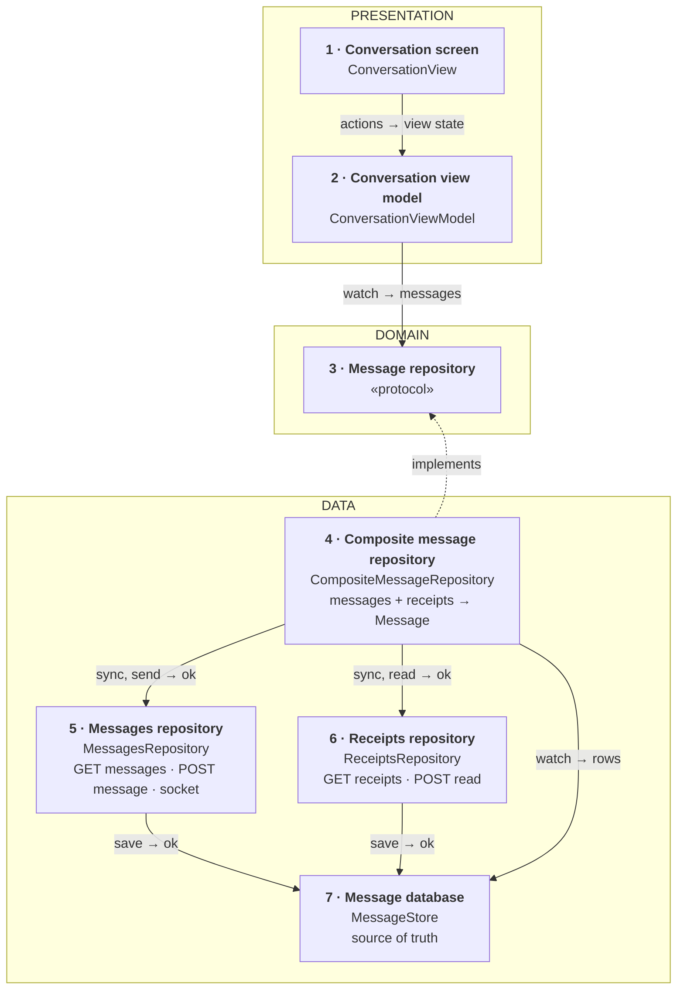
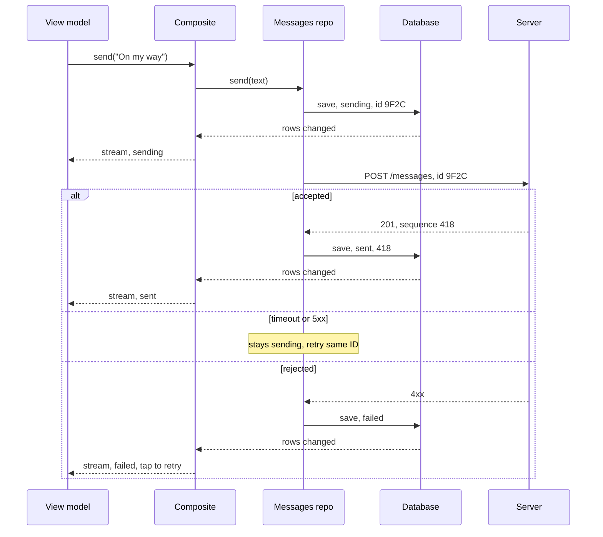
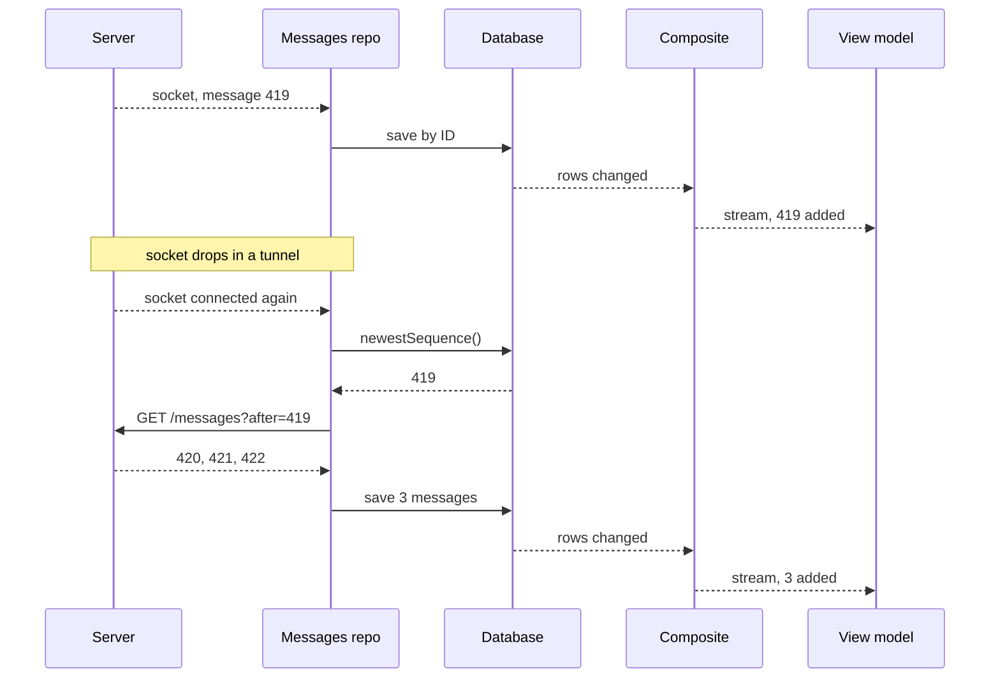
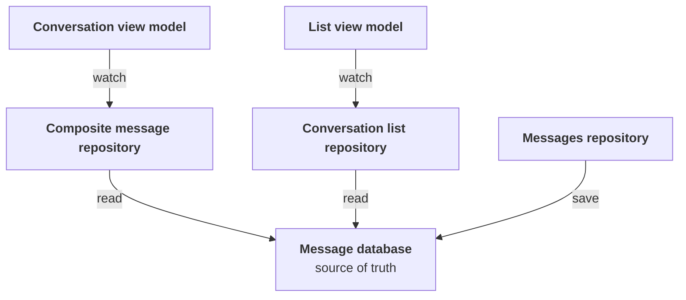

*A recurring senior mobile prompt, and one of the public exercises interviewers draw their wording from. The answer below stays small on purpose: one repository per source, one composite to combine them, five endpoints and one socket. Start simple; add parts only when the interviewer asks for them.*

> **Interviewer:** "Let's design the client side of a chat app. One-to-one and small group conversations. Where would you start?"

## Run it as a round, not as reading

Set a timer. Sketch. Talk the whole time. Open a section only when its slot is over.

| Clock | Phase | What you do |
|---|---|---|
| 0:00–0:02 | The prompt | Repeat it back in one sentence |
| 0:02–0:07 | Clarify | Ask yours, then read section 1 |
| 0:07–0:12 | Scope | Out of scope first, then required, then later |
| 0:12–0:24 | High level | The idea · the parts · the sketch · each part · two flows |
| 0:24–0:40 | Deep dives | The interviewer picks one of sections 9–11 |
| 0:40–0:45 | Recap | Follow-ups, then the 60-second summary |

## What this question is really testing

- **Who decides the order?** The server's sequence number, not the phone's clock.
- **A send that doesn't wait for the network**, and a retry the server can recognise: a client message ID.
- **The screen reads only the local database.** The network only writes into it.
- **Catching up after a gap**, from the last sequence number you have, because the socket can miss things.
- **Keeping it small.** Fan-out, presence and storage at scale are the server's job.

**Traps:** ordering by the phone's clock; a send button that waits for the server; a retry that sends a new ID; trusting push notifications for delivery; drawing the screen straight from the socket; showing "not read" when the receipts call failed.

::: Words used in this chapter
- **Server, API, endpoint** — the server passes messages and keeps the history; the API is the requests it accepts; an endpoint is one of them.
- **WebSocket** — a line kept open to the server, so it can say "new message" the moment it happens.
- **Sequence number** — a counter the server stamps on each message in a conversation: 417, 418, 419. The server promises it is the order.
- **Client message ID** — an ID the phone gives a message before sending it. Sent twice, the server keeps one.
- **Outbox** — messages written on the phone that the server hasn't accepted yet. Here, the unsent rows.
- **Idempotent** — sending the same request twice has the same effect as once.
- **Layer** — a group of parts with the same kind of job: *presentation* (what you see), *domain* (the app's own rules and data), *data* (where data comes from).
- **View model, view state** — the view model is the screen's brain. The view state is one value that describes everything the screen shows.
- **Model, DTO, mapping** — the *model* is the app's own description of a message. A *DTO* is the server's format. *Mapping* turns one into the other.
- **Protocol** — a promise of what a part can do, without saying how. A fake can keep the same promise in tests.
- **Repository** — the one place the app asks for data. **Composite** — a repository that combines several sources into one model.
- **Receipt** — the server telling you how far the others have got: "delivered up to 418, read up to 417".
:::

::: 1 · The interviewer answers your clarifying questions
**"One-to-one only, or groups?"** → *Both. Groups are small, up to about 50 people.*

**"What's in a message?"** → *Text only. Attachments are out of scope.*

**"Offline?"** → *Yes. Read your conversations with no signal, and write a message that goes out later.*

**"Several devices per user?"** → *A phone and an iPad at once. Both show the same order.*

**"What status does a sent message show?"** → *Sending, sent, delivered, read. And failed, with a retry.*

**"How do I know who has read what?"** → *A separate receipts endpoint. A message is shared by everyone in the conversation; how far each person has read is per user.*

**"How many users?"** → *Say 20 million a day, sending about 30 messages each. Don't design the backend.*

**"Typing, presence, encryption?"** → *Typing is nice to have. Presence and end-to-end encryption are out.*

**"Minimum OS, UI framework?"** → *iOS 17, SwiftUI.*
:::

::: 2 · Requirements and scope — what you should have said
**Out of scope, said first:** the server (fan-out, storage, presence), attachments, calls, editing and deleting, search, encryption, sign-in.

**Required for the prompt**

1. Open a conversation instantly, even offline.
2. Send a message, online or offline: it shows at once, the server keeps it once, and it shows its status.
3. Receive new messages live, and catch up on anything missed.
4. Scroll back through older messages.

**What must feel good:** no lost or doubled messages, in the server's order on every device · opening and sending don't wait on the network · survives tunnels and a closed app · one socket, only while the app is open.

**Production considerations** (say them, don't draw them): token refresh, timeouts and safe retries, socket reconnect, metrics, data protection. See section 12.

**Optional follow-ups** (add only when asked):

```text
The conversation list        → a second reader of the same database
Typing indicators            → socket events, kept in memory
New messages while closed    → push notifications, then a catch-up
Sending after hours closed   → a background sync step
Attachments                  → upload first, then send a message with the URL
```

*"I'll start simple and add each of these when the requirement appears."*
:::

::: 3 · The idea, in 30 seconds — before you draw anything
> *"One repository per source. A messages repository calls `GET /conversations/{id}/messages` (`?before=` for history, `?after=` to catch up), `POST /conversations/{id}/messages`, and listens on the `/live` WebSocket. A receipts repository calls `GET /conversations/{id}/receipts` and `POST /conversations/{id}/read`. Both save into a database on the phone, so a conversation opens instantly, even offline. A composite repository owns no source: it combines messages and receipts into one `Message` with a send state and a receipt state. Sending saves first, then posts unsent rows oldest first, each with an ID the phone chose, so the server can recognise a retry. Three layers: presentation, domain, data."*
:::

::: 4 · What we need — the components, before the sketch
| # | Part | Type | Layer | Its one job |
|---|---|---|---|---|
| 1 | **Conversation screen** | `ConversationView` | Presentation | Draws the view state. |
| 2 | **Conversation view model** | `ConversationViewModel` | Presentation | Turns messages into a view state. |
| 3 | **Message repository** | `MessageRepository` | Domain | Promises a conversation and sending. |
| 4 | **Composite message repository** | `CompositeMessageRepository` | Data | Combines messages and receipts into `Message`. |
| 5 | **Messages repository** | `MessagesRepository` | Data | Fetches, sends and receives messages. |
| 6 | **Receipts repository** | `ReceiptsRepository` | Data | Reads and sends read receipts. |
| 7 | **Message database** | `MessageStore` | Data | Keeps the chat on the phone. |

The `Message` model isn't a card: it's what the composite returns, written on its card. The HTTP client and the one socket connection the two source repositories share aren't drawn either.

**No use case.** Sending's rules (save first, oldest first, same ID on retry) touch only messages; marking read's rule (only up, at most every two seconds) touches only receipts; loading has none. A use case earns its place once a rule spans both sources.

Not on the list yet: everything under "optional follow-ups" in section 2.
:::

::: 5 · The sketch


**How to read it.** A solid arrow points from the part that asks to the part that answers: *request → reply*. The dashed arrow means *implements*.

**Dependency inversion, in one line.** The domain writes the promise (card 3); the data layer keeps it (card 4). The arrow points **up**, so the domain never depends on the database or the network.

**One owner per source.** Messages come only through card 5, receipts only through card 6; each saves into its own table in card 7, the screen's source of truth. The composite owns nothing: it reads both and combines them.

**On Miro:** three frames (blue, purple, green), seven cards, eight arrows. Point at card 7 and say: *"the screen only ever reads from here."*
:::

::: 6 · Each component: its job, its interface, the choice inside it
**The model everyone shares.** It's what the composite returns; the screen never sees a DTO.

```swift
struct Message: Identifiable, Hashable, Sendable {
    /// the client message ID, chosen on the phone
    let id: MessageID
    let senderID: UserID
    let text: String
    let sentAt: Date
    /// the server's order, nil until the server accepts it
    let sequence: Int?
    /// sending, sent, failed — my message reaching the server
    var send: SendState
    /// unknown, notDelivered, delivered, read — only once sent
    var receipt: ReceiptState
}
```

The ID is the one the phone made, so a bubble keeps its identity from "sending" to "read" and doesn't flicker.

**Two states, not one status enum.** "Did my send reach the server?" and "how far have the others got?" come from different sources and fail separately. `unknown` means no receipts ever loaded: a dimmed tick, never "not delivered".

### 1 · Conversation screen (`ConversationView`)

**Job:** draws what the view model hands it and reports taps and scrolls. It decides nothing.

**Interface:** reads `viewModel.viewState`; calls `onAppear()`, `send(_:)`, `retry(_:)`, `onTopReached()`, `onNewestVisible(_:)`.

**Choice:** a SwiftUI `List` anchored to the bottom, newest last. *Switch to* a wrapped `UICollectionView` if long conversations stutter on the oldest phone.

### 2 · Conversation view model (`ConversationViewModel`)

**Job:** watches the conversation and turns it into one view state.

**Interface:**

```swift
struct ConversationViewState: Equatable {
    let title: String
    let rows: [MessageRow]
    /// e.g. "Waiting for network…", nil when online
    let banner: String?
    /// idle, loading, failed(message), beginning
    let history: HistoryState
}

struct MessageRow: Equatable, Identifiable {
    let id: MessageID
    let text: String
    let isMine: Bool
    /// already formatted, e.g. "14:02"
    let time: String
    /// clock, red retry, one tick, two ticks, read, dimmed;
    /// nil for other people's messages
    let ticks: Ticks?
}

@MainActor @Observable
final class ConversationViewModel {
    init(conversation: ConversationID, repository: MessageRepository)

    var viewState: ConversationViewState { get }

    func onAppear() async
    func send(_ text: String)
    func retry(_ id: MessageID)
    func onTopReached() async
    func onNewestVisible(_ id: MessageID)
}
```

**Choices:**

- **One view state**, so the screen stays dumb and a test checks one value. Rows, banner and history can coexist, so they're separate fields, not one status.
- **Optimistic "sending" bubble** with a clock icon, before the server answers. Nothing to roll back: it's a saved row. A failure turns **only that bubble** red with "tap to retry"; the messages around it don't change.

### 3 · Message repository (`MessageRepository`)

**Job:** the one promise the view model needs: a live conversation, sending, older history and marking read.

```swift
protocol MessageRepository: Sendable {
    /// The conversation, sorted, updated on every change
    func messages(in conversation: ConversationID) -> AsyncStream<[Message]>
    func send(_ text: String, in conversation: ConversationID) async
    func retry(_ id: MessageID) async
    /// Loads 50 older messages, returns false at the beginning
    func loadOlder(in conversation: ConversationID) async throws -> Bool
    func markRead(upTo sequence: Int, in conversation: ConversationID)
}
```

**Choices:**

- **A stream, not a one-off fetch**, because the conversation keeps changing.
- **What the protocol earns:** the view model is tested with a fake whose stream the test controls, and it never knows there are two sources or a database.

### 4 · Composite message repository (`CompositeMessageRepository`)

**Job:** combines message rows and receipt numbers into `Message`s, and passes each action to the repository that owns it.

**Interface:** conforms to `MessageRepository`. Built with `init(messages: MessagesRepositoryType, receipts: ReceiptsRepositoryType, store: MessageStoreType)`.

**How it combines:**

1. On watch, ask both repositories to sync, then watch the database.
2. Send state from the row: no sequence → `sending` (or `failed` if marked), else `sent`.
3. Receipt state from the numbers: none saved yet → `unknown`; up to `readUpTo` → `read`; up to `deliveredUpTo` → `delivered`; else `notDelivered`.
4. Sort by sequence. Messages still sending go last, oldest first.

**Choices:**

- **It owns no source of its own.** Send, retry and load older go to card 5; mark read goes to card 6.
- **Mapping in two steps.** Each source repository maps its DTOs to rows before saving; the composite maps rows to `Message`. DTOs never leave the data layer.
- **The trade-off, said out loud:** a separate receipts endpoint adds a request when a conversation opens. In production I'd ask the backend to return the receipt numbers with the catch-up reply; then the receipts read disappears, and nothing above the domain changes.

### 5 · Messages repository (`MessagesRepository`)

**Job:** owns messages: `GET messages`, `POST message` and socket message events, all saved to the database.

```swift
protocol MessagesRepositoryType: Sendable {
    /// Listens for message events and catches up with ?after=
    func sync(_ conversation: ConversationID) async
    /// Saves as sending, then posts with the same ID until it's accepted
    func send(_ text: String, in conversation: ConversationID) async
    func retry(_ id: MessageID) async
    /// Fetches 50 older with ?before=, false at the beginning
    func loadOlder(in conversation: ConversationID) async throws -> Bool
}
```

**Choices:**

- **Catch up from the newest sequence it has**, on watch and after every reconnect. The socket is fast but can miss events while it's down; the catch-up fills them in.
- **The outbox is the unsent rows**, sent oldest first, one at a time, each with its own client ID kept for every retry. No separate queue type: the database already survives a relaunch.
- **One shared instance for the app**, so a send outlives the screen that started it. Unsent rows are retried on launch and when the network returns (`NWPathMonitor`).

### 6 · Receipts repository (`ReceiptsRepository`)

**Job:** owns receipts: `GET receipts`, `POST read` and socket receipt events, saved to the database.

```swift
protocol ReceiptsRepositoryType: Sendable {
    /// Fetches receipts now, then listens for receipt events
    func sync(_ conversation: ConversationID) async
    /// Sent at most every two seconds, and only if the number went up
    func markRead(upTo sequence: Int, in conversation: ConversationID)
}
```

**Choice:** receipts are "up to" numbers, not one flag per message. One number covers every tick, and reading is cumulative, so one request is enough.

### 7 · Message database (`MessageStore`)

**Job:** stores message rows and receipt numbers on the phone, and tells watchers when they change.

```swift
protocol MessageStoreType: Sendable {
    /// Rows and receipts, re-sent on every change
    func observe(_ conversation: ConversationID) -> AsyncStream<ConversationRecord>
    /// Insert or update by message ID
    func saveMessages(_ rows: [MessageRecord], in conversation: ConversationID) async throws
    func saveReceipts(_ receipts: ReceiptsRecord, in conversation: ConversationID) async throws
    func unsent() async throws -> [MessageRecord]
    func newestSequence(in conversation: ConversationID) async throws -> Int?
}
```

**Choices:**

- **SwiftData or SQLite**; SQLite if you need tight control of queries and migrations.
- **Save by ID**, so a message delivered twice is stored once.
- **Protected on disk** (`completeUntilFirstUserAuthentication`) and deleted on sign-out.

**What the three data protocols earn:** the composite is tested alone, with fake sources and an in-memory store, no server.

**Why these parts, and no more.** Each part changes for a different reason: the screen with design, the view model with screen behaviour, each source repository with its endpoints, the composite with how sources combine, the database with storage. What I'd *not* add yet: a use case that only passes calls through, a protocol for the view model, a separate outbox or sync-engine type, a DI container, a generic repository. Constructor injection is enough.
:::

::: 7 · Key flows through the sketch
**Flow 1 — sending a message.**



Only message 9F2C changes state, and every retry posts 9F2C again.

**Flow 2 — receiving: live, then catch-up.**


:::

::: 8 · The server contract
```
GET  /v1/conversations/{id}/messages?before={sequence}&limit=50
GET  /v1/conversations/{id}/messages?after={sequence}&limit=50
     → { "items": [ { "id", "clientMessageId", "senderId",
                      "text", "sequence", "sentAt" } ],
         "hasMore": true }

POST /v1/conversations/{id}/messages
     { "clientMessageId": "9F2C…", "text": "On my way" }
     → 201 { "id", "clientMessageId", "sequence": 418, "sentAt" }
       (same clientMessageId again → 200, the same message)

GET  /v1/conversations/{id}/receipts
     → { "deliveredUpTo": 418, "readUpTo": 417 }

POST /v1/conversations/{id}/read   { "upToSequence": 419 }
     → 204

WSS  /v1/live
     ← { "type": "message" | "receipt" | "typing", … }
```

The first three belong to the messages repository, the next two to the receipts repository. The one shared socket routes each event type to its owner.

- **Sequence numbers per conversation.** The server promises they are the order and have no holes, so a jump shows a gap. The client still saves by ID.
- **`clientMessageId` makes sending idempotent.** A retry after a lost reply is safe, as long as the server remembers the ID.
- **Shared vs per user.** A message is shared by the conversation; receipts are per user, so they have their own endpoint. That costs a request on open; the `?after=` reply could carry the numbers instead.
:::

::: 9 · Deep dive — "Messages arrive out of order, twice, or not at all."
**Decision:** the server's sequence is the order, the ID removes duplicates, and a catch-up fills gaps.

1. **Save by ID.** Already there? Update it. A message delivered twice shows once.
2. **Sort by sequence.** A late message still lands in the right place.
3. **Spot a gap.** If 418 is followed by 421, the messages repository calls `GET ?after=418`. This relies on the server's promise of no holes.
4. **Catch up after every reconnect.** A socket doesn't promise delivery across a drop, and a dead one can look open (`sendPing` finds out). Reconnect with backoff and jitter, then catch up.

*Rejected:* ordering by the time on the sender's phone. Clocks drift, so two devices would disagree.
:::

::: 10 · Deep dive — "I send a message in a tunnel, then close the app."
**Decision:** save first, show at once, resend with the same ID until the server answers.

1. **Save** the message with status *sending*. It is on screen at once.
2. **No network?** It waits in the database. When `NWPathMonitor` says the network is back, or the app next launches, the messages repository sends every unsent row, oldest first, one at a time. In parallel, the server could accept them in any order.
3. **Temporary error** (timeout, 5xx, 429 with `Retry-After`) → stays *sending*, the queue pauses and retries with backoff. **Permanent error** (4xx) → only that message turns *failed*; the queue moves on, so one bad message doesn't block the rest.
4. **Every retry uses the same `clientMessageId`**, automatic or tapped. If the server stored it but the reply was lost, it answers "already have it". A tapped retry joins the back of the queue and gets a later sequence.

`beginBackgroundTask` asks for a little time in the background; the system can end it early, and anything left goes on next launch.

*Rejected:* disabling send while offline. Safe, but it feels broken.
:::

::: 11 · Deep dive — "Read receipts, and a second screen."
**Marking as read.**

1. When the newest message is visible, the view model calls `markRead(upTo: 419)`.
2. The composite passes it to the receipts repository, which sends `POST /read` at most every two seconds, and only if the number went up. A failure just waits for the next one: the number only grows, so the latest call covers the old.
3. The others get a receipt event; every message up to 419 shows *read*.

**Receipts fail to load.** Keep the saved numbers; with none, ticks are `unknown` and dimmed. *Rejected:* showing "not delivered", which may be false.

**The conversation list shows the same messages.** It is almost free: the list's own repository reads the same database, so one save updates both screens. No shared store, no change bus.



:::

::: 12 · Failure modes, production and scale
**Failures**

| Failure | Client behaviour |
|---|---|
| Offline | Open from the database, sends wait, "Waiting for network…" banner |
| Send times out or 5xx | Stays *sending*, retry with backoff, same ID |
| Send rejected (4xx) | Only that message turns *failed*, tap to retry |
| Socket drops | Reconnect with backoff and jitter, then catch up `?after=` |
| Receipts call fails | Keep the saved ticks; none saved → dimmed, never "not delivered" |
| Duplicate or gap | Saved by ID; a gap triggers a catch-up |
| App killed mid-send | Row is on disk; next launch resends with the same ID |
| Token expired | Refresh it, retry the request once, reopen the socket |
| Signed out | Database deleted, socket closed |

**Production notes** (short, not on the board)

- **Networking:** a timeout per request; retry only what's safe (timeouts, 5xx, and sends, thanks to the ID); honour `Retry-After` on 429; cancellation is cooperative, so a late reply still lands in the database, harmlessly.
- **Caching:** the database is the cache; personal responses never go on a shared CDN.
- **Metrics:** send-to-sent time, send failure rate, outbox size, reconnects per hour, catch-up size, time to open a conversation.
- **Security:** HTTPS and WSS only; file protection on the database; nothing about message text in logs or metrics.

**Scale, back of the envelope.** Use the interviewer's numbers; the shape is what matters.

```text
daily users × messages each = messages a day
messages a day ÷ 86,400 s   = sends per second (average)
```

20M × 30 is 600 million messages a day, about 7,000 sends a second on average. A text is under 1 KB, so a phone's history stays small. Cost moves with sockets, fan-out, catch-up size and receipt frequency, not the client architecture.

**Grow only when asked**

```text
One conversation           → one view model over the database
The conversation list      → a second reader of the same database
New messages while closed  → push to nudge, catch-up to deliver
Big groups                 → "read by 12", fetched when asked
Sending after hours closed → a background sync step
```
:::

::: 13 · Question bank — everything they can push on
Answer out loud first, then open.

### Scope and architecture

<details>
<summary>"Walk me through the layers."</summary>

Presentation: screen and view model. Domain: `Message` and the message repository protocol. Data: a messages repository, a receipts repository, a composite that combines them, and the database they save into.
</details>

<details>
<summary>"Why separate messages and receipts repositories and a composite?"</summary>

Messages and receipts are different sources that change for different reasons. One repository each keeps them small; the composite is the one place they meet.
</details>

<details>
<summary>"Why no SendMessageUseCase?"</summary>

Save-first, oldest-first and same-ID retry touch only messages, so they live in the messages repository. A use case earns its place when a rule spans sources.
</details>

<details>
<summary>"Show me dependency inversion."</summary>

The message repository protocol lives in the domain; the composite in the data layer implements it. The arrow points up, so the domain never imports the database or networking.
</details>

<details>
<summary>"Where does mapping happen?"</summary>

Each source repository maps its DTOs to database rows; the composite maps rows to `Message`. The domain never sees the server's shape.
</details>

<details>
<summary>"Where does a message's status come from?"</summary>

The composite: the send state from the row (no sequence means sending), the receipt state from the saved numbers (up to `readUpTo` means read).
</details>

<details>
<summary>"Why two states and not one status enum?"</summary>

They come from different sources and fail separately. A message can be sent while its receipts are unknown.
</details>

<details>
<summary>"Isn't this a lot of protocols?"</summary>

Four, each for a test: a fake repository for the view model, fake sources and an in-memory store for the composite. None for the view model or the screen.
</details>

### Ordering and the API

<details>
<summary>"Why not order by timestamp?"</summary>

Phone clocks drift and can be changed. The server's sequence number is the same on every device.
</details>

<details>
<summary>"What guarantees the order and no holes?"</summary>

The server's promise. The client still saves by ID and catches up after gaps, because the promise lives on another machine.
</details>

<details>
<summary>"Why are receipts a separate endpoint?"</summary>

A message is shared by the conversation; how far each person has read is per user and changes on its own. The cost is a second request on open, so in production I'd ask for the numbers in the catch-up reply.
</details>

<details>
<summary>Follow-up chain: "The reply is lost."</summary>

1. *"You post a message and the connection times out."* → The row stays *sending*.
2. *"Did the server get it?"* → You can't know. Retry with the same ID.
3. *"It had."* → The server returns the stored message. One message, not two.
4. *"Retry with a new ID?"* → Your friend gets it twice.
</details>

### Sending

<details>
<summary>"What happens when I tap send?"</summary>

The messages repository saves it as sending, so it appears at once, then posts it. A success makes it sent, a rejection failed, a timeout keeps it sending for a retry.
</details>

<details>
<summary>"Three messages queued offline. In what order do they go?"</summary>

One at a time, oldest first. Sending in parallel could deliver them out of order.
</details>

<details>
<summary>"The second of three is rejected."</summary>

Only it turns failed; the third still goes. A tapped retry reuses its ID and gets a later sequence.
</details>

<details>
<summary>"Why not cancel the send when the user leaves the screen?"</summary>

Cancelling doesn't recall a request the server may have, and the user expects it to go. The messages repository is one shared instance; the screen was only watching.
</details>

<details>
<summary>"The app is killed mid-send."</summary>

The row is on disk as sending. Next launch resends it with the same ID.
</details>

### Receiving and sync

<details>
<summary>"Why read from the database instead of the socket?"</summary>

The database survives restarts and works offline. The socket is a fast way to fill it, not a place to read from.
</details>

<details>
<summary>"The socket was down for five minutes."</summary>

On reconnect, the messages repository asks `GET ?after=` the newest sequence it has, and saves what comes back.
</details>

<details>
<summary>"Can push notifications replace the socket?"</summary>

No. Delivery isn't guaranteed: they can be late, merged or dropped. They nudge; the catch-up delivers.
</details>

<details>
<summary>"The socket looks connected but nothing arrives."</summary>

A ping finds the dead connection; then reconnect with backoff and catch up from the last sequence.
</details>

<details>
<summary>"The receipts call fails. Show 'not read'?"</summary>

No. Keep the saved ticks; with none saved, they're unknown and dimmed. A failed read isn't "false".
</details>

<details>
<summary>"Scroll back two years."</summary>

Show what the database has, then `GET ?before=` the oldest sequence, 50 at a time, until `hasMore` is false.
</details>

<details>
<summary>Follow-up chain: "A second screen."</summary>

1. *"Add the conversation list. A message arrives."* → The messages repository saves it to the database.
2. *"How does the list update?"* → Its repository reads the same database, so it updates on its own.
3. *"No shared store?"* → The database is the shared store.
4. *"When would you need a change bus?"* → For "everything is stale" events, like sign-out.
</details>

### Offline, testing and change

<details>
<summary>"How do you test sending?"</summary>

A fake HTTP client that times out, then succeeds. Check the row stays sending, then turns sent, and both posts carry the same ID.
</details>

<details>
<summary>"How do you test the composite repository?"</summary>

An in-memory database with three rows and receipts `readUpTo: 2`. Check two come back read and one not delivered.
</details>

<details>
<summary>"What changes at 10x?"</summary>

Mostly the server. On the client: receipts on demand in big groups, less history on the phone, backing off on 429s.
</details>

<details>
<summary>Follow-up chain: "Two weeks instead of six."</summary>

1. *"What do you cut?"* → Old-history paging and the 10× work.
2. *"What can't you cut?"* → The database as source of truth, client IDs, catch-up after reconnect.
3. *"Risk?"* → Long conversations load slower. Fixable next release.
</details>
:::

::: 14 · Scorecard — mark yourself, 0 / 1 / 2
| | Did you… | 0–2 |
|---|---|---|
| 1 | Talk the whole time, and listen when interrupted | |
| 2 | Clarify before designing | |
| 3 | Give a rejected alternative for each choice | |
| 4 | Say out of scope first, including the server | |
| 5 | Say the idea, list the parts, then sketch | |
| 6 | Keep the sketch to about nine cards | |
| 7 | Name the endpoints and the socket | |
| 8 | Order by the server's sequence, not the clock | |
| 9 | Give every message a client ID, reused on retry; fail only that message | |
| 10 | Make the database the screen's only source | |
| 11 | Catch up after a reconnect; treat failed receipts as unknown | |
| 12 | One repository per source, a composite that combines them | |
| 13 | Say why there's no use case, and what each protocol earns | |
| 14 | Land the recap inside 60 seconds | |

14+ is a pass.<!--private--> Anything scored 0 goes in the progress log and comes back as a recall prompt.<!--/private--><!--public--> A zero names the thing to read about next.<!--/public-->
:::

::: 15 · The 60-second recap
The screen reads only from a database on the phone, so conversations open instantly and work offline. Messages and receipts each have their own repository that saves into it, and a composite combines them into one `Message` with a status; DTOs never leave the data layer. Each message has a send state and a receipt state; a failed receipts call means unknown, not unread. Sending saves first as "sending", then posts unsent rows oldest first with an ID the phone chose, so the server can recognise a retry, and a rejection fails only that message. The server's sequence number is the order on every device. A WebSocket brings new messages, but it can miss things, so after any gap or reconnect the messages repository asks for everything after the last sequence it has. There's no use case: these rules each touch one source. The conversation list, push, and big groups come when they're asked for.
:::
