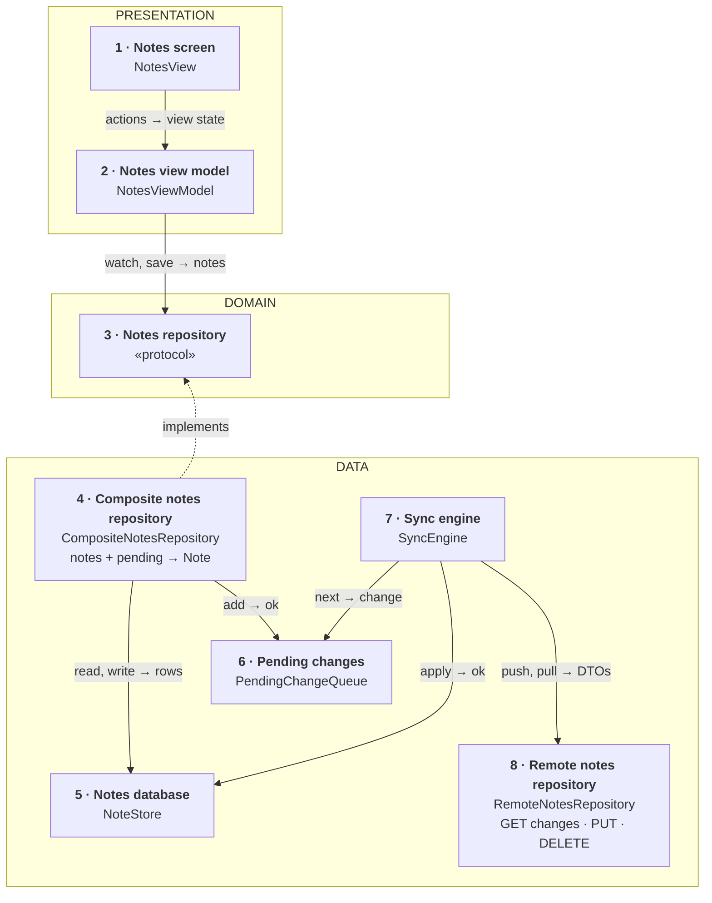
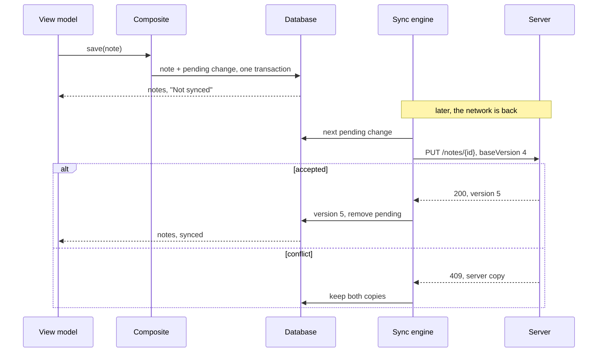
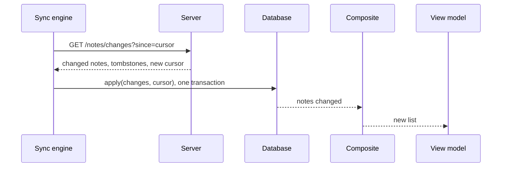

*Offline-first notes (and messaging) is one of the recurring senior mobile prompts in the first-hand reports collected for this programme. The answer stays small: the phone's database is the truth, and syncing is a background job.*

> **Interviewer:** "Design a notes app that works fully offline and syncs."

## Run it as a round, not as reading

Set a timer. Sketch. Talk the whole time. Open a section only when its slot is over.

| Clock | Phase | What you do |
|---|---|---|
| 0:00–0:02 | The prompt | Repeat it back in one sentence |
| 0:02–0:07 | Clarify | Ask yours, then read section 1 |
| 0:07–0:12 | Scope | Out of scope first, then features, then what must feel good |
| 0:12–0:24 | High level | The idea · the parts · the sketch · each part · two flows |
| 0:24–0:40 | Deep dives | The interviewer picks one of sections 9–11 |
| 0:40–0:45 | Recap | Follow-ups, then the 60-second summary |

## What this question is really testing

- **Where the truth lives.** The phone's database, not the server. The screen never waits for the network.
- **A queue of unsent changes** that survives the app being killed.
- **Conflicts:** the same note edited on two devices while offline.
- **Deletes that travel:** a note deleted offline must disappear everywhere.
- **Keeping it small.** Sync is one background job, not something every screen does.

**Traps:** saving to the server first; sending the whole database to sync; "last write wins" that silently loses typing; deleting rows instead of marking them deleted.

::: Words used in this chapter
- **Offline-first** — the app works fully without a network; the network only catches it up.
- **Source of truth** — the one place whose answer is right. Here: the database on the phone.
- **Sync** — making the phone and the server agree: send what changed here, fetch what changed there.
- **Pending change** — an edit saved on the phone that the server hasn't got yet. They wait in a queue.
- **Version** — a number the server bumps each time a note changes, so both sides can tell which copy is newer.
- **Conflict** — the same note changed on two devices before either synced.
- **Tombstone** — a "this note was deleted" marker kept instead of the note, so other devices learn about the delete.
- **Cursor** — a bookmark from the server: "you've seen every change up to here".
- **Transaction** — several writes saved together, all or none.
- **Idempotent** — sending the same request twice has the same effect as once.
- **Repository, composite** — a repository is where the app asks for data; a composite combines several sources into one model.
:::

::: 1 · The interviewer answers your clarifying questions
**"What's in a note?"** → *A title and plain text. No images or attachments for now.*

**"One device or several?"** → *Phone, iPad and the web, same account.*

**"Shared notes, collaboration?"** → *No. One owner per note.*

**"What if two devices edit the same note offline?"** → *Never lose what someone typed. How you show it is up to you.*

**"How fresh must other devices be?"** → *Seconds when online is nice. Minutes is fine.*

**"How many notes?"** → *Most users have hundreds. Some have ten thousand.*

**"Minimum OS?"** → *iOS 17, SwiftUI.*
:::

::: 2 · Requirements and scope — what you should have said
**Out of scope, said first:** attachments, sharing and collaboration, rich text, search on the server, the web client, how the server stores notes.

**Features**

1. Create, edit and delete notes with no network.
2. Changes reach the user's other devices when online.
3. A conflict never loses text.
4. Show which notes haven't synced yet.

**What must feel good**

- **Instant** — typing and saving never wait for the network.
- **Durable** — nothing typed is lost, even if the app is killed.
- **Correct** — deletes and edits arrive everywhere, once.
- **Cheap** — sync sends only what changed.
:::

::: 3 · The idea, in 30 seconds — before you draw anything
> *"The phone's database is the truth: the screen reads and writes only there, so it works offline. Every save also adds a pending change, in the same transaction. A sync engine sends pending changes with `PUT /notes/{id}` and `DELETE /notes/{id}`, and fetches other devices' changes with `GET /notes/changes?since=`. A composite repository combines the notes and the pending changes, so each note knows if it's synced. Three layers: presentation, domain, data."*
:::

::: 4 · What we need — the components, before the sketch
| # | Part | Type | Layer | Its one job |
|---|---|---|---|---|
| 1 | **Notes screen** | `NotesView` | Presentation | Draws the view state. |
| 2 | **Notes view model** | `NotesViewModel` | Presentation | Turns notes into a view state. |
| 3 | **Notes repository** | `NotesRepository` | Domain | Promises notes: watch, save, delete. |
| 4 | **Composite notes repository** | `CompositeNotesRepository` | Data | Combines notes and pending changes into `Note`. |
| 5 | **Notes database** | `NoteStore` | Data | Keeps every note on the phone. |
| 6 | **Pending changes** | `PendingChangeQueue` | Data | Keeps edits the server hasn't got. |
| 7 | **Sync engine** | `SyncEngine` | Data | Sends pending changes, fetches remote ones. |
| 8 | **Remote notes repository** | `RemoteNotesRepository` | Data | Calls the three endpoints. |

The `Note` model isn't a card: it's what the composite returns, written on its card.

No use case: the screen only watches, saves and deletes, one call each. The one real rule, conflicts, lives inside the sync engine, because only the sync engine meets conflicts.

Not on the list yet: attachments, a search index, a second device's live push, a shared editor screen. *"I'll add those if we go there."*
:::

::: 5 · The sketch


**How to read it.** A solid arrow points from the part that asks to the part that answers: *request → reply*. The dashed arrow means *implements*.

**Dependency inversion, in one line.** The domain writes the promise (card 3); the data layer keeps it (card 4). The arrow points **up**, so the domain never depends on the database or the network.

**One owner per source.** Notes live in card 5, unsent edits in card 6, the server behind card 8. The composite (card 4) is where the screen's view meets; the sync engine (card 7) is the only part that talks to the server.

**On Miro:** three frames (blue, purple, green), eight cards, eight arrows. Point at card 7 and say: *"the screen never waits for this."*
:::

::: 6 · Each component: its job, its interface, the choice inside it
**The model everyone shares.** It's what the composite returns.

```swift
struct Note: Identifiable, Hashable, Sendable {
    /// Made on the phone, so a new note has an ID before the server knows it
    let id: NoteID
    var title: String
    var body: String
    var updatedAt: Date
    /// True while a pending change for this note is waiting
    var isSynced: Bool
}
```

### 1 · Notes screen (`NotesView`)

**Job:** shows the list and the editor, and reports what the user does. It decides nothing.

**Interface:** reads `viewModel.viewState`; calls `select(_:)`, `create()`, `edit(title:body:)`, `delete(_:)`.

**Choice:** `NavigationSplitView`, so the same screen works as list-and-editor on iPad and pushes on iPhone.

### 2 · Notes view model (`NotesViewModel`)

**Job:** turns the notes into one view state, and saves edits.

```swift
struct NotesViewState: Equatable {
    let rows: [NoteRow]
    let editor: EditorState?
}

struct NoteRow: Equatable, Identifiable {
    let id: NoteID
    let title: String
    let preview: String
    /// already formatted, e.g. "Yesterday"
    let date: String
    let showsNotSynced: Bool
}

@MainActor @Observable
final class NotesViewModel {
    init(repository: NotesRepository)

    var viewState: NotesViewState { get }

    func onAppear() async
    func select(_ id: NoteID)
    func create()
    func edit(title: String, body: String)
    func delete(_ id: NoteID)
}
```

**Choices:**

- **It watches, it doesn't fetch.** The repository sends a fresh list whenever the database changes, from this screen or from sync.
- **Saves are debounced:** half a second after typing stops, and when leaving the note. Fewer writes, fewer pending changes.

### 3 · Notes repository (`NotesRepository`)

**Job:** the promise the view model needs.

```swift
protocol NotesRepository: Sendable {
    /// A new list every time the notes change
    func notes() -> AsyncStream<[Note]>
    func save(_ note: Note) async throws
    func delete(_ id: NoteID) async throws
}
```

**Choice:** a protocol in the domain, so the view model is tested with a fake and never knows about syncing.

### 4 · Composite notes repository (`CompositeNotesRepository`)

**Job:** combines the notes and the pending changes into `Note`s, and records the user's edits.

**Interface:** conforms to `NotesRepository`. Built with `init(store: NoteStoreType, pending: PendingChangeQueueType)`.

**How it combines:** watch the notes, look up which IDs have a pending change, set `isSynced` for each.

**How it saves:** write the note **and** add a pending change in **one transaction**. Either both are saved or neither, so an edit can't exist without its pending change.

**Choices:**

- **It never calls the server.** That's why saving is instant and works offline.
- **A delete is a tombstone:** the note is marked deleted, hidden from the list, and a pending delete is added.

### 5 · Notes database (`NoteStore`)

**Job:** keeps every note on the phone, including tombstones and each note's server version.

```swift
protocol NoteStoreType: Sendable {
    func observeNotes() -> AsyncStream<[NoteRecord]>
    func write(_ record: NoteRecord) async throws
    /// Server changes and the new cursor, saved together
    func apply(_ changes: [NoteRecord], cursor: Cursor) async throws
}
```

**Choice:** SwiftData behind a `@ModelActor`, so database work runs off the main thread with its own context. *Switch to* Core Data if you need finer control of migrations or fetch performance.

### 6 · Pending changes (`PendingChangeQueue`)

**Job:** keeps the edits the server hasn't got yet, oldest first.

```swift
protocol PendingChangeQueueType: Sendable {
    func add(_ change: PendingChange) async throws
    /// The oldest waiting change, or nil
    func next() async -> PendingChange?
    func remove(_ id: PendingChangeID) async throws
}
```

**Choices:**

- **A table in the same database**, so the note and its pending change are saved in one transaction.
- **One pending change per note.** Ten edits while offline become one "upload the latest" change, not ten requests.

### 7 · Sync engine (`SyncEngine`)

**Job:** sends pending changes to the server, then fetches what changed elsewhere.

```swift
protocol SyncEngineType: Sendable {
    /// Starts the loop: at launch, when the network returns, after each save
    func start()
}
```

Built with the queue, the store and the remote repository.

**Choices:**

- **One loop, one change at a time,** oldest first. No two syncs race each other.
- **Push first, then pull.** The server sees our edits before we ask for everyone else's.
- **Part inside: the conflict resolver.** When the server says "conflict", it keeps both copies (see deep dive 9). The rule lives here because only the sync engine meets conflicts.

### 8 · Remote notes repository (`RemoteNotesRepository`)

**Job:** calls the three endpoints and decodes the replies into DTOs.

```swift
protocol RemoteNotesRepositoryType: Sendable {
    func changes(since cursor: Cursor?) async throws -> ChangesPageDTO
    /// Throws .conflict(serverNote) if baseVersion is stale
    func put(_ note: NoteDTO, baseVersion: Int?) async throws -> Int
    func delete(_ id: NoteID, baseVersion: Int) async throws
}
```

**Choice:** DTOs stay in the data layer; the sync engine maps them to database records. The domain never sees the server's shape.
:::

::: 7 · Key flows through the sketch
**Flow 1 — editing offline, then syncing.**



**Flow 2 — another device changed a note.**


:::

::: 8 · The server contract
```
GET    /v1/notes/changes?since={cursor}&limit=200
       → { "changes": [ { "id", "title", "body", "version",
                          "updatedAt", "deleted": false } ],
           "nextCursor": "…", "hasMore": false }

PUT    /v1/notes/{id}   { "title", "body", "baseVersion": 4 }
       → 200 { "version": 5 }
       → 409 { "note": { …the server's copy… } }

DELETE /v1/notes/{id}?baseVersion=5
       → 204, or 409 if it changed since
```

- **The phone makes the ID**, so `PUT` creates or updates, and sending it twice is harmless.
- **`baseVersion`** says "I edited version 4". If the server is past 4, it refuses with 409 instead of overwriting.
- **The changes feed includes deletes** as `"deleted": true`, so other devices remove the note.
:::

::: 9 · Deep dive — "The same note is edited on the phone and the laptop, both offline. What happens?"
**Decision: keep both copies. Never lose text.**

1. The phone syncs first: `PUT` with base version 4 is accepted, the note is now version 5.
2. The laptop syncs: `PUT` with base version 4 gets **409** and the server's version 5.
3. The laptop keeps the server's copy as the note, and saves its own text as a new note, "Groceries (conflict copy)".
4. The user merges by hand, if they care.

*Rejected:* last write wins. Simple, and it silently throws away one device's typing. *Rejected for now:* merging line by line, or a CRDT. They merge automatically but cost real complexity. *Switch condition:* collaboration or frequent shared editing, then a CRDT earns its place.
:::

::: 10 · Deep dive — "The user deletes a note offline. How do the other devices find out?"
**Decision: a tombstone, not a removed row.**

1. The phone marks the note deleted and hides it, and adds a pending delete.
2. The sync engine sends `DELETE` with the base version.
3. The server keeps a tombstone and returns it in everyone's changes feed.
4. Other devices apply it: mark deleted, hide.

**Why not just remove the row?** Then the next pull can't tell "deleted here" from "never had it", and the note comes back.

**Edit on one device, delete on another:** the `DELETE` gets 409. Keep the edit; the user sees the note again, which is safer than losing it.

**Cleaning up:** tombstones are purged after a long window (say 30 days). A device offline for longer does a full resync.
:::

::: 11 · Deep dive — "The app is killed in the middle of syncing."
**Nothing is lost, and nothing is applied twice.**

- **Killed after saving, before sending.** The note and its pending change were saved in one transaction. At next launch the sync engine finds the change and sends it.
- **Killed after the server accepted, before we removed the pending change.** We send it again. The server sees the same ID and content; at worst it returns 409 against our own new version, which the resolver recognises as identical text and drops.
- **Killed while applying a pull.** The changes and the new cursor are saved in one transaction, so either both landed or neither, and the next pull repeats safely.

**Concurrency:** the database lives behind one `@ModelActor`; the sync engine is one loop, so two syncs never run at once. The view model is on the main actor and only reads finished lists.

**A second screen is free.** Any screen that shows notes watches the same database, so an edit appears everywhere without extra work.
:::

::: 12 · Failure modes and 10×
- **No network** → everything works; rows show "Not synced".
- **Server down** → pending changes wait; retry with backoff when `NWPathMonitor` says the network is back.
- **Server rejects a note for good** (4xx, not 409) → stop retrying that change, mark it, tell the user.
- **Cursor too old** → the server says so; do a full resync.
- **Database migration** → a new app version migrates the schema; done off the launch path where possible.

**At 10×:**

- **Ten thousand notes** → pulls are paged with `limit`, and the list loads lazily.
- **Long notes** → send only what changed (a diff) instead of the whole body.
- **Background freshness** → a `BGAppRefreshTask` pulls now and then; the system decides when, so it's a bonus, not a guarantee.
- **Attachments** → uploaded separately, referenced from the note.
:::

::: 13 · Question bank — everything they can push on
Answer out loud first, then open.

### Scope and architecture

<details>
<summary>"Where does the truth live?"</summary>

On the phone, in the database. The screen only reads and writes there; the server is something we catch up with.
</details>

<details>
<summary>"Walk me through the layers."</summary>

Presentation: the notes screen and view model. Domain: the notes repository protocol and the Note model. Data: the composite repository, the database, the pending queue, the sync engine and the remote repository.
</details>

<details>
<summary>"Why no use case?"</summary>

The screen only watches, saves and deletes, one call each. The one rule, conflicts, lives in the sync engine, the only part that meets them.
</details>

<details>
<summary>"What does the composite combine?"</summary>

The notes from the database and the pending changes, so each Note says whether it has synced.
</details>

<details>
<summary>"Show me dependency inversion."</summary>

The notes repository protocol lives in the domain; the composite in the data layer implements it. The arrow points up, so the domain never imports SwiftData or networking.
</details>

<details>
<summary>"Why is the sync engine not behind the repository protocol?"</summary>

The screen never asks for a sync; it just saves. Syncing is a background job started at launch, so it doesn't belong in the screen's promise.
</details>

### Saving and the queue

<details>
<summary>"What happens when the user types?"</summary>

The view model saves half a second after typing stops. The note and a pending change are written in one transaction, and the list shows "Not synced".
</details>

<details>
<summary>"Why one transaction?"</summary>

So an edit can never exist without its pending change. Otherwise a crash between the two writes would lose the sync forever.
</details>

<details>
<summary>"The user edits a note ten times offline."</summary>

There's one pending change per note, holding "upload the latest". Ten edits, one request.
</details>

<details>
<summary>"Why does the phone make the note ID?"</summary>

So a new note has an ID offline, and sending it twice creates it once.
</details>

<details>
<summary>Follow-up chain: "The app is killed."</summary>

1. *"Killed right after saving."* → The pending change was saved with the note; it's sent at next launch.
2. *"Killed after the server accepted."* → We send it again; the same ID makes it harmless.
3. *"Killed mid-pull."* → Changes and cursor are saved together, so the pull just repeats.
</details>

### Sync and the API

<details>
<summary>"How does the phone learn about other devices' changes?"</summary>

`GET /notes/changes?since=cursor` returns everything changed after the bookmark, including deletes, and a new bookmark.
</details>

<details>
<summary>"Why a changes feed and not download all notes?"</summary>

Ten thousand notes is megabytes; the changes since last time are usually a few. Only a stale cursor needs a full download.
</details>

<details>
<summary>"Push first or pull first?"</summary>

Push first, so the server has our edits before we ask for everyone else's, and our pending notes aren't overwritten by older server copies.
</details>

<details>
<summary>"A pulled change arrives for a note we have unsent edits on."</summary>

Skip it; our pending change will be pushed and the server's answer, accept or conflict, settles it.
</details>

<details>
<summary>"When does sync run?"</summary>

At launch, after each save, when the network comes back, and sometimes in the background. One loop, so never twice at once.
</details>

<details>
<summary>"Seconds-fresh across devices?"</summary>

Add a silent push or a socket that just says "something changed", which starts a pull. The data still comes from the changes feed.
</details>

### Conflicts and deletes

<details>
<summary>"Two devices edit the same note offline."</summary>

The second `PUT` gets 409 with the server's copy. We keep both: the server's as the note, ours as a conflict copy. No text is lost.
</details>

<details>
<summary>"Why not last write wins?"</summary>

It silently throws away one device's typing. For notes, losing text is the worst bug.
</details>

<details>
<summary>"How are deletes synced?"</summary>

With tombstones: the note is marked deleted, the server keeps the marker, and the changes feed tells other devices.
</details>

<details>
<summary>Follow-up chain: "Merging."</summary>

1. *"Users hate conflict copies."* → Merge automatically when the two edits touch different lines.
2. *"They touch the same line."* → Fall back to a conflict copy.
3. *"Now it's shared and collaborative."* → A CRDT, which merges any edits, at real cost in complexity and storage.
</details>

### Storage, testing and change

<details>
<summary>"SwiftData or Core Data?"</summary>

SwiftData behind a `@ModelActor` on iOS 17; Core Data if migrations or fetch performance need finer control.
</details>

<details>
<summary>"What runs on the main thread?"</summary>

Only the view model and the screen. The database is its own actor; the sync loop runs in the background.
</details>

<details>
<summary>"How do you test conflicts?"</summary>

A fake remote that answers 409 with a known copy; check the database ends with both notes.
</details>

<details>
<summary>"How do you test the composite?"</summary>

A fake store with three notes and a fake queue with one pending ID; check only that note says not synced.
</details>

<details>
<summary>Follow-up chain: "A second screen."</summary>

1. *"Add a widget showing the latest notes."* → It reads the same database.
2. *"Does it see an edit at once?"* → In the app, yes, by watching; the widget reloads its timeline after a save.
3. *"Any extra sync code?"* → None. The database is the truth, so every reader agrees.
</details>
:::

::: 14 · Scorecard — mark yourself, 0 / 1 / 2
| | Did you… | 0–2 |
|---|---|---|
| 1 | Talk the whole time, and listen when interrupted | |
| 2 | Clarify before designing | |
| 3 | Give a rejected alternative for each choice | |
| 4 | Say out of scope first | |
| 5 | Say the idea, list the parts, then sketch | |
| 6 | Keep the sketch to about eight cards | |
| 7 | Make the phone's database the source of truth | |
| 8 | Save the note and its pending change in one transaction | |
| 9 | Name the three endpoints | |
| 10 | Combine notes and pending changes in the composite | |
| 11 | Use versions and a 409 for conflicts, and never lose text | |
| 12 | Sync deletes with tombstones | |
| 13 | Survive being killed mid-sync | |
| 14 | Land the recap inside 60 seconds | |

14+ is a pass.<!--private--> Anything scored 0 goes in the progress log and comes back as a recall prompt.<!--/private--><!--public--> A zero names the thing to read about next.<!--/public-->
:::

::: 15 · The 60-second recap
The phone's database is the truth, so the app works fully offline and never waits for the network. Every save writes the note and a pending change in one transaction; ten edits to one note stay one pending change. A composite repository combines notes and pending changes, so each note shows whether it has synced. One background sync engine pushes pending changes with `PUT` and `DELETE`, each carrying the version it was based on, then pulls `GET /notes/changes?since=` and applies changes and the new cursor together. A 409 means a conflict: keep both copies, never lose text. Deletes are tombstones so they reach every device. Being killed at any step is safe, because every step is a transaction or a repeatable request.
:::
