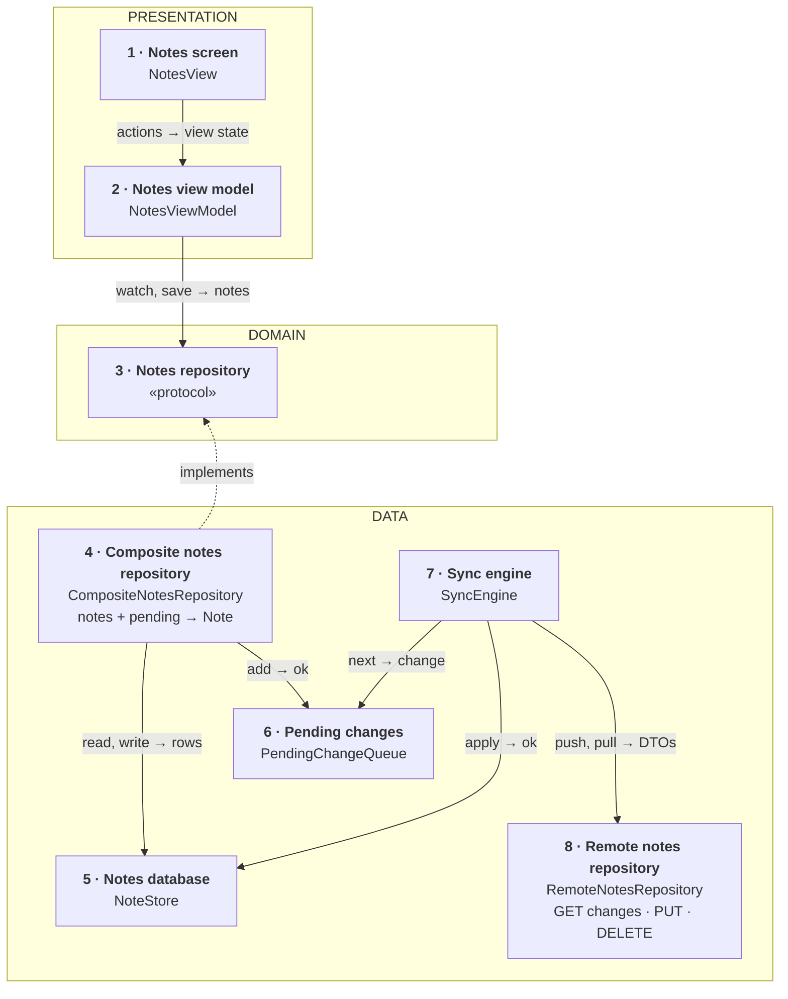
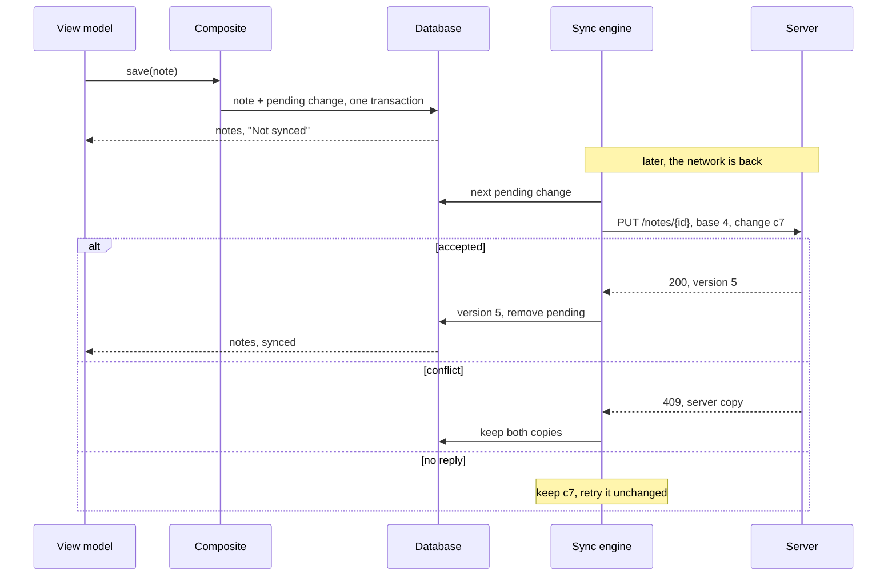
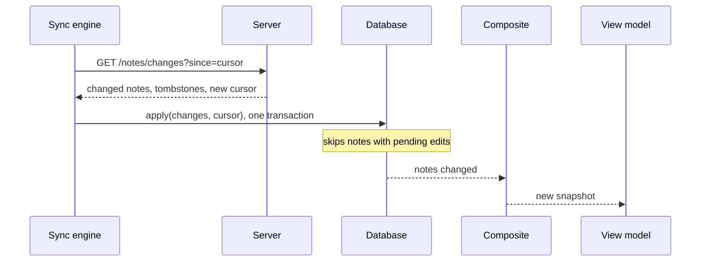

*Offline-first notes is a recurring senior mobile prompt. The answer stays small: the phone's database is the truth, syncing is one background job, and each note's changes go out in order and are safe to retry. Start simple; add parts only when asked.*

> **Interviewer:** "Design a notes app that works fully offline and syncs."

## Run it as a round, not as reading

Set a timer. Sketch. Talk the whole time. Open a section only when its slot is over.

| Clock | Phase | What you do |
|---|---|---|
| 0:00–0:02 | The prompt | Repeat it back in one sentence |
| 0:02–0:07 | Clarify | Ask yours, then read section 1 |
| 0:07–0:12 | Scope | Out of scope first, then required, then later |
| 0:12–0:24 | High level | The idea · the parts · the sketch · each part · two flows |
| 0:24–0:40 | Deep dives | The interviewer picks one of sections 9–11 |
| 0:40–0:45 | Recap | Follow-ups, then the 60-second summary |

## What this question is really testing

- **Where the truth lives.** The phone's database, not the server. The screen never waits for the network.
- **A queue of unsent changes** that survives the app being killed, goes out in order per note, and is safe to retry.
- **Conflicts:** the same note edited on two devices while offline.
- **Deletes that travel:** a note deleted offline must disappear everywhere.
- **Keeping it small.** Sync is one background job, not something every screen does.

**Traps:** saving to the server first; "last write wins" that loses typing; retries without an ID; deleting rows instead of marking them deleted; "No notes" when the first sync failed; promising background sync at a set time.

::: Words used in this chapter
- **Offline-first** — the app works fully without a network; the network only catches it up.
- **Source of truth** — the one place whose answer is right. Here: the database on the phone.
- **Sync** — making the phone and the server agree: send what changed here, fetch what changed there.
- **Pending change** — an edit saved on the phone that the server hasn't got yet. They wait in a queue.
- **Version** — a number the server bumps each time a note changes, so both sides can tell which copy is newer.
- **Conflict** — the same note changed on two devices before either synced.
- **Tombstone** — a "this note was deleted" marker kept instead of the note, so other devices learn about the delete.
- **Cursor** — a bookmark from the server: "you've seen every change up to here". Only the server can read it.
- **Transaction** — several writes saved together, all or none.
- **Idempotent** — sending the same request twice has the same effect as once. A **change ID** on each request lets the server spot a repeat.
- **Repository, composite** — a repository is where the app asks for data; a composite combines several sources into one model.
:::

::: 1 · The interviewer answers your clarifying questions
**"What's in a note?"** → *A title and plain text. No images or attachments for now.*

**"One device or several?"** → *Phone, iPad and the web, same account.*

**"Shared notes, collaboration?"** → *No. One owner per note.*

**"What if two devices edit the same note offline?"** → *Never lose what someone typed. How you show it is up to you.*

**"How fresh must other devices be?"** → *Seconds when online is nice. Minutes is fine.*

**"How many notes?"** → *Most users have hundreds, a few KB each. Some have ten thousand.*

**"How many users?"** → *Say five million, each saving a few dozen times a day. Don't design the backend.*

**"Minimum OS?"** → *iOS 17, SwiftUI.*
:::

::: 2 · Requirements and scope — what you should have said
**Out of scope, said first:** attachments, sharing and collaboration, rich text, search on the server, the web client, how the server stores notes.

**Required for the prompt**

1. Create, edit and delete notes with no network.
2. Changes reach the user's other devices when online.
3. A conflict never loses text.
4. Show which notes haven't synced, and whether the last sync failed.

**What must feel good:** instant (never waits for the network) · durable (nothing typed is lost, even if killed) · correct (each change lands once, in order) · cheap (sync sends only what changed).

**Production considerations** (say them, don't draw them): token refresh, safe retries and backoff, 429s, data protection on the database, metrics. They're in section 12.

**Optional follow-ups** (add only when asked):

```text
Seconds-fresh on other devices → a silent push that starts a pull
Long notes, attachments        → diffs, separate uploads
Fewer conflict copies          → merge edits to different lines
Real-time collaboration        → a different design (CRDT or OT)
```

*"I'll start simple and add each of these when the requirement appears."*
:::

::: 3 · The idea, in 30 seconds — before you draw anything
> *"The phone's database is the truth: the screen reads and writes only there, so it works offline. Every save also adds a pending change, in the same transaction. A sync engine sends pending changes with `PUT /notes/{id}` and `DELETE /notes/{id}`, one at a time per note, each with a change ID so a retry is harmless, and fetches other devices' changes with `GET /notes/changes?since=` and an opaque cursor. A composite repository combines the notes and the pending changes, so each note knows if it's synced. A failed sync means 'not up to date', never 'no notes'. Three layers: presentation, domain, data."*
:::

::: 4 · What we need — the components, before the sketch
| # | Part | Type | Layer | Its one job |
|---|---|---|---|---|
| 1 | **Notes screen** | `NotesView` | Presentation | Draws the view state. |
| 2 | **Notes view model** | `NotesViewModel` | Presentation | Turns notes into a view state. |
| 3 | **Notes repository** | `NotesRepository` | Domain | Promises notes: watch, save, delete. |
| 4 | **Composite notes repository** | `CompositeNotesRepository` | Data | Combines notes and pending changes into `Note`. |
| 5 | **Notes database** | `NoteStore` | Data | Keeps every note on the phone. |
| 6 | **Pending changes** | `PendingChangeQueue` | Data | Keeps edits the server hasn't got. |
| 7 | **Sync engine** | `SyncEngine` | Data | Sends pending changes, fetches remote ones. |
| 8 | **Remote notes repository** | `RemoteNotesRepository` | Data | Calls the three endpoints. |

The `Note` model isn't a card: it's what the composite returns, written on its card.

No use case: the screen's three calls would only pass through one. The one real rule, conflicts, lives in the sync engine, the only part that meets them.

Not on the list yet: everything under "optional follow-ups" in section 2, and a search index. *"I'll add those if we go there."*
:::

::: 5 · The sketch


**How to read it.** A solid arrow points from the part that asks to the part that answers: *request → reply*. The dashed arrow means *implements*.

**Dependency inversion, in one line.** The domain writes the promise (card 3); the data layer keeps it (card 4). The arrow points **up**, so the domain never depends on the database or the network.

**On Miro:** three frames (blue, purple, green), eight cards, eight arrows. Point at card 7 and say: *"the screen never waits for this."*
:::

::: 6 · Each component: its job, its interface, the choice inside it
**The model everyone shares.** It's what the composite returns.

```swift
struct Note: Identifiable, Hashable, Sendable {
    /// Made on the phone, so a new note has an ID before the server knows it
    let id: NoteID
    var title: String
    var body: String
    var updatedAt: Date
    /// synced, pending, or failed (the server refused this note's change)
    var sync: NoteSyncState
}

/// What the repository streams: the notes, plus how the last sync went
struct NotesSnapshot: Equatable, Sendable {
    let notes: [Note]
    /// nil = this device has never finished a sync
    let lastSyncedAt: Date?
    let isSyncing: Bool
    let lastSyncFailed: Bool
}
```

The sync engine writes its status into a small row in the same database, so the screen learns about sync by watching, like everything else.

### 1 · Notes screen (`NotesView`)

**Job:** shows the list and the editor, and reports what the user does. It decides nothing.

**Interface:** reads `viewModel.viewState`; calls `select(_:)`, `create()`, `edit(title:body:)`, `delete(_:)`.

**Choice:** `NavigationSplitView`, so the same screen works as list-and-editor on iPad and pushes on iPhone.

### 2 · Notes view model (`NotesViewModel`)

**Job:** turns the notes into one view state, and saves edits.

```swift
struct NotesViewState: Equatable {
    let rows: [NoteRow]
    /// noNotes, firstSyncRunning, or firstSyncFailed — nil when there are rows
    let empty: EmptyState?
    /// "Syncing…", shown next to the rows
    let isSyncing: Bool
    /// e.g. "Couldn't sync · last synced 10:42" — the rows stay
    let syncProblem: String?
    let editor: EditorState?
}

struct NoteRow: Equatable, Identifiable {
    let id: NoteID
    let title: String
    let preview: String
    /// already formatted, e.g. "Yesterday"
    let date: String
    /// none, "Not synced", or "Couldn't sync"
    let badge: SyncBadge
}

@MainActor @Observable
final class NotesViewModel {
    init(repository: NotesRepository)

    var viewState: NotesViewState { get }

    func onAppear() async
    func select(_ id: NoteID)
    func create()
    func edit(title: String, body: String)
    func delete(_ id: NoteID)
}
```

**Choices:**

- **It watches, it doesn't fetch.** A fresh snapshot arrives whenever the database changes, from this screen or from sync.
- **Small states that coexist, not one status enum.** The list can have rows *and* be syncing *and* show that the last sync failed. Separate fields say that without a dozen cases.
- **A failed sync is "unknown", not "empty".** On a new device, "No notes yet" appears only after a sync succeeded; before that, "Loading your notes…" or "Couldn't load them yet".
- **The draft is the view model's until saved.** Saves are debounced (half a second after typing stops, and when leaving the note). An incoming snapshot never overwrites text the user is typing.

### 3 · Notes repository (`NotesRepository`)

**Job:** the promise the view model needs.

```swift
protocol NotesRepository: Sendable {
    /// A new snapshot every time the notes or the sync status change
    func notes() -> AsyncStream<NotesSnapshot>
    func save(_ note: Note) async throws
    func delete(_ id: NoteID) async throws
}
```

**Choice:** a protocol in the domain; it earns a fake for the view model's tests. No "sync now" method: the screen saves, the engine decides when to sync.

### 4 · Composite notes repository (`CompositeNotesRepository`)

**Job:** combines the notes and the pending changes into `Note`s, and records the user's edits.

**Interface:** conforms to `NotesRepository`. Built with `init(store: NoteStoreType, pending: PendingChangeQueueType)`.

**How it combines:** watch the notes, look up which IDs have a pending or failed change, set each note's `sync`, and add the sync-status row.

**How it saves:** write the note **and** add a pending change in **one transaction**. Either both are saved or neither, so an edit can't exist without its pending change.

**Choices:**

- **It never calls the server.** That's why saving is instant and works offline.
- **A delete is a tombstone:** the note is marked deleted, hidden from the list, and a pending delete is added.

### 5 · Notes database (`NoteStore`)

**Job:** keeps every note on the phone, including tombstones and each note's server version.

```swift
protocol NoteStoreType: Sendable {
    func observeNotes() -> AsyncStream<[NoteRecord]>
    func write(_ record: NoteRecord) async throws
    /// Server changes and the new cursor, saved together.
    /// Skips notes that have a pending change at that moment.
    func apply(_ changes: [NoteRecord], cursor: Cursor) async throws
    func recordSync(_ status: SyncStatus) async throws
}
```

**Choices:**

- **SwiftData behind a `@ModelActor`**, off the main thread with its own context. *Switch to* Core Data for finer control of migrations or fetches.
- **A protocol, for the sync engine's tests** (an in-memory store).

### 6 · Pending changes (`PendingChangeQueue`)

**Job:** keeps the edits the server hasn't got yet, oldest first.

```swift
struct PendingChange: Sendable {
    /// Made once; every retry of this change reuses it
    let id: ChangeID
    let noteID: NoteID
    /// upsert or delete
    let kind: ChangeKind
    /// Title, body and baseVersion, frozen when the change is first sent
    var sent: ChangeSnapshot?
}

protocol PendingChangeQueueType: Sendable {
    /// Replaces this note's waiting change, never the one in flight
    func add(_ change: PendingChange) async throws
    /// The oldest waiting change whose note has nothing in flight
    func next() async -> PendingChange?
    func remove(_ id: ChangeID) async throws
    func markFailed(_ id: ChangeID) async throws
}
```

**Choices:**

- **A table in the same database**, so the note and its pending change are saved in one transaction.
- **Per note: at most one in flight, one waiting.** Ten offline edits become one "upload the latest" change. An edit made during a send waits behind it, so a note's changes arrive in order.
- **A sent change is frozen.** Its snapshot and change ID never change, so a retry is exactly the same request.

### 7 · Sync engine (`SyncEngine`)

**Job:** sends pending changes to the server, then fetches what changed elsewhere.

```swift
protocol SyncEngineType: Sendable {
    /// Starts the loop: at launch, when the network returns, after each save
    func start()
}
```

Built with the queue, the store and the remote repository.

**Choices:**

- **One loop, one change at a time,** oldest first. No two syncs race, and each note's changes go in order. Parallel notes are a later optimisation.
- **A failure only touches that note.** A conflict or refusal affects that note's change; the loop moves on. It never rolls a note back to older text.
- **Push first, then pull.** The server sees our edits before we ask for everyone else's.
- **Part inside: the conflict resolver.** When the server says "conflict", it keeps both copies (see deep dive 9). The rule lives here because only the sync engine meets conflicts. That's why there's no use case.

### 8 · Remote notes repository (`RemoteNotesRepository`)

**Job:** calls the three endpoints and decodes the replies into DTOs.

```swift
protocol RemoteNotesRepositoryType: Sendable {
    func changes(since cursor: Cursor?) async throws -> ChangesPageDTO
    /// Throws .conflict(serverNote) if baseVersion is stale
    func put(_ note: NoteDTO, baseVersion: Int?, change: ChangeID) async throws -> Int
    func delete(_ id: NoteID, baseVersion: Int, change: ChangeID) async throws
}
```

**Choices:**

- **DTOs stay in the data layer**; the sync engine maps them to database records. The domain never sees the server's shape.
- **A protocol, for a fake server** that answers 409 or times out in tests.
- **Auth in its HTTP client:** on a 401, refresh the token once and retry; if that fails, sign in again, pending changes kept.

**Why these parts, and no more.** Each changes for a different reason: the screen with design, the view model with screen behaviour, the composite with what a `Note` shows, the store and queue with the schema, the sync engine with sync rules, the remote repository with the API. The domain protocol earns a fake for the view model; the data protocols earn fakes for the sync engine's tests. What I'd *not* add: a pass-through use case, a protocol for the view model, a DI container, a generic repository, a sync framework or CRDT library. Constructor injection is enough.
:::

::: 7 · Key flows through the sketch
**Flow 1 — editing offline, then syncing.**



A timeout doesn't say whether the server saved the change, so the retry sends the same change ID, base version and text. The server answers a repeat with its first answer.

**Flow 2 — another device changed a note.**



If the pull fails, nothing is applied and the cursor doesn't move. The screen shows "Couldn't sync", not fewer notes.
:::

::: 8 · The server contract
```
GET    /v1/notes/changes?since={cursor}&limit=200
       → { "changes": [ { "id", "title", "body", "version",
                          "updatedAt", "deleted": false } ],
           "nextCursor": "…", "hasMore": false }

PUT    /v1/notes/{id}   Idempotency-Key: {changeId}
       { "title", "body", "baseVersion": 4 }      // null for a new note
       → 200 { "version": 5 }
       → 409 { "note": { …the server's copy… } }

DELETE /v1/notes/{id}?baseVersion=5   Idempotency-Key: {changeId}
       → 204, or 409 if it changed since
```

- **The phone makes the note ID and the change ID.** `PUT` creates or updates. A repeated change ID gets the first answer back, so a retry never applies twice.
- **`baseVersion`** says "I edited version 4". If the server is past 4, it refuses with 409 instead of overwriting.
- **The cursor is opaque and the server's.** Ordering and "no change skipped" are the server's promise. The client sends the cursor back untouched, and ignores a change whose version isn't newer than the one it has. Deletes come through the same feed as `"deleted": true`. An expired cursor gets `410 Gone`: do a full resync.
:::

::: 9 · Deep dive — "The same note is edited on the phone and the laptop, both offline. What happens?"
**Decision: keep both copies. Never lose text.**

1. The phone syncs first: `PUT` with base version 4 is accepted, the note is now version 5.
2. The laptop syncs: `PUT` with base version 4 gets **409** and the server's version 5.
3. The laptop keeps the server's copy as the note. Its **latest** local text, including anything typed since the request went out, becomes a new note, "Groceries (conflict copy)", with its own pending change. The note's waiting change is dropped; its text is in the copy.
4. The user merges by hand, if they care.

Only this note is affected. Nothing typed is rolled back: the newest text survives under a new name.

*Rejected:* last write wins. Simple, and it silently throws away one device's typing. *Later:* merging line by line, when users complain about copies. *Out of this design:* CRDTs or operational transforms, which solve real-time collaboration.
:::

::: 10 · Deep dive — "The user deletes a note offline. How do the other devices find out?"
**Decision: a tombstone, not a removed row.**

1. The phone marks the note deleted and hides it, and adds a pending delete.
2. The sync engine sends `DELETE` with the base version.
3. The server keeps a tombstone and returns it in everyone's changes feed.
4. Other devices apply it: mark deleted, hide.

**Why not just remove the row?** Then the next pull can't tell "deleted here" from "never had it", and the note comes back.

**Edit on one device, delete on another:** whichever arrives second gets 409. Keep the edit; the note reappears, which is safer than losing text.

**Cleaning up:** tombstones are purged after a long window (say 30 days). A device offline for longer gets `410` for its cursor and does a full resync, keeping its pending changes.
:::

::: 11 · Deep dive — "The app is killed in the middle of syncing."
**Nothing is lost, and nothing is applied twice.**

- **Killed after saving, before sending.** The note and its pending change were saved together; at next launch the change is sent.
- **Killed after the server accepted, before we removed the pending change.** At launch we send the frozen change again, same change ID. The server recognises it and returns the first answer, version 5. No 409, no duplicate.
- **Killed while applying a pull.** The changes and the new cursor are saved in one transaction, so either both landed or neither, and the next pull repeats safely.

**Concurrency:** the database lives behind one `@ModelActor`; the sync engine is one loop, so two syncs never run at once. The view model is on the main actor and only reads finished snapshots.

**Stale results.** Cancellation in Swift is cooperative: a reply can still arrive after we cancel. Two guards:

1. Each sync run carries the signed-in account; after sign-out, `apply` refuses results from the old run.
2. `apply` checks for pending edits *inside* its transaction, so an edit made while the pull was out is never overwritten.

**Background.** `UIApplication.beginBackgroundTask` gives a push a little time to finish as the user leaves. A `BGAppRefreshTask` (via `BGTaskScheduler`) may pull now and then, but the system decides if and when. A bonus, never relied on.
:::

::: 12 · Failure modes, production and scale
**Failures**

| Failure | Client behaviour |
|---|---|
| No network | Everything works; rows say "Not synced" |
| Push times out | Keep the change, retry it unchanged with backoff |
| Pull fails | Apply nothing, keep the cursor; "Couldn't sync", rows stay |
| First sync fails on a new device | "Couldn't load your notes yet", never "No notes" |
| 409 conflict | Server copy kept, our latest text as a conflict copy |
| Refused for good (4xx, not 409) | Stop retrying that change; "Couldn't sync" on that note only |
| Token expired (401) | Refresh once and retry; if that fails, sign in again, keep pending |
| Too many requests (429) | Wait for `Retry-After`, then resume |
| Cursor expired (410) | Full resync, keeping pending changes |

**Production notes** (short, not on the board)

- **Networking:** a timeout per request; retry timeouts and 5xx with backoff, safe because every write has a change ID. `NWPathMonitor` is a hint to retry now, not a promise the server is reachable. Cancel the sync run on sign-out.
- **Caching:** the database *is* the cache; the changes feed isn't HTTP-cached.
- **Metrics:** sync latency (save to server ack), queue depth and oldest pending age, sync failure rate, conflict rate, full resyncs. No note text in logs.
- **Security:** HTTPS; tokens in the Keychain. Keep the default data-protection class (until first unlock): full `complete` protection locks the database while the phone is locked, so background sync fails. Delete the database on sign-out.

**Scale, back of the envelope.** Use the interviewer's numbers; the shape is what matters.

```text
notes per user × average note size         = local storage
users × saves synced a day × payload size  = sync traffic
```

10,000 notes × 2 KB is 20 MB: fine on the phone, too much to download at every launch, hence the changes feed. Five million users × 30 saves × 2 KB is about 300 GB of uploads a day; debouncing and one waiting change per note keep it down, diffs come next.

**Grow only when asked**

```text
Another screen or a widget   → free: it reads the same database
Seconds-fresh across devices → a silent push that starts a pull (also not guaranteed)
Ten thousand notes           → paged pulls, a lazy list
Long notes                   → send diffs, not whole bodies
Attachments                  → separate uploads, referenced from the note
Collaboration                → a different design (CRDT or OT), only if asked
```
:::

::: 13 · Question bank — everything they can push on
Answer out loud first, then open.

### Scope and architecture

<details>
<summary>"Where does the truth live?"</summary>

On the phone, in the database. The screen only reads and writes there; the server is something we catch up with.
</details>

<details>
<summary>"Walk me through the layers."</summary>

Presentation: the notes screen and view model. Domain: the notes repository protocol and the Note model. Data: the composite repository, the database, the pending queue, the sync engine and the remote repository.
</details>

<details>
<summary>"Why no use case?"</summary>

The screen only watches, saves and deletes, one call each. The one rule, conflicts, lives in the sync engine, the only part that meets them.
</details>

<details>
<summary>"What does the composite combine?"</summary>

The notes from the database and the pending changes, so each Note says whether it has synced.
</details>

<details>
<summary>"Show me dependency inversion."</summary>

The notes repository protocol lives in the domain; the composite in the data layer implements it. The arrow points up, so the domain never imports SwiftData or networking.
</details>

<details>
<summary>"Why is the sync engine not behind the repository protocol?"</summary>

The screen never asks for a sync; it just saves. Syncing is a background job started at launch.
</details>

### Saving and the queue

<details>
<summary>"Why one transaction?"</summary>

So an edit can never exist without its pending change. Otherwise a crash between the two writes would lose the sync forever.
</details>

<details>
<summary>"The user edits a note ten times offline."</summary>

There's one pending change per note, holding "upload the latest". Ten edits, one request.
</details>

<details>
<summary>"A PUT times out. Did the server save it?"</summary>

We can't know. We resend the same frozen change with the same change ID; the server returns its first answer if it already saved it.
</details>

<details>
<summary>"The user keeps typing while a change is in flight."</summary>

The new text becomes the note's waiting change, behind the one in flight. It's sent next, with the version the first one got back.
</details>

<details>
<summary>"An old change fails after a newer edit. Do you roll back?"</summary>

No. The database already holds the newer text, and nothing reverts it. A conflict keeps the user's latest text as a copy; a refusal marks the note "Couldn't sync".
</details>

<details>
<summary>Follow-up chain: "The app is killed."</summary>

1. *"Killed right after saving."* → The pending change was saved with the note; it's sent at next launch.
2. *"Killed after the server accepted."* → We resend the same change ID; the server returns its first answer.
3. *"Killed mid-pull."* → Changes and cursor are saved together, so the pull just repeats.
</details>

### Sync and the API

<details>
<summary>"What's inside the cursor, and what if it expires?"</summary>

It's opaque: the server might encode a position in its change log. If it's too old the server says so (410), and we do a full resync, keeping pending changes.
</details>

<details>
<summary>"Can the feed send a change twice, or out of order?"</summary>

Ordering is the server's promise, not something the client can check. The client applies a change only if its version is newer than the one it has, so a repeat is harmless.
</details>

<details>
<summary>"Push first or pull first?"</summary>

Push first, so the server has our edits before we ask for everyone else's.
</details>

<details>
<summary>"A pulled change arrives for a note we have unsent edits on."</summary>

Skip it; our pending change will be pushed and the server's answer, accept or conflict, settles it.
</details>

<details>
<summary>"When does sync run? Every 15 minutes in the background?"</summary>

At launch, after each save, and when the network comes back, one loop at a time. Background refresh runs when `BGTaskScheduler` chooses, or not at all, so it's a bonus.
</details>

<details>
<summary>"The sync fails. What does the screen show?"</summary>

The notes it has, plus "Couldn't sync" and the last-synced time. On a new device with no completed sync, "Couldn't load your notes yet", never "No notes".
</details>

### Conflicts and deletes

<details>
<summary>"Two devices edit the same note offline."</summary>

The second `PUT` gets 409 with the server's copy. We keep both: the server's as the note, ours as a conflict copy. No text is lost.
</details>

<details>
<summary>"How are deletes synced?"</summary>

With tombstones: the note is marked deleted, the server keeps the marker, and the changes feed tells other devices.
</details>

<details>
<summary>Follow-up chain: "Merging."</summary>

1. *"Users hate conflict copies."* → Merge automatically when the two edits touch different lines.
2. *"They touch the same line."* → Fall back to a conflict copy.
</details>

### Storage, testing and change

<details>
<summary>"The user signs out mid-sync."</summary>

Cancel the run, but cancellation is cooperative, so a reply can still land. Each run carries the account, and apply refuses results from an old run.
</details>

<details>
<summary>"What would you measure in production?"</summary>

Sync latency, queue depth and oldest pending age, sync failures, conflict rate, full resyncs. Never note text.
</details>

<details>
<summary>"What changes at 10x?"</summary>

Mostly the server. On the client: paged pulls, diffs for long notes, backing off on 429s.
</details>

<details>
<summary>"Why not a sync framework or a CRDT?"</summary>

One owner per note and "never lose text" are met by versions and conflict copies. A CRDT pays off for real-time collaboration, which wasn't asked for.
</details>

<details>
<summary>"How do you test conflicts?"</summary>

A fake remote that answers 409 with a known copy; check the database ends with both notes.
</details>

<details>
<summary>Follow-up chain: "A second screen."</summary>

1. *"Add a widget showing the latest notes."* → It reads the same database, moved into an App Group container.
2. *"Does it see an edit at once?"* → In the app, yes, by watching; the widget after `WidgetCenter` reloads its timeline.
3. *"Any extra sync code?"* → None. The database is the truth, so every reader agrees.
</details>
:::

::: 14 · Scorecard — mark yourself, 0 / 1 / 2
| | Did you… | 0–2 |
|---|---|---|
| 1 | Talk the whole time, and listen when interrupted | |
| 2 | Clarify before designing | |
| 3 | Give a trade-off for each choice | |
| 4 | Say out of scope first; separate required from later | |
| 5 | Say the idea, list the parts, then sketch | |
| 6 | Keep the sketch to about nine cards | |
| 7 | Make the phone's database the truth; note + pending change in one transaction | |
| 8 | Name the three endpoints; call the cursor opaque and server-owned | |
| 9 | Send each note's changes in order, one in flight, with a change ID | |
| 10 | Use versions and a 409 for conflicts; never roll back newer text | |
| 11 | Sync deletes with tombstones | |
| 12 | Treat a failed sync as unknown, not empty | |
| 13 | Survive being killed; call background sync opportunistic | |
| 14 | Land the recap inside 60 seconds | |

14+ is a pass.<!--private--> Anything scored 0 goes in the progress log and comes back as a recall prompt.<!--/private--><!--public--> A zero names the thing to read about next.<!--/public-->
:::

::: 15 · The 60-second recap
The phone's database is the truth, so the app works fully offline and never waits for the network. Every save writes the note and a pending change in one transaction; ten edits to one note stay one pending change. A composite repository combines notes and pending changes, so each note shows whether it has synced. One background sync engine pushes pending changes with `PUT` and `DELETE`, one at a time per note, each with the version it was based on and a change ID so retries are harmless. Then it pulls `GET /notes/changes?since=` with the server's opaque cursor and applies changes and the new cursor together. A 409 means a conflict: keep both copies, never lose text. Deletes are tombstones. A failed sync means "not up to date", never "no notes". Being killed at any step is safe, and background refresh is a bonus the system schedules, not a promise.
:::
